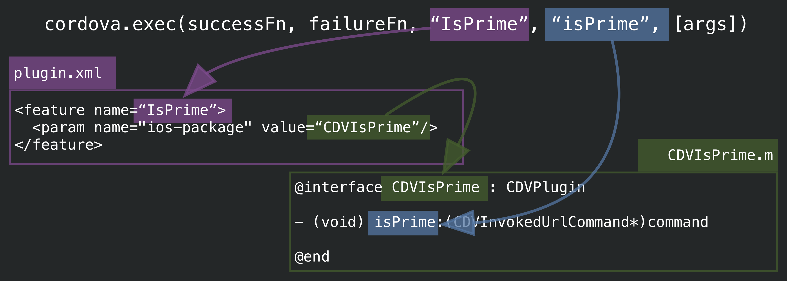
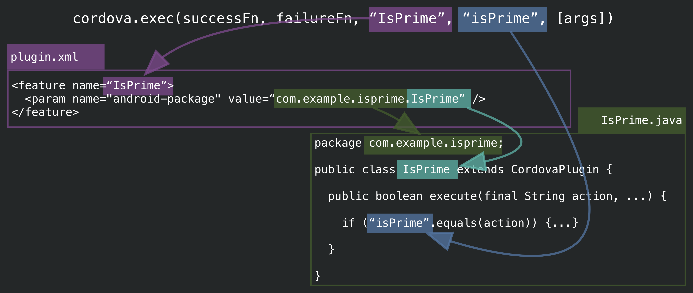

title: Creating a Modern PhoneGap Plugin
class: animation-fade
layout: true

<!-- This slide will serve as the base layout for all your slides -->
.bottom-bar[
  {{footer}}
]

---
class: title
footer: Photo by AlexanderStein (https://pixabay.com/en/users/AlexanderStein-45237/), courtesy of Pixabay.com

.bg[]
# Creating a Modern PhoneGap Plugin

## Kerri Shotts ([@kerrishotts](https://www.twitter.com/kerrishotts))
## Jesse MacFadyen ([@purplecabbage](https://www.twitter.com/purplecabbage))

### Slides at https://kerrishotts.github.io/pgday
### Based on [PGDay EU 2016 plugin workshop](http://purplecabbage.github.io/slides/pgd16Plugins/index.html) by Jesse

???
Kerri

Good afternoon everyone! This is "Creating a Modern PhoneGap Plugin", and I'll be presenting alongside Jesse, who is _the_ expert when it comes to plugins! If you have any questions, feel free to tweet either of us, and slides are available at the link on the slide.

---
footer:

# About Kerri

.right.side-layer[]


* Used PhoneGap for six+ years
* Author of five books about PhoneGap
* Apache Cordova committer
* One of several moderators:
    * [Adobe PhoneGap Forums](http://forums.adobe.com/community/phonegap)
    * [Google Cordova Group](https://groups.google.com/forum/#!forum/phonegap)
* At Adobe now for nearly 2 months
* [@kerrishotts](https://www.twitter.com/kerrishotts)

???

Kerri

---

footer:

# About Jesse

.right.side-layer[]

* PhoneGap Developer since 2008
* Apache Cordova committer
* At Adobe for nearly 6 years now
* [@purplecabbage](https://www.twitter.com/purplecabbage)

???

Jesse

---

footer:

# What is a Cordova Plugin?

_noun_ A mystical collection of machine incantations which grant access to amazing and magical capabilities

## ahem...

_noun_ A module consisting of code and settings extending the essential functionality of Cordova with the goal of providing access to device capabilities, enhancing existing capabilities, or improving the developer's workflow

???

Kerri

So, almost everyone is _using_ plugins today, but only a few people actually know how they work. To many, plugins are kind of magical &mdash; plugins cross into territory and languages the dev might not know, and the dev might not be familiar with everything a plugin can actually do.

But plugins aren't magical: they're just modules conisting of code and settings that can extend the functionality of a Cordova app _or_ the Cordova development environment. And although you may be exposed to languages with which you aren't immediately familiar, that process can be extremely rewarding. And you can always start small and grow over time.

---

footer:

# What can plugins do?

* Anything native code can do
* Active in the following contexts:
    * run time
    * build time
    * install time
* Two sources of Plugins
  * Core &mdash; used to be built in pre-3.x
  * Community &mdash; people like you!

???

A plugin can do anything that native code could do within the same context. There are various contexts in which a plugin can operate, mainly "install time", "build time", and "run time". Most developers are probably most familiar with the latter context, and most plugins provide their functionality within that context. For example, a plugin that operates in the run time context can use the native SDK's functionality (including widgets, low-level functionality, etc.), whereas a plugin that operates in either the install or build time context can use Cordova's Node environment.
---

footer: Photo by skeeze (https://pixabay.com/en/users/skeeze-272447/), courtesy of Pixabay.com

# Plugins at Run Time

.bg[]

Full access to the native SDK and device features. Some examples:

* Push Notifications: [PhoneGap](https://github.com/phonegap/phonegap-plugin-push), [Pushwoosh](https://github.com/Pushwoosh/pushwoosh-phonegap-3.0-plugin), [AeroGear](https://github.com/aerogear/aerogear-cordova-push), [OneSignal](https://github.com/onesignal/OneSignal-Cordova-SDK)
* Storage Plugins: [Native Storage](https://github.com/TheCocoaProject/cordova-plugin-nativestorage), [SQLite](https://github.com/litehelpers/Cordova-sqlite-storage), [SQLite 2](https://github.com/nolanlawson/cordova-plugin-sqlite-2)
* Social Plugins: [Email](https://github.com/hypery2k/cordova-email-plugin), [X SocialSharing](https://github.com/EddyVerbruggen/SocialSharing-PhoneGap-Plugin)
* Audio Plugins: [DBMeter](https://github.com/akofman/cordova-plugin-dbmeter), [Native Audio](https://github.com/floatinghotpot/cordova-plugin-nativeaudio), [Media Picker](https://github.com/an-rahulpandey/cordova-plugin-mediapicker)
* Misc: [Barcode Scanner](https://github.com/phonegap/phonegap-plugin-barcodescanner), [In App Purchase](https://github.com/j3k0/cordova-plugin-purchase), [Google Maps](https://github.com/mapsplugin/cordova-plugin-googlemaps), [Vuforia](https://github.com/mattrayner/cordova-plugin-vuforia) (AR), [Microsoft ACE](https://github.com/Microsoft/ace) (native controls), [Tesseract](https://github.com/jcesarmobile/cordova-plugin-tesseract-ocr) (OCR, iOS)

---

footer: Photo by Pexels (https://pixabay.com/en/users/Pexels-2286921/), courtesy of Pixabay.com

# Plugins at Build Time

.bg[]

Full access to the build-time environment and Cordova project. Some examples:

* Transpile and Bundle ES2015+: [Webpack &amp; Transpiler plugin](https://github.com/kerrishotts/cordova-plugin-webpack-transpiler)
* Pre-process CSS files (SASS, less, auto-prefixer)
* Check code quality (eslint, tslint, jshint)
* Etc.

---

footer: Photo by PublicDomainPictures (https://pixabay.com/en/users/PublicDomainPictures-14/), courtesy of Pixabay.com

# Plugins at Install Time

.bg[]

Full access to the Cordova project and environment at install time. Some ideas:

* Configure the project environment
* Bundle other plugins
* Provide tests for another plugin...
    * [cordova-plugin-test-framework](https://github.com/apache/cordova-plugin-test-framework)

.center.big[*Plugin-ception!*]

---

footer:
class: table-no-header medium

# The Core Plugins

 Plugin              | Decision        | Notes
:-------------------:|:---------------:|:--------------:
 battery-status      | Keep            |
 camera              | Keep            |
 contacts            | Sunset          |
 console             | Merge           | Remember to remove it!
 device              | Keep            |
 device-motion       | Sunset          | [Migration](https://blog.phonegap.com/migrating-from-the-cordova-device-motion-plugin-ddd8176632ed)
 device-orientation  | Sunset          | [Migration](https://blog.phonegap.com/migrating-from-the-cordova-device-orientation-plugin-8442b869e6cc)
 dialogs             | Keep            |
 file                | Keep            |
 file-transfer       | Sunset          | XHR2

---

footer:
class: table-no-header medium

## The Core Plugins

 Plugin              | Decision        | Notes
:-------------------:|:---------------:|:--------------:
 geolocation         | Keep            |
 globalization       | Keep            |
 inappbrowser        | Keep            |
 media               | Sunset          | Browser APIs
 media-capture       | Keep            |
 network-information | Keep            |
 splashscreen        | Merge           |
 statusbar           | Merge           |
 vibration           | Keep            |
 whitelist           | Keep            |

???
There are two categories of plugins: _core_ and _community_. The former are generally plugins that were originally core functionality &mdash; that is, they were built-in to Cordova and later split out so that they could be maintained separately and receive updates without having to update all of Cordova. The latter are plugins developed and supported by the community themselves.

I should mention that there is currently an ongoing plugin audit -- check out issue CB-12708 for more info and to express your thoughts if you have plugins you'd like to see sunsetted, brought up to spek, etc.

---

footer:
class: table

# Community Plugins

Devoloped and supported by the community &mdash; like you!

.center.huge[
https://cordova.apache.org/plugins

~2,720 plugins &amp; templates (excl. core)
]

.notes[
At PG Day EU: 2,211
]


---
class: section
footer:

# Managing Plugins

???

Kerri

Whether you are using a core or community plugin or you're developing your own, the commands for adding plugins to your projects remain the same. In order to support various workflows and local development, plugins can be installed from a variety of sources.

---
footer:

# npm

Plugins are typically downloaded from npm:

```sh
cordova plugin add cordova-plugin-device

cordova plugin ls                                # or list
cordova-plugin-device 1.1.1 "Device"

cordova plugin rm cordova-plugin-device          # or remove
```

.notes[
**Note:** As of Cordova 7.x, `--save` is implied, so plugins automatically get saved to your project configuration. Use `--nosave` to disable if needed.

**Important:** Fetching via npm is now the default as of Cordova 7.x; if a plugin doesn't have `package.json` adding will fail. Use `--nofetch` for those plugins.
]

???

You're probably familiar with adding plugins this way. I do want to mention that Cordova 7 does change somethings -- plugins are saved automatically to your project configuration, and plugins are now added using your system npm. You can both if you want &mdash `--nosave` will disable saving, and `--nofetch` will go back to the pre-7.x way of installing plugins, but hopefully this change will make it even easier for you to manage your projects.

---

footer:

# Git

Plugins can also be installed from a Git repository. Typically used for pre-release testing.

```sh
cordova plugin add http://github.com/apache/cordova-plugin-device
cordova plugin rm cordova-plugin-device
```

Specify a branch:

```sh
cordova plugin add http://github.com/apache/cordova-plugin-device
  #branch
```

.notes[
  **Note:** Use the plugin's identifier when removing &mdash; not the URL.
]

---

footer:

# Local Filesystem

Or install from the local file system &mdash; very useful for plugin development.

```sh
cordova plugin add /path/to/plugin
cordova plugin rm cordova-plugin-device
```

???

When building your own plugins, you'll probably be using this method the most &mdash; you don't have to publish anything anywhere, but you can still test your plugins in Cordova apps using this method.

---
footer:

# Finding Plugins

* Cordova Plugin Search: https://cordova.apache.org/plugins
* npm: https://www.npmjs.com/search?q=ecosystem:cordova
* Or, if the CLI is more your thing:

    ```sh
    npm install -g npms-cli
    npms search cordova-plugin device --size=5
    ┌────────────────────────────────────────────────────────────────────────────────
    │ Package
    ├────────────────────────────────────────────────────────────────────────────────
    │ cordova-plugin-device • https://github.com/apache/cordova-plugin-device
    │ Cordova Device Plugin
    │ updated 2 months ago by shazron
    ├────────────────────────────────────────────────────────────────────────────────
    ```

???

And, of course, you're probably familiar with how to search for plugins, but I do want to point out that `ecosystem:cordova` query string &mdash; all Cordova plugins should have that in their metadata (which we'll show later) &mdash; otherwise they may not be visible to the Cordova plugin search page.

---
class: section
footer: Photo by dcondrey (https://pixabay.com/en/users/dcondrey-122249/), courtesy of Pixabay.com

# Plugin X-ray


.bg[]

???

Kerri

---
footer:
class: table-no-header

# The Stuff Plugins are Made of

.big[
 Ingredients  | Ingredients
:------------:|:------------------:
Metadata      | Documentation +
Native Code \*| JavaScript \*
Tests +       | Hooks \*
Typings \*    | TLC \* +
]

.notes[
**\*** Optional

**+** Optional but highly suggested
]

???

So, what's in a plugin anyway? Plugins consist of several things:

* metadata (cordova, npm)
* documentation
* JavaScript code
* native code (iOS, Android, etc.)
* tests
* TypeScript types
* hooks

Aside from a few parts of metadata, everything else is optional &mdash; you should only include what you need in order to make your plugin function as desired. If you don't need JavaScript code, don't include it. If you aren't using hooks, then you don't need those either. Although documentation and tests aren't required, both are highly suggested as they can help the user better understand your plugin, and provide your user with some assurance that the plugin will work correctly.

It's entirely possible your plugin might contain NO code whatsoever. This is because plugins can depend upon other plugins, meaning you could build a plugin mash-up of sorts. If you use a set of plugins frequently, you could create an often-used plugin and add them all in one go.

---
footer:
class: table-no-header

.small[
Plugin Structure                                       | Description
:------------------------------------------------------|:----------------------------------
cordova-plugin-*your-plugin*/                          | Plugin root
&nbsp;&nbsp; package.json                              | npm metadata
&nbsp;&nbsp; plugin.xml                                | Plugin metadata and configuration
&nbsp;&nbsp; README.md                                 | English documentation
&nbsp;&nbsp; doc/_locale_                              | Documentation other than English
&nbsp;&nbsp; tests/                                    | *Please add tests!*
&nbsp;&nbsp; types/                                    | TypeScript typings
&nbsp;&nbsp; src/_platform_                            | Platform-specific native code
&nbsp;&nbsp;&nbsp;&nbsp; android/                      | Native Android code
&nbsp;&nbsp;&nbsp;&nbsp;&nbsp;&nbsp; *YourPlugin*.java |
&nbsp;&nbsp;&nbsp;&nbsp; ios/                          | Native iOS code
&nbsp;&nbsp;&nbsp;&nbsp;&nbsp;&nbsp; CDV*YourPlugin*.h |
&nbsp;&nbsp;&nbsp;&nbsp;&nbsp;&nbsp; CDV*YourPlugin*.m |
&nbsp;&nbsp; www/                                      | JavaScript code &amp; web assets
&nbsp;&nbsp;&nbsp;&nbsp; *yourPlugin*.js               | API for JavaScript consumers
]

.notes[
  (representational; not every file is included here); Ex: [Device Plugin](https://github.com/apache/cordova-plugin-device)
]

???

So this is a typical file structure for plugins &mdash; you'll typically have the metadata and configuration out in the root diretory, along with primary documentation and licensing information. Then you'll have your native code in `src`, your JavaScript code in `www`, for example, etc.

---
footer:

# Documentation

Documentation is absolutely critical!

* Location of documentation
    * English goes in `README.md` (plugin root)
    * Other languages in `docs/[locale]/README.md`
* Provide examples, constants, errors that can be thrown, etc.

---
footer:
# Metadata

.col-5[
### plugin.xml

**id**, **version**, author, license, name, description, repo, issue, keywords, platform (&amp; assets), dependencies, engines, preferences, hooks, info, etc.
]

.col-2[&nbsp;]

.col-5[
### package.json

**name**, **version**, author, license, description, repository, issue, keywords, platforms, dependencies

]

.notes[
  Note: **bold is required**; otherwise optional, but most are used

  **Note:** `package.json` can be generated by `plugman`
]

???

Metadata controls a lot of aspects of your plugin, including how people find your plugin, but also how your plugin is configured, and how it affects your consumer's app. There are two types of metadata:

* Plugin metadata is stored in `plugin.xml`. You can think of this as an analogue to an app's `config.xml`. Plugin metadata controls lots of things, such as id, version, author, license, name, description, repo, issue, keywords, platform (&amp; assets), dependencies, engines, preferences, hooks, info, and more.

* npm metadata is stored in `package.json`. This is required for publishing your plugin to npm. It is focused mostly on presentation aspects of your plugin, including things such as name, version, author, license, description, repository, issue, keywords, platforms, and dependencies.

  > **Note:** The `package.json` file can be automatically generated when it comes time to publish. We'll go over this later. Once you have one, though, you'll end up manually modifying this file.

---
footer:

## Example Metadata (plugin.xml)

```xml
<?xml version="1.0" encoding="UTF-8"?>
<plugin xmlns="http://apache.org/cordova/ns/plugins/1.0"
  xmlns:android="http://schemas.android.com/apk/res/android"
  id="cordova-plugin-device" version="1.1.5-dev">
  <name>Device</name>
  <description>Cordova Device Plugin</description>
  <license>Apache 2.0</license>
  <keywords>cordova,device</keywords>
  <repo>https://git-wip-us.apache.org/repos/asf/
    cordova-plugin-device.git</repo>
  <issue>https://issues.apache.org/jira/browse/CB/
    component/12320648</issue>
```

.notes[
[Device Plugin's Metadata](https://github.com/apache/cordova-plugin-device/blob/master/plugin.xml)
]

???

Descriptive metadata includes things like the name of the plugin, the version, the repository where it is located, and so on. In `plugin.xml`, an example looks like this:


---
footer:

## npm Metadata Example (package.json)

```javascript
{ "name": "cordova-plugin-device",
  "author": "Apache Software Foundation",
  "license": "Apache-2.0",
  "version": "1.1.5-dev",
  "description": "Cordova Device Plugin",
  "types": "./types/index.d.ts",
  "cordova": {
    "id": "cordova-plugin-device",
    "platforms": ["android", "ios", "windows", "wp8", ... ] },
  "repository": { "type": "git", "url": "https://..." },
  "keywords": ["cordova", "device", "ecosystem:cordova",
               "cordova-ios", "cordova-android", ... ],
```

.notes[
  [Device Plugin's package.json](https://github.com/apache/cordova-plugin-device/blob/master/package.json)
]

---
footer:
class: table

# JavaScript Modules

Automatically injected into your consumer's `index.html`. [<sup>docs</sup>](https://cordova.apache.org/docs/en/latest/plugin_ref/spec.html#js-module)

```xml
<js-module src="www/device.js" name="device">
  [<actions.../>]
</js-module>
```

 Actions                       | Description
:------------------------------|:------------------------------
`<clobbers target="device" />` | overwrites `window.device`
`<merges target="device" />`   | merges with `window.device`
`<runs />`                     | runs, but doesn't export

.notes[ Unless necessary, target `cordova.plugins.yourPlugin`]

???
Typically run-time plugins will provide some sort of JavaScript API that the consumer's app can interact with. This isn't a hard-and-fast rule, however, since some plugins can operate independently and don't return data to the app's webview.

To specify a module, the following pattern is used (note the path to the source file, and a unique name for the file):

You can then replace `actions` with any of the following, depending upon your API's needs.

It is important to point out that by specifying one or more JavaScript modules, references will be automatically injected into your consumer's `index.html` file.

> **Tip:** Unless necessary, target `cordova.plugins.yourPlugin`. Polyfills and implementations of standards are example exceptions.

---
footer:

# Platform Support

Use `<platform>` tags: [<sup>docs</sup>](https://cordova.apache.org/docs/en/latest/plugin_ref/spec.html#platform)

```xml
<platform name="android">
  ...
</platform>
<platform name="ios">
  ...
</platform>
```

.notes[
**Note:** You should also indicate platform support in `packge.json`:`cordova.platforms`
]

---
footer:

## Assets and Native Code

```xml
<platform name="android">
  <source-file src="src/android/Device.java"
    target-dir="src/org/apache/cordova/device" />
</platform>
<platform name="ios">
  <header-file src="src/ios/CDVDevice.h" />
  <source-file src="src/ios/CDVDevice.m" />
  <framework src="libz.tbd" />
</platform>
```

.notes[
Other asset tags: `asset`, `resource-file`, `lib-file`; [full docs](https://cordova.apache.org/docs/en/latest/plugin_ref/spec.html)

**Note:** You can include third-party libraries; iOS supports Cocoapods, and Android supports AARs with Gradle.

**Bug:** On iOS hidden (dot) files may not be copied. See [CB-10135](https://issues.apache.org/jira/browse/CB-10135)
]

???

Run-time plugins will also often provide native code and other assets (such as images and such). Because these are often platform-specific and we don't want to copy unnecessary files to each platform, `<platform>` tags are used to indicate which assets go to which platforms. [(docs)](https://cordova.apache.org/docs/en/latest/plugin_ref/spec.html)

---
footer:

# Plugin Class Mapping

  * Android ([Geolocation](https://github.com/apache/cordova-plugin-geolocation/blob/96f0830caab4d48a01d97db1d9ec3f4c52b95be3/plugin.xml#L45))
    ```xml
    <config-file target="res/xml/config.xml" parent="/*">
      <feature name="Geolocation">
        <param name="android-package"
               value="org.apache.cordova.geolocation.Geolocation" />
      </feature>
    </config-file>
    ```
  * iOS ([Geolocation](https://github.com/apache/cordova-plugin-geolocation/blob/96f0830caab4d48a01d97db1d9ec3f4c52b95be3/plugin.xml#L93))
    ```xml
    <config-file target="config.xml" parent="/*">
      <feature name="Geolocation">
        <param name="ios-package" value="CDVLocation"/>
      </feature>
    </config-file>
    ```


---

footer:

# Manifest Modifications

* `config-file`<sup>1</sup> [<sup>docs</sup>](https://cordova.apache.org/docs/en/latest/plugin_ref/spec.html#config-file)
  * Adds elements to manifests / plist or platform `config.xml`
    ```xml
    <config-file target="AndroidManifest.xml" parent="/*">
      <uses-permission android:name=
        "android.permission.WRITE_EXTERNAL_STORAGE" />
    </config-file>
    ```
    ```xml
    <config-file target="*-Info.plist"
      parent="NSLocationWhenInUseUsageDescription">
      <string>$GEOLOCATION_USAGE_DESCRIPTION</string>
    </config-file>
    ```

.notes[
1: [android, file transfer](https://github.com/apache/cordova-plugin-file-transfer/blob/ac2ae8ba2edc099dcde49cd66b810eb225e04d3d/plugin.xml#L50); [ios, geolocation](https://github.com/apache/cordova-plugin-geolocation/blob/96f0830caab4d48a01d97db1d9ec3f4c52b95be3/plugin.xml#L103); [windows, geolocation](https://github.com/apache/cordova-plugin-geolocation/blob/96f0830caab4d48a01d97db1d9ec3f4c52b95be3/plugin.xml#L218)
]

???

Often times you'll need to modify the consumer app's configuration files. Sometimes this will be the app's `config.xml` file, but other times you may need to modify a plist or `AndroidManifest.xml` file.

There are two types of modifications: insertion of elements to the manifest via `config-file`, or additions of attributes to existing elements via `edit-config`.

---
footer:

# Manifest Modifications (2)

* `edit-config`[<sup>1</sup>](https://github.com/manugando/cordova-plugin-transparent-status-bar/blob/25c0f913260334ac0d518077c9efd1f66447b107/plugin.xml#L26) [<sup>docs</sup>](https://cordova.apache.org/docs/en/latest/plugin_ref/spec.html#edit-config)
  * Edits attributes of existing elements in manifests
  ```xml
  <edit-config file="AndroidManifest.xml"
               target="/manifest/application/activity \
               [@android:name='MainActivity']"
               mode="merge">
    <activity android:theme="@style/AppTheme" />
  </edit-config>
  ```

---
footer:

# Dependencies

Plugin Dependencies are managed in `plugin.xml`: [<sup>docs</sup>](https://cordova.apache.org/docs/en/latest/plugin_ref/spec.html#dependency)
```xml
<dependency id="cordova-plugin-camera" version="~2.0.0" />
<dependency id="cordova-plugin-statusbar" version="^2.0.0" />
<dependency id="cordova-plugin-device"
           url="https://github.com/apache/cordova-plugin-device.git" />
```

???

Sometimes you'll need to specify dependencies for a plugin as well. This can be done with `plugin.xml` -- and if you wanted to create a plugin mashup, this is where you'd do it.

---
footer:

# Publishing your plugin

* Generate / update `package.json`

  * `plugman` can generate it based on `plugin.xml` for you:

      ```sh
      plugman createpackagejson .
      ```

* Once `package.json` is correct, publish via:
    ```sh
    npm publish
    ```

.notes[
Don't forget `.npmignore`!

If you used the PhoneGap Plugin Template, `package.json` is already there &mdash; you'll need to update it.
]

---
class: section
footer: Photo by kaboompics (https://pixabay.com/en/users/kaboompics-1013994/), courtesy of Pixabay.com

.bg[]

# Crossing the bridges

???

Jesse

---
footer:

# Know your Bridges

Allows communication between native code and web view contexts.

* iOS

* Android

* Browser/Windows is an exception...
  * Careful, the bridge is a **mirage**!
  * JavaScript is **native**
  * `cordova.exec` uses a proxy to keep things consistent
  * [full docs](https://cordova.apache.org/docs/en/latest/guide/platforms/win8/plugin.html#creating-a-windows-plugin-in-javascript)

.notes[
  <a href="http://github.com/apache/cordova-plugin-device">Device Plugin</a>
]

---
footer:

.bg.fit.original[]

---
footer:

.bg.fit.original[]

---
footer:

.bg.fit.original[]


---
footer:
class: section

# Creating Plugins

???

Kerri

---

class: section
footer: Photo by PeteLinforth (https://pixabay.com/en/users/PeteLinforth-202249/), courtesy of Pixabay.com

# Demo Time

.bg[]


## [cordova-plugin-example-isprime](https://github.com/kerrishotts/cordova-plugin-example-isprime)


---
footer:

# plugman

[plugman](https://github.com/apache/cordova-plugman) is a `node` library that manages plugins in your projects. `cordova-cli`, `phonegap-cli`, etc., use `plugman` internally.

It is also used to create an initial plugin project:

```sh
npm install -g plugman
mkdir isprime
plugman create --name IsPrime
               --plugin_id cordova-plugin-example-isprime
               --plugin_version 0.0.1
               --path .
```

---
footer:

# phonegap-plugin-template

Or, use PhoneGap's plugin template to create a plugin: https://github.com/phonegap/phonegap-plugin-template

```sh
npm i -g https://github.com/phonegap/phonegap-plugin-template

#parms: path name plugin-id
phonegap-plugin-create isprime IsPrime cordova-plugin-example-isprime
? license[MIT] [enter]
```

Creates `docs`, `src/android`, `src/ios`, `www`, `plugin.xml`, `package.json`, and `README.md` (as well as some dot files)

---
footer:

.bg.original.fit[]

---
footer:

# Your Plugin's JS API

```javascript
// www/isPrime.js
var exec = cordova.require("cordova/exec"),
    SERVICE = "IsPrime";
module.exports = function isPrime(successFn, failureFn,
  candidate) {
  // ensure the arguments are of the correct types
  if (typeof successFn !== "function") throw new Error("!");
  /* etc. */
  var arg = { isPrime: false, candidate: candidate, ... };
  /* pass the call over the cordova bridge */
  exec(successFn, failureFn, SERVICE, "isPrime", [arg]);
}
```

---
footer:

.bg.original.fit[]

---
footer:

# Your Native Code (iOS)

```objc
#import <Cordova/CDV.h>
@interface CDVIsPrime : CDVPlugin
@end
@implementation CDVIsPrime
- (void)isPrime:(CDVInvokedUrlCommand*)command {
  NSMutableDictionary* result = [[command argumentAtIndex:0] mutableCopy];
  NSMutableArray* factors = result[@"factors"];
  int64_t candidate = [result[@"candidate"] longLongValue];
  /* let there be a miracle: calculate if prime is a candidate */
  CDVPluginResult* r = [CDVPluginResult
    resultWithStatus:CDVCommandStatus_OK messageAsDictionary: result];
  [self.commandDelegate sendPluginResult:r callbackId:command.callbackId];
}
@end
```

---
footer:

# Your Native Code (Android)

.small[
```java
package com.example.isprime; /* omitting imports */
public class IsPrime extends CordovaPlugin {
  @Override
  public boolean execute(String action, JSONArray args,
    CallbackContext callbackContext) throws JSONException {
    if ("isPrime".equals(action)) {
      this.isPrime(args.getJSONObject(0), callbackContext);
    } else { return false; }
    return true;
  }
  private void isPrime(JSONObject result, CallbackContext
    callbackContext) throws JSONException {
	/* magic incantation: determine if candidate is prime */
    PluginResult pluginResult = new PluginResult(PluginResult.Status.OK, result);
    callbackContext.sendPluginResult(pluginResult);
  }
}
```
]

---
footer:

# Your Native Code (Browser / Win)

```javascript
//src/[browser|windows]/yourPluginProxy.js
function isPrime(successFn, failureFn, args) {
  var result = args[0],
      candidate = result.candidate;
  /* magic! calculate if candidate is prime */
  successFn(result);
}

module.exports = { isPrime: isPrime };

require("cordova/exec/proxy").add("IsPrime", module.exports);
```

---
footer:

<!-- # Plugin Class Mapping (iOS)

Remember the JS API's call to `cordova.exec` and plugin class mapping in `plugin.xml`? -->

.bg.fit.original[]

---
footer:

<!-- # Plugin Class Mapping (Android) -->

.bg.fit.original[]

---
footer:

# Triggering callback more than once

```objc
// iOS
CDVPluginResult* r=[CDVPluginResult resultWithStatus:CDVCommandStatus_OK
  messageAsDictionary:result];
[r setKeepCallbackAsBool:YES];
```
```java

// Android
PluginResult r = new PluginResult(PluginResult.Status.OK, result);
r.setKeepCallback(true);
```
```javascript

// Browser / Windows
successFn(result, {keepCallback: true});
```

.notes[
[iOS StatusBar example](https://github.com/apache/cordova-plugin-statusbar/blob/95eb824d0ac37b542ffc2dad38d00c11dd1f660b/src/ios/CDVStatusBar.m#L157)
]

---
footer:

# Things your plugin should do

* If your plugin does a lot of work, use a background thread
* You should respond to `pause` and `resume` events
	* Respect the Android lifecycle! [<sup>docs</sup>](https://cordova.apache.org/docs/en/latest/guide/platforms/android/plugin.html#launching-other-activities)
* You should respond to `onDestroy` and `onReset` as well
	* `onDestroy` occurs when the plugin is about to go away
	* `onReset` occurs when the web view is about to navigate
	* Great for cleaning up background operations

---
footer:

.bg.original.fit[]

???

Jesse

---
footer:

# Testing plugins

`cordova-medic` is a test tool designed to run all the core Cordova plugin tests as part of Cordova's continuous integration system

* Tests are written in Jasmine 2.0
* Tests run asynchonously
* Plugins have a dependent test plugin which is installed separately (usually in `/tests` by convention)
* Many of these pieces of `cordova-medic` are reusable, so Jesse spun them into another purpose-based tool...

---
footer:

## cordova-paramedic

> n. *provides advanced levels of care at the point of illness or injury, including out-of-hospital treatment, and diagnostic services*

```sh
npm i -D cordova-paramedic
# or
npm i -D https://github.com/apache/cordova-paramedic.git
```

Then:

```sh
./node_modules/cordova-paramedic/main.js --platform ios --plugin .
```

Repo &amp; docs: https://github.com/apache/cordova-paramedic

---
footer:

## cordova-paramedic

Or, just use an npm script in `package.json`:

```json
"scripts": {
    "test:ios": "cordova-paramedic --platform ios --plugin .",
}
```

And then:

```sh
npm run test:ios
```

---
footer:

## Automates Jasmine Tests

* Creates a new project (in temporary location)
* Adds the platform specified (`ios`, `android`, `windows`, etc.)
* Installs the `cordova-plugin-test-framework` plugin
* Installs the plugin specified (in `.`) (current working directory)
* Installs the plugin's tests (in `./tests`)
* Sets  start page to `cordova-plugin-test-framework`'s test runner
* Creates a local server to listen for results
* Exits with success/fail based on results

.notes[
  **Note**: Only supports npm-published platforms
]

---
footer:

## How to write tests

* Copy a core plugin's tests – we all do it!
* Create a `tests` folder in your plugin's repository
* Add a `package.json` file (shouldn't be complex)
* Add a `plugin.xml` file (doesn't need to be complex) [<sup>eg</sup>](https://github.com/apache/cordova-plugin-statusbar/blob/95eb824d0ac37b542ffc2dad38d00c11dd1f660b/tests/plugin.xml)

    ```xml
    <plugin xmlns="http://apache.org/cordova/ns/plugins/1.0"
    xmlns:android="http://schemas.android.com/apk/res/android"
    id="cordova-plugin-statusbar-tests" version="2.2.3-dev">
      <name>Cordova StatusBar Plugin Tests</name>
      <license>Apache 2.0</license>
      <js-module src="tests.js" name="tests"></js-module>
    </plugin>
    ```

---
footer:

## Testing Tips

* Automate as much as you can (`exports.defineAutoTests`)
* For tests that can't be automated, use manual tests (`exports.defineManualTests`)
* Don't forget to accept &amp; call `done` in your `it` tests when working with callbacks and promises.
* If you've got similar tests, you can build them programatically
* For native UI, you can use Appium
* [Travis CI example](https://github.com/kerrishotts/cordova-plugin-example-isprime/blob/master/.travis.yml) (iOS &amp; Android only)

---
class: section
footer: Photo by ROverhate (https://pixabay.com/en/users/ROverhate-1759589/), courtesy of Pixabay.com

.bg[]


# Debugging &amp; Iterating

???

Kerri

---
footer:

# Debugging &amp; Iterating

* Create an example app that uses your plugin
    ```sh
    cordova create hello com.example.hello hello
    cd hello
    cordova platform add ios android browser
    cordova plugin add /path/to/plugin
    ```

* Open your preferred IDE

* Build &amp; run your app

---
footer:

## IDEs &amp; Debugging Demo

* iOS: Xcode / Safari
  ```sh
  open ./platforms/ios/*.xcworkspace
  ```

* Android: Android Studio / Google Chrome
  ```sh
  open -a "Android Studio" "./platforms/android/"
  ```

* Windows (universal): Visual Studio
  ```sh
  start .\platforms\windows\CordovaApp.sln
  ```

---

footer: Photo by bernswaelz (https://pixabay.com/en/users/bernswaelz-1728198/), courtesy of Pixabay.com

.bg[]


# Workflow

* Run your project
* If changes need to be made, make them locally
* Once things work, be sure to copy changes back to the original plugin!

---
class: section
footer: Photo by Pexels (https://pixabay.com/en/users/Pexels-2286921/), courtesy of Pixabay.com

.bg[]


# Tips &amp; Tricks

???

Jesse and Kerri

---
footer:

# JavaScript API

* Promisify your API [<sup>eg</sup>](https://github.com/kerrishotts/cordova-plugin-example-isprime/blob/master/www/isPrime.js#L35)
* Preprocess arguments in JavaScript
    * convert to appropriate types
    * throw type-mismatch errors, etc.
* Transpile ES2015+ to ES5
* Stick to the `cordova.plugins` namespace
    * Unless creating a polyfill; **window** is crowded!
* Return useful error messages to error callbacks

---
footer:


# Native

* Return useful error information
* Use background threads for processing
  * [iOS documentation](https://cordova.apache.org/docs/en/latest/guide/platforms/ios/plugin.html#threading)
  * [Android documentation](https://cordova.apache.org/docs/en/latest/guide/platforms/android/plugin.html#threading)
* Avoid init at app startup unless necessary, but if you need to start up at start, you can:
    ```xml
    <param name="onload" value="true" />
    ```
* Override `onReset` to clean up when web view navigates [<sup>eg</sup>](https://github.com/apache/cordova-plugin-statusbar/blob/master/src/ios/CDVStatusBar.m#L153) [<sup>ios</sup>](https://github.com/apache/cordova-ios/blob/636113f047ee2c7dae742dff2beafae2121ceb62/CordovaLib/Classes/Public/CDVPlugin.m#L154)
[<sup>android</sup>](https://github.com/apache/cordova-android/blob/master/framework/src/org/apache/cordova/CordovaPlugin.java#L348)

---
footer:

# Native (Android)

* Override `pluginInitialize` for plugin initialization logic [<sup>code</sup>](https://github.com/apache/cordova-android/blob/master/framework/src/org/apache/cordova/CordovaPlugin.java#L72)

* Runtime Permission Requests (Marshmallow) [<sup>docs</sup>](https://cordova.apache.org/docs/en/latest/guide/platforms/android/plugin.html#runtime-permissions-cordova-android-500)
  * `cordova.requestPermission()` [<sup>code</sup>](https://github.com/apache/cordova-android/blob/master/framework/src/org/apache/cordova/CordovaPlugin.java#L397)
  * `cordova.hasPermission()` [<sup>code</sup>](https://github.com/apache/cordova-android/blob/master/framework/src/org/apache/cordova/CordovaPlugin.java#L407)
  * Override `onRequestPermissionResult` [<sup>code</sup>](https://github.com/apache/cordova-android/blob/master/framework/src/org/apache/cordova/CordovaPlugin.java#L418)
* Don't forget Android activity lifecycle [<sup>docs</sup>](https://cordova.apache.org/docs/en/latest/guide/platforms/android/plugin.html#launching-other-activities) [<sup>code</sup>](https://github.com/apache/cordova-android/blob/master/framework/src/org/apache/cordova/CordovaPlugin.java#L178)

---

footer:

# Native (iOS)

* Use `pluginInitialize` for plugin initialization logic [<sup>eg</sup>](https://github.com/apache/cordova-plugin-statusbar/blob/master/src/ios/CDVStatusBar.m#L107) [<sup>code</sup>](https://github.com/apache/cordova-ios/blob/636113f047ee2c7dae742dff2beafae2121ceb62/CordovaLib/Classes/Public/CDVPlugin.m#L83)
* If memory is getting low, `onMemoryWarning` is called [<sup>code</sup>](https://github.com/apache/cordova-ios/blob/636113f047ee2c7dae742dff2beafae2121ceb62/CordovaLib/Classes/Public/CDVPlugin.m#L149)
* If app is going to be terminated, `onAppTerminate` is called [<sup>code</sup>](https://github.com/apache/cordova-ios/blob/636113f047ee2c7dae742dff2beafae2121ceb62/CordovaLib/Classes/Public/CDVPlugin.m#L144)
* You can respond to `pause`, `resume`, etc. [<sup>code</sup>](https://github.com/apache/cordova-ios/blob/636113f047ee2c7dae742dff2beafae2121ceb62/CordovaLib/Classes/Public/CDVPlugin.m#L123), but you have to register for notifications in `pluginInitialize`
* If you need to handle URLs, override `handleOpenURL` [<sup>code</sup>](https://github.com/apache/cordova-ios/blob/636113f047ee2c7dae742dff2beafae2121ceb62/CordovaLib/Classes/Public/CDVPlugin.m#L130)
* Never, _ever_ call JavaScript that triggers blocking UI (e.g. `alert`) without wrapping with `setTimeout`

---
footer:

# Miscellaneous

* Don't forget the Browser platform! It's real, and useful!
* Don't forget Windows, either
  * JavaScript is a first-class citizen, which makes things even easier.

* Plugins don't just have to be about improving computational performance!
  * You can do pretty cool things by integrating with the native SDK
  * https://github.com/purplecabbage/phonegap-plugin-multiview


---
footer: Photo by Tama66 (https://pixabay.com/en/users/Tama66-1032521/), courtesy of Pixabay.com

.bg[]

# Hook

*noun* A piece of code that hooks into a Cordova process in order to perform some action on behalf of the plugin; see [dev guide](https://cordova.apache.org/docs/en/latest/guide/appdev/hooks/).

Possibilities:

* Create entitlements as needed
* Transform code (transpile, version # replacement, etc.)
* Create launch images and icons
* Check plugin versions and warn if out-of-date
* **Note:** NOT supported by PhoneGap Build

???

Kerri or Jesse

---
footer:

# Hook Tips

* **Don't be evil!** Your hook executes on your user's machine!
* `before_prepare` plugin hooks not run on discovery; run the `cordova` command again
* `events.emit("verbose", ...)` and `--verbose` are your friends when troubleshooting

---
footer: Photo by geralt (https://pixabay.com/en/users/geralt-9301/), courtesy of Pixabay.com

.bg[]

# Homework

* Create a new plugin and add it to a Cordova project.
  * Apple Pencil / Stylus support (pressure, tilt)
  * Audio/video processing
  * Faster computation (compared to JavaScript)
* Extend and/or improve an existing plugin
  * Core plugins should adhere to specs when they are available
  * Translate API docs if you know a language other than English
  * Add and improve tests and examples

???

Jesse
---
class: section
footer:

# Questions?

## Thanks!

### Jesse ([@purplecabbage](https://www.twitter.com/purplecabbage)) &bullet; Kerri ([@kerrishotts](https://www.twitter.com/kerrishotts))

### Slides at https://kerrishotts.github.io/pgday

#### Based on Jesse's [PG Day 2016 EU plugin workshop](http://purplecabbage.github.io/slides/pgd16Plugins/index.html)


---
class: section
footer:

###### This slide intentionally left blank