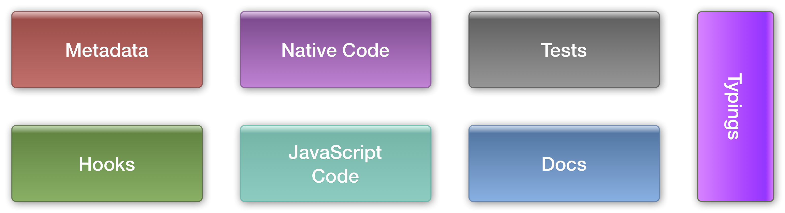
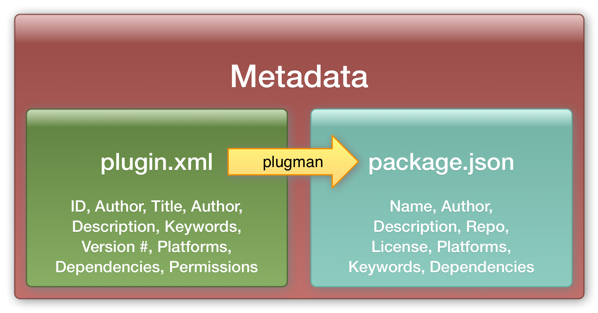
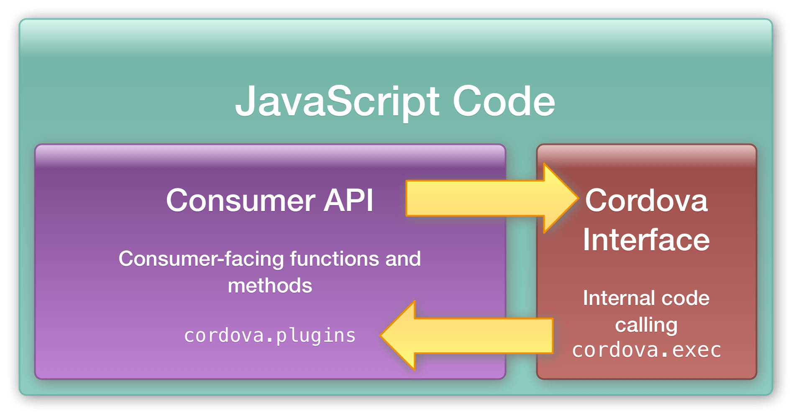
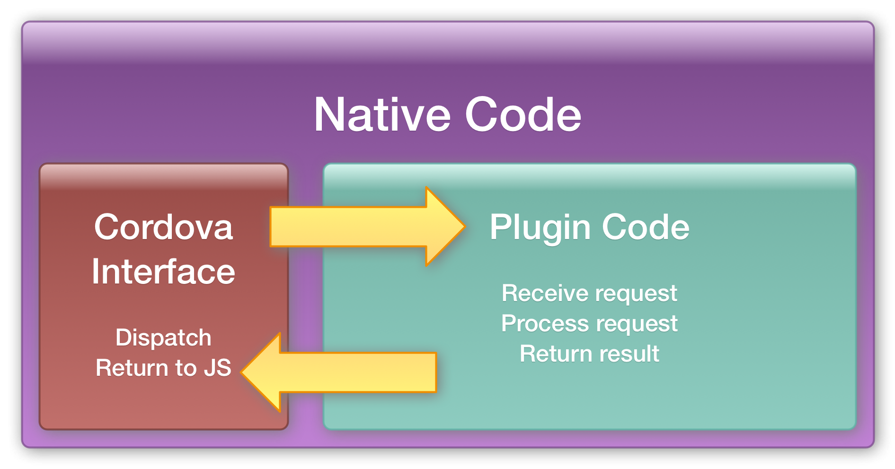
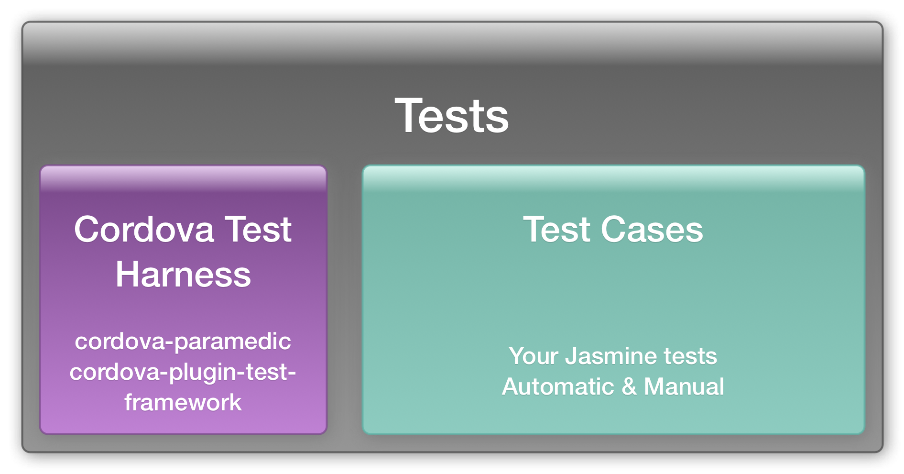
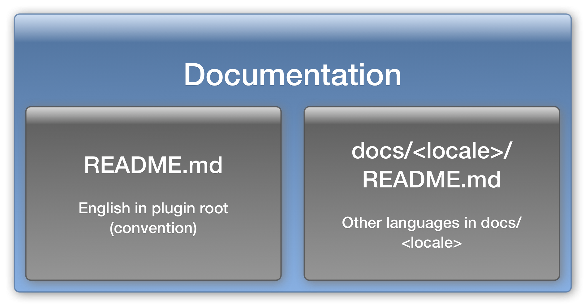
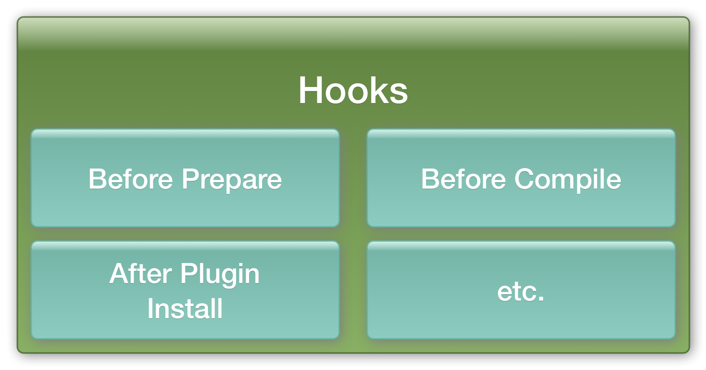

<!-- $size: 16:9 -->
<!-- page_number: true -->
<!-- $theme: elegant -->
<!-- template: dark -->
<!-- $prism: okaidia -->


<!-- footer: Photo by AlexanderStein (https://pixabay.com/en/users/AlexanderStein-45237/), courtesy of Pixabay.com-->

# Fantastic Plugins & 
# How to Make Them

###### Kerri Shotts (@kerrishotts)

###### Jesse MacFadyen (@purplecabbage)

###### https://github.com/kerrishotts/pgday/2017/fantastic-plugins-and-how-to-make-them <!--{style='font-size:90%'}-->

###### Based in part on http://purplecabbage.github.io/slides/pgd16Plugins/index.html 
<!--{h6:style='font-size:80% !important'}-->

---

<!-- footer: https://github.com/kerrishotts/pgday/2017/fantastic-plugins-and-how-to-make-them -->


# About Kerri

 <!-- {style='float: right'} -->


* Used PhoneGap for six+ years
* Author of five books about PhoneGap
* IT Consultant for eight years
* Apache Cordova comitter
* One of many moderators:
    * [Adobe PhoneGap Forums](http://forums.adobe.com/community/phonegap)
    * [Google Cordova Group](https://groups.google.com/forum/#!forum/phonegap)
* [@kerrishotts](https://www.twitter.com/kerrishotts)

---

# About Jesse

* PhoneGap Developer since 2008
* Apache Cordova committer
* at Adobe for nearly 6 years now
* [@purplecabbage](https://www.twitter.com/purplecabbage)

---

# What is a Cordova Plugin?

_noun_ A mystical collection of machine incantations which grant access to amazing and magical capabilities

## ahem... <!-- {style='text-align: center'} -->

_noun_ A module consisting of code and settings extending the essential functionality of Cordova with the goal of providing access to device capabilities, enhancing existing capabilities, or improving the developer's workflow

---

# What can plugins do?

* Anything native at these times:
    * run time
    * build time
    * install time
* Two categories
  * Core &mdash; used to be built in
  * Community &mdash; people like you!

---

# Plugins at run time

Full access to the native SDK and device features. Some examples:

* Push Notifications: [PhoneGap](https://github.com/phonegap/phonegap-plugin-push), [Pushwoosh](https://github.com/Pushwoosh/pushwoosh-phonegap-3.0-plugin), [AeroGear](https://github.com/aerogear/aerogear-cordova-push), [OneSignal](https://github.com/onesignal/OneSignal-Cordova-SDK)
* Storage Plugins: [Native Storage](https://github.com/TheCocoaProject/cordova-plugin-nativestorage), [SQLite](https://github.com/litehelpers/Cordova-sqlite-storage), [SQLite 2](https://github.com/nolanlawson/cordova-plugin-sqlite-2)
* Social Plugins: [Email](https://github.com/hypery2k/cordova-email-plugin), [X SocialSharing](https://github.com/EddyVerbruggen/SocialSharing-PhoneGap-Plugin)
* Audio Plugins: [DBMeter](https://github.com/akofman/cordova-plugin-dbmeter), [Native Audio](https://github.com/floatinghotpot/cordova-plugin-nativeaudio), [Media Picker](https://github.com/an-rahulpandey/cordova-plugin-mediapicker)
* Misc: [Barcode Scanner](https://github.com/phonegap/phonegap-plugin-barcodescanner), [In App Purchase](https://github.com/j3k0/cordova-plugin-purchase), [Google Maps](https://github.com/mapsplugin/cordova-plugin-googlemaps), [Vuforia](https://github.com/mattrayner/cordova-plugin-vuforia), [Microsoft ACE](https://github.com/Microsoft/ace) (native controls)
* Creative Cloud: [Auth](https://github.com/CreativeSDK/phonegap-plugin-csdk-user-auth), [Asset Browser](https://github.com/CreativeSDK/phonegap-plugin-csdk-asset-browser), [Image Editor](https://github.com/CreativeSDK/phonegap-plugin-csdk-image-editor), [Send to Desktop](https://github.com/CreativeSDK/phonegap-template-csdk-send-to-desktop)

<!--
* * Faster computations (compared to JS)
* Expose native device features
    * push notifications, native social network sharing 
* Use native widgets
    * [Microsoft ACE](https://github.com/Microsoft/ace)
* Quality assurance, logging, etc.
* Analytics
-->

---

# Plugins at build time

Full access to the build-time environment and Cordova project. Some examples:

* Transpile and Bundle ES2015+: [Webpack & Transpiler](https://github.com/kerrishotts/cordova-plugin-webpack-transpiler) (Me!)
* Pre-process CSS files (SASS, less, auto-prefixer)
* Check code quality (eslint, tslint, jshint)
* Etc.

---

# Plugins at install time

Full access to the Cordova project and environment at install time. Some ideas:

* Could bundle other plugins
* Could configure the project environment
* Or, could provide tests for another plugin...
    * [Cordova Plugin Test Harness](https://github.com/apache/cordova-plugin-test-framework)

## *Plugin-ception :fireworks:* <!-- {h2:style='text-align:center'} -->

---

# The Core Plugins

Core Cordova features (used to be built-in)

 Plugin              | Plugin          | Plugin <!-- {thead:style='display:none'} -->
:--------------------|:----------------|:----------------
 battery-status      | camera          | console
 contacts            | device          | device-motion
 device-orientation  | dialogs         | file
 file-transfer       | geolocation     | globalization
 inappbrowser        | media           | media-capture
 network-information | ~~splashscreen~~ | statusbar
 vibration           | whitelist

---

# Community Plugins

Extensions provided by the community &mdash; like you!

|                         Repository | Plugins                 |
|-----------------------------------:|:------------------------|
| https://cordova.apache.org/plugins | ~1,960 plugins (&minus; core) |
| http://www.plugreg.com             | ~1,592 plugins (&minus; core) |
| http://plugins.telerik.com/cordova | ~77 plugins             |

---

# Managing Plugins

## or, finding fantastic plugins...

---

# npm

Plugins are typically downloaded from npm:

```sh <!-- cli output=2,4-5,7-8 host=dev -->
cordova plugin add --save cordova-plugin-device

cordova plugin ls                     # or list
cordova-plugin-device 1.1.1 "Device"

cordova plugin rm --save \
        cordova-plugin-device         # or remove
```
<!-- {style='font-size:85%'} -->

<hr>

**Note:** `--save` persists the plugin to `config.xml` so that plugins can be easily restored (done at `prepare`-time) 
**Note:** `--save` should be on by default in `cordova@7.0.0`

---

# Github

Plugins can also be installed from a Github repository.

```sh <!-- cli output=2,4  host=dev -->
cordova plugin add --save \ 
  http://github.com/apache/cordova-plugin-device
cordova plugin rm --save cordova-plugin-device
```
<!-- {style='font-size:80%'} -->

Can specify a branch, too (useful for testing pre-release plugins):

```sh <!-- cli output=2-3 host=dev -->
cordova plugin add --save \
  http://github.com/apache/cordova-plugin-device#branch
```
<!-- {style='font-size:79%'} -->

<hr>

**Note:** Use the plugin's identifier when removing &mdash; not the URL.

---

# Local Filesystem

```sh <!-- cli host=dev output=2,3 -->
cordova plugin add --save [--link] \
  path/to/cordova-plugin-device

cordova plugin rm --save cordova-plugin-device
```
<!-- {style='font-size:90%'} -->

* Use `--link` when developing plugins
	* Changes are reflected automatically &mdash; no `rm` & `add` flow
	* Automatically symlinked if a parent (`../`)

<hr>

**Note:** Careful with parent plugins and child projects &mdash; easy to get circular references in the file system (borks **cp**)

---

# Finding Plugins

* Cordova Plugin Search: https://cordova.apache.org/plugins
* npm: https://www.npmjs.com/search?q=ecosystem:cordova
* Or, if the CLI is more your thing:

    ```sh <!-- cli host=dev output=3-9 -->
    npm install -g npms-cli
    npms search cordova-plugin device --size=5
    ┌────────────────────────────────────────────────────────────────────────────────
    │ Package                                                                        
    ├────────────────────────────────────────────────────────────────────────────────
    │ cordova-plugin-device • https://github.com/apache/cordova-plugin-device        
    │ Cordova Device Plugin                                                          
    │ updated 2 months ago by shazron                                                
    ├────────────────────────────────────────────────────────────────────────────────
    ```
<!-- {style='font-size:75%'} -->

---

# Plugin X-ray :hospital:

## or, what's inside these things?

###### ref: [cordova-plugin-device](http://github.com/apache/cordova-plugin-device)

---



---

# Plugin Structure

```text
cordova-plugin-device/        # plugin root
    doc/<locale>              # documentation other than English (convention)
    src/<platform>            # Platform-specific native code
    |   android/
    |   +   Device.java       # Native Android code
    |   ios/
    |   |   CDVDevice.h       # Native iOS header
    |   +   CDVDevice.m       # Native iOS code
    |       
    tests/                    # Please add tests!
    types/                    # Types for Typescript
    www/                      # Web assets
    +   device.js             # API for JavaScript consumers
    package.json              # npm metadata
    plugin.xml                # plugin metadata and configuration
    README.md                 # English documentation
```
<!-- {style='font-size:55%'} -->

<hr> 

(representational only; not every file is included here); [Device Plugin Code](https://github.com/apache/cordova-plugin-devicehttps://github.com/apache/cordova-plugin-device)


---




<!--
# Metadata

All plugins have metadata and settings in `plugin.xml`

* Unique plugin ID for registration, discovery, and management
* Version number, author, repository, etc.
* Supported platforms, engines, OS versions
* Native headers, source files, resources, JavaScript files
* Configuration preferences, permissions 
* JavaScript API (if exposed to webview)
* Hook scripts and when to run them
-->

---

# Example Metadata (plugin.xml)

```xml
<?xml version="1.0" encoding="UTF-8"?>
<plugin xmlns="http://apache.org/cordova/ns/plugins/1.0"
    xmlns:rim="http://www.blackberry.com/ns/widgets"
    xmlns:android="http://schemas.android.com/apk/res/android"
    id="cordova-plugin-device" version="1.1.5-dev">
    <name>Device</name>
    <description>Cordova Device Plugin</description>
    <license>Apache 2.0</license>
    <keywords>cordova,device</keywords>
    <repo>https://link/to/git/repository.git</repo>
    <issue>https://link/to/issue/reporter.html</issue>
```
<!-- {style='font-size:80%'} -->

<hr>

[Device Metadata](https://github.com/apache/cordova-plugin-device/blob/master/plugin.xml)


---

## JavaScript API Entry

In `cordova-plugin-device`'s `plugin.xml`:

```xml
<js-module src="www/device.js" name="device">
    <clobbers target="device" />
</js-module>
```

Examples: Multiple `clobbers` ^1^,`runs`^2^, `merges`^3^

<hr>

1. [clobbers, in app browser](https://github.com/apache/cordova-plugin-inappbrowser/blob/92ca973b3da3c79fd4bba1e1ca8a12c75a1b6260/plugin.xml#L38)
2. [runs, file transfer](https://github.com/apache/cordova-plugin-file-transfer/blob/master/plugin.xml#L148)
3. [merges, vibration](https://github.com/apache/cordova-plugin-vibration/blob/92bf1132b31ccbc247921020c38c05e3d02af9e3/plugin.xml#L33)

---

## Indicate Platform Support

Using `<platform>` tags:

```xml
<platform name="android">
    ...
</platform>
<platform name="ios">
    ...
</platform>
```

---

## Specifying headers, frameworks, etc.

```xml <!-- highlight=2-3,6-8 number -->
<platform name="android">
  <source-file src="src/android/Device.java" 
               target-dir="src/org/apache/cordova/device" />
</platform>
<platform name="ios">
    <header-file src="src/ios/CDVDevice.h" />
    <source-file src="src/ios/CDVDevice.m" />
    <framework src="libz.tbd" />
</platform>    
```

<hr>

**Note:** Can include third-party libraries too. iOS supports Cocoapods too!

---

## Manifest modifications

* `config-file`^1^
    * Adds elements to manifest
* `edit-config`^2^
    * Edits attributes of existing elements

<hr>

1. [android, file transfer](https://github.com/apache/cordova-plugin-file-transfer/blob/ac2ae8ba2edc099dcde49cd66b810eb225e04d3d/plugin.xml#L50); [ios, geolocation](https://github.com/apache/cordova-plugin-geolocation/blob/96f0830caab4d48a01d97db1d9ec3f4c52b95be3/plugin.xml#L103); [windows, geolocation](https://github.com/apache/cordova-plugin-geolocation/blob/96f0830caab4d48a01d97db1d9ec3f4c52b95be3/plugin.xml#L218)
2. [android, transparent status bar](https://github.com/manugando/cordova-plugin-transparent-status-bar/blob/25c0f913260334ac0d518077c9efd1f66447b107/plugin.xml#L26)

---

# npm Metadata Example

```javascript
{
  "name": "cordova-plugin-device",
  "author": "Apache Software Foundation",
  "license": "Apache-2.0",
  "version": "1.1.5-dev",
  "description": "Cordova Device Plugin",
  "types": "./types/index.d.ts",
  "cordova": { "id": "cordova-plugin-device",
    "platforms": ["android", "ios", "windows", "wp8", ... ] },
  "repository": { "type": "git". "url": "https://..." },
  "keywords": ["cordova", "device", "ecosystem:cordova", "cordova-ios", 
               "cordova-android", ... ],
```
<!-- {style='font-size:69%'} -->

<hr>

[Device Plugin package.json](https://github.com/apache/cordova-plugin-device/blob/master/package.json)

---

# Dependencies

```xml
<!-- plugin.xml -->
<dependency id="cordova-plugin-device" />
<dependency id="cordova-plugin-console" version="^1.0.0" />
```
<!-- {style='font-size:80%'} -->

```javascript
// or in package.json
"engines": {
    "cordovaDependencies": {
        "2.0.0": { //plugin version (applies to any ver 2+)
            "cordova-plugin-console": "> 1.0.0",
        "cordova": "> 1.0.0" // cordova-cli above version 1
}   }   }
```
<!-- {style='font-size:80%'} -->

<hr>

**Note**: don't forget about XML entities! So "`<`" becomes "`lt;`"
Ex 1: [engine, in app browser](https://github.com/apache/cordova-plugin-inappbrowser/blob/92ca973b3da3c79fd4bba1e1ca8a12c75a1b6260/plugin.xml#L32)
Ex 2: [dependency, file transfer](https://github.com/apache/cordova-plugin-file-transfer/blob/ac2ae8ba2edc099dcde49cd66b810eb225e04d3d/plugin.xml#L32)

---


# Creating and Publishing Plugins

## or, the art of crafting plugins

###### :euro: And getting rich, maybe? :euro: 
###### Or maybe not...

---

# plugman

[plugman](https://github.com/apache/cordova-plugman) is a `node` library that manages plugins in your projects. `cordova-cli`, `phonegap-cli`, etc., use `plugman` internally.

* It can also create plugins:

```sh <!-- cli host=dev output=3-5 -->
npm install -g plugman
plugman create --name Abracadabra \
               --plugin_id cordova-plugin-abracadabra \
               --plugin_version 0.0.1 \
               --path .
```
<!-- {style='font-size:75%'} -->

* Pass `--variable-name=value` strings to supply extra config
---

# phonegap-plugin-template

Or, use PhoneGap's plugin template to create a plugin: https://github.com/phonegap/phonegap-plugin-template

```sh <!-- host=dev cli output=2-4,6 -->
npm install -g \
  https://github.com/phonegap/phonegap-plugin-template

# phonegap-plugin-create path name plugin-id
phonegap-plugin-create ./abracadabra Abracadabra \
  cordova-plugin-abracadabra
```
<!-- {style='font-size:80%'} -->

---



---

# Wiring it all up...

:page_facing_up: `www/<plugin>.js` (consumer API)
```javascript
function doSomething(successFn, failureFn, ...args) {
  if (typeof successFn !== "function") {
    throw new Error ("Success callback not function!");
  }
  /* ... */
  cordova.exec(successFn, failureFn, "PluginName", 
               "pluginMethod", args); 
}
```

---



---

# Wiring it all up... (2)

:page_facing_up: `plugin.xml` (class mapping)
```xml
<feature name="PluginName">
    <param name="ios-package" value="CDV<PluginClass>" />
    <param name="onload" value="true" />
</feature>
```
<!-- {style='font-size:90%'} -->


:page_facing_up: `src/ios/CDV<PluginClass>.m` (native code)
```objectivec
- (void) <pluginMethod>:(CDVInvokedUrlCommand*)command {
    // do something useful and optionally return results
}
```
<!-- {style='font-size:90%'} -->

---

# StatusBar Example

:page_facing_up: `www/statusbar.js` (consumer API)
```javascript
// this example has no success/failure callbacks and no
// parameters that need to be passed.

function styleDefault() {
    cordova.exec(null, null, "StatusBar", "styleDefault", []);
}
```
<!-- {style='font-size:85%'} -->

<hr>

[Ref](https://github.com/apache/cordova-plugin-statusbar/blob/95eb824d0ac37b542ffc2dad38d00c11dd1f660b/www/statusbar.js#L51)

---

# StatusBar Example (2)

```xml
<!-- plugin.xml -->
<config-file target="config.xml" parent="/*">
  <feature name="StatusBar">
    <param name="ios-package" value="CDVStatusBar" />
    <param name="onload" value="true" /> <!-- ... -->
```
<!-- {style='font-size:85%'} -->
<br />

```clike
// src/ios/CDVStatusBar.m (native code)
- (void) styleDefault:(CDVInvokedUrlCommand*)command {
    [self setStyleForStatusBar:UIStatusBarStyleDefault];
}
```
<!-- {style='font-size:85%'} -->

<hr>

Refs: [plugin.xml](https://github.com/apache/cordova-plugin-statusbar/blob/95eb824d0ac37b542ffc2dad38d00c11dd1f660b/plugin.xml#L59), [CDVStatusBar.m](https://github.com/apache/cordova-plugin-statusbar/blob/95eb824d0ac37b542ffc2dad38d00c11dd1f660b/src/ios/CDVStatusBar.m#L301)

---

# StatusBar Example (3)

Remember the JS API's call to `cordova.exec`?

```javascript
cordova.exec(null, null, "StatusBar", "styleDefault", []);
```
<!-- {style='font-size:90%'} -->

```text

"StatusBar"     --> <feature name="StatusBar"> (plugin.xml)
                --> <param name="ios-package" 
                           value="CDVStatusBar"/>
                --> CDVStatusBar interface & implementation
"styleDefault"  --> - styleDefault: command (CDVStatusBar.m)
```
<!-- {style='font-size:90%'} -->

---

# Returning data back to JavaScript

```clike
// in CDVStatusBar.m
- (void) fireTappedEvent {
    if (_eventsCallbackId == nil) { return; }
    NSDictionary* payload = @{@"type": @"tap"};
    CDVPluginResult* result = [CDVPluginResult 
        resultWithStatus:CDVCommandStatus_OK  
        messageAsDictionary:payload];
    [result setKeepCallbackAsBool:YES]; // default is NO
    [self.commandDelegate sendPluginResult:result 
        callbackId:_eventsCallbackId];
}
```
<!-- {style='font-size:80%'} -->

<hr>

[Ref](https://github.com/apache/cordova-plugin-statusbar/blob/95eb824d0ac37b542ffc2dad38d00c11dd1f660b/src/ios/CDVStatusBar.m#L157)

---

# Follow the yellow brick bridge?

## or, a look at the code behind the curtain!

---

# Lots of bridges

A bridge is used to cross the gap between the native code context and the web view context.

* iOS

* Android

* Windows is an exception...
  * Careful, the bridge is a **mirage**! :desert:
  * JavaScript is **native** :fireworks:
  * `cordova.exec` uses a proxy

---

<!-- footer: -->


  
---

<!-- footer: https://github.com/kerrishotts/pgday/2017/fantastic-plugins-and-how-to-make-them -->


# Publishing your plugin

* If you want to publish to `npm`, you'll need a `package.json`

* `plugman` can fill create it based on `plugin.xml` for you:

    ```sh <!-- cli host=dev output=1,4 -->
    
    plugman createpackagejson .
    npm publish
    
    ```

* Don't panic if the repo doesn't immediately show your plugin

   * wait a while &mdash; the underlying index has to catch up 

---

# A cool plugin demo

---

# Testing your plugins

## or, the art of making sure it works like it should

###### and improving the lives of developers who use your plugin :smile:

---



---

# Testing plugins

`cordova-medic` is a test tool designed to run all the core Cordova plugin tests as part of Cordova's continuous integration system

* Tests are written in Jasmine 2.0
* Tests run asynchonously
* Plugins have a dependent test plugin which is installed separately (usually in `/tests` by convention)

* Many of these pieces of `cordova-medic` are reusable, so Jesse spun them into another purpose-based tool...

--- 

# cordova-paramedic

> n. *provides advanced levels of care at the point of illness or injury, including out-of-hospital treatment, and diagnostic services*

```sh <!-- cli host=dev output=2 -->
npm install -g cordova-paramedic

cordova-paramedic --platform ios --plugin .
```
<!-- {style='font-size:90%'} -->

Repo &amp; docs: https://github.com/apache/cordova-paramedic


---

# Automates Jasmine Tests

* Creates a new project (in temporary location)
* Adds the platform specified (`ios`, `android`, `windows`, etc.)
* Installs the `cordova-plugin-test-framework` plugin
* Installs the plugin specified (in `.`) (current working directory)
* Installs the plugin's tests (in `./tests`)
* Sets  start page to `cordova-plugin-test-framework`'s test runner
* Creates a local server to listen for results
* Exits with success/fail based on results
<!-- {ul:style='font-size:90%'} -->

<hr>

**Note**: Only supports npm-published platforms

---

# How to write tests

* Copy a core plugin's tests – we all do it!
* Create a `tests` folder in your plugin's repository
* Add a `plugin.xml` file (doesn't need to be complex) [^eg^](https://github.com/apache/cordova-plugin-statusbar/blob/95eb824d0ac37b542ffc2dad38d00c11dd1f660b/tests/plugin.xml)

    ```xml
    <plugin xmlns="http://apache.org/cordova/ns/plugins/1.0"
    xmlns:rim="http://www.blackberry.com/ns/widgets"
    xmlns:android="http://schemas.android.com/apk/res/android"
    id="cordova-plugin-statusbar-tests" version="2.2.3-dev">
      <name>Cordova StatusBar Plugin Tests</name>
      <license>Apache 2.0</license>
      <js-module src="tests.js" name="tests"></js-module>
    </plugin>
    ```

<!--{style='font-size:80%'}-->

---

# Debugging

## or, mastering the dark art of reading your computer's mind

--- 

# Debugging

* Xcode (macOS) / Safari
    * But not concurrently!
* Android Studio / Google Chrome
* Visual Studio (Windows)

---



<!--
# Docs

You should include documentation so that users know how to use your plugin; **good documentation is paramount**

* Look at any of the &ldquo;core&rdquo; plugins for best practices
* Convention:
    * English docs in the root `README.md` file
    * Translations in the `docs/` folder

-->

---



---

# Hooks

*noun* A piece of code that hooks into a Cordova process in order to perform some action on behalf of the plugin; see [dev guide](https://cordova.apache.org/docs/en/latest/guide/appdev/hooks/).

Possibilities:

* Create entitlements as needed
* Transform code (transpile, version # replacement, etc.)
* Create launch images and icons
* Check plugin versions and warn if out-of-date

---

<!--

# A few more things...

* Some platforms support plugins that are separate projects
* Some plugins reference third-party libraries
* Cocoapod support is now in iOS
* Gradle support exists in Android; plugins can actually be AARs

---

-->

# Some more cool plugin ideas

* Optical Character Recognition using Tesseract
* Game controller support
* Apple Pencil, anyone?
* iOS Storage providers
* Audio/video processing

---

# Tips &amp; Tricks

## or, wisdom from those who have gone before

###### and face-palmed for you in your stead...

---

# JS API

  * Promisify your API
    <div style='font-size:65%'>
    
    ```javascript <!-- number highlight=4,6,11,13 -->
    function _promisifyMeMaybe(fn, thisArg) {
      if (typeof Promise === "undefined") { return fn.bind(thisArg); }
      return function _wrapper() {
        return new Promise(function (resolve, reject) {
          fn.apply(thisArg ? thisArg : this,
            [resolve, reject].concat([].slice.call(arguments, 2)));
        }
      }
    }
    function doSomething(successCB, errorCB, options) {
        return (_promisifyMeMaybe(cordova.exec, cordova) 
            (successCB, errorCB, "Abracadabra", "doSomething",
            [arguments.length <= 1 ? successCB : options]));
    }
    ```
    
    </div>

---

# JS API (2)

* Preprocess arguments in JavaScript
    * convert to appropriate types
    * throw type-mistmatch errors, etc.
* Transpile ES2015+ to ES5
    * not all targets understand native ES2015 yet
* Unless creating a polyfill, stick to the `cordova.plugins` namespace. `window` is getting crowded!

---

# Native

  * Return useful error information
  * Use background threads!
  * Be respectful of other plugins
  * TODO: Lazy load?
  * TODO: Init events?

---

# Miscellany

* Don't forget the `browser` platform!
    * Useful when testing on the desktop
        * May need to mock results if no equivalent browser support

* Be kind when using hooks!
    * Your hook runs on your consumer's machine!
    * Don't be evil!
    * `before_prepare` plugin hooks not run on discovery; run the `cordova` command again

---

# Miscellany (2)

* `events.emit("verbose", ...)` and `--verbose` are your friends when troubleshooting hooks
* Likewise, return useful error messages to error callbacks

---

# Homework

* Create a new plugin and publish it to the Cordova plugin repo
* Extend and/or improve a plugin
    * For example, the globalization plugin's API is asynchronous, which is really irritating.
        * All the formatting / globalization information could be determined up-front instead
        * Go for it: https://github.com/apache/cordova-plugin-globalization
* The sky's the limit!

---

# Questions?

## Thanks!

##### Jesse ([@purplecabbage](https://www.twitter.com/purplecabbage))

##### Kerri ([@kerrishotts](https://www.twitter.com/kerrishotts))

###### https://github.com/kerrishotts/pgday/2017/fantastic-plugins-and-how-to-make-them <!--{style='font-size:90%'}-->

###### Based in part on http://purplecabbage.github.io/slides/pgd16Plugins/index.html 
<!--{h6:style='font-size:80% !important'}-->

---

# This slide intentionally left blank