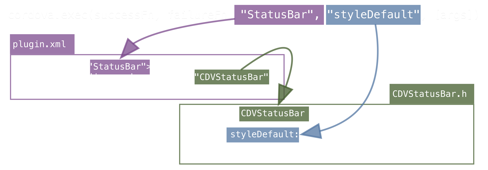
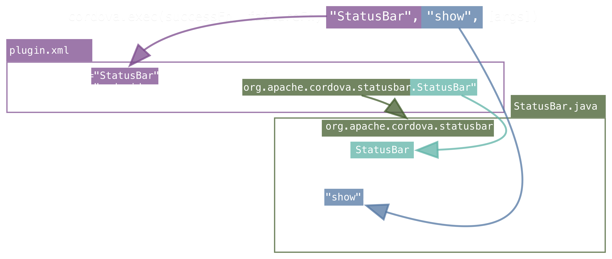

<!-- $size: 16:9 -->
<!-- page_number: true -->
<!-- $theme: elegant -->
<!-- $prism: okaidia -->

<style>
  .slide_bg_img:not([data-alt~="original"]) {
      opacity: 0.3 !important;
  }
  /*.only-headings .slide_bg_img:not([data-alt~="original"]) {
      opacity: 0.6 !important;
  }*/
  .slide_bg_img[data-alt~="o10%"] {
      opacity: 0.1 !important;
  }
  .slide_bg_img[data-alt~="o20%"] {
      opacity: 0.2 !important;
  }
  .slide_bg_img[data-alt~="o30%"] {
      opacity: 0.3 !important;
  }
  .slide_bg_img[data-alt~="o40%"] {
      opacity: 0.4 !important;
  }
  .slide_bg_img[data-alt~="o50%"] {
      opacity: 0.5 !important;
  }
  .slide_bg_img[data-alt~="o60%"] {
      opacity: 0.6 !important;
  }
  .slide_bg_img[data-alt~="o70%"] {
      opacity: 0.7 !important;
  }
  .slide_bg_img[data-alt~="o80%"] {
      opacity: 0.8 !important;
  }
  .slide_bg_img[data-alt~="o90%"] {
      opacity: 0.9 !important;
  }
  .slide_wrapper {
    --text-font-family: 'Helvetica Neue', 'Helvetica', 'Arial', sans-serif !important;;
    --title-font-family: "Helvetica Neue", 'Playball', serif !important;
    --heading-font-family: 'Helvetica Neue', serif !important;
    --quote-font-family: var(--text-font-family);
    --big-quote-font-family: 'Playball', serif;
    --code-font-family: 'Fira Mono', 'Roboto Mono', 'Menlo', 'Courier New', Courier, monospace;
  }
  table.no-border td, table.no-border th {
    border: 0 !important;
  }
</style>


<!-- footer: Photo by AlexanderStein (https://pixabay.com/en/users/AlexanderStein-45237/), courtesy of Pixabay.com-->

# Creating a Modern PhoneGap Plugin <!--{style="color: white"}-->

### Presented by
* Kerri Shotts ([@kerrishotts](https://www.twitter.com/kerrishotts))
* Jesse MacFadyen ([@purplecabbage](https://www.twitter.com/purplecabbage))

### Slides
* PDF: https://goo.gl/fl2nh0
* Based on [PGDay EU 2016 plugin workshop](http://purplecabbage.github.io/slides/pgd16Plugins/index.html) by Jesse

---
<!-- template: default -->
<!-- footer: -->

# About Kerri

 <!-- {style='float: right'} -->


* Used PhoneGap for six+ years
* Author of five books about PhoneGap
* IT Consultant for eight years
* Apache Cordova committer
* One of several moderators:
    * [Adobe PhoneGap Forums](http://forums.adobe.com/community/phonegap)
    * [Google Cordova Group](https://groups.google.com/forum/#!forum/phonegap)
* [@kerrishotts](https://www.twitter.com/kerrishotts)

---

# About Jesse

 <!-- {style='float: right'} -->

* PhoneGap Developer since 2008
* Apache Cordova committer
* At Adobe for nearly 6 years now
* [@purplecabbage](https://www.twitter.com/purplecabbage)

---

# What is a Cordova Plugin?

_noun_ A mystical collection of machine incantations which grant access to amazing and magical capabilities

## ahem... <!-- {style='text-align: center'} -->

_noun_ A module consisting of code and settings extending the essential functionality of Cordova with the goal of providing access to device capabilities, enhancing existing capabilities, or improving the developer's workflow

---

# What can plugins do?

* Anything native code can do
* Active in the following contexts:
    * run time
    * build time
    * install time
* Two sources of Plugins
  * Core &mdash; used to be built in pre-3.x
  * Community &mdash; people like you!

---

# Plugins at Run Time


<!-- footer: Photo by skeeze (https://pixabay.com/en/users/skeeze-272447/), courtesy of Pixabay.com-->

Full access to the native SDK and device features. Some examples:

* Push Notifications: [PhoneGap](https://github.com/phonegap/phonegap-plugin-push), [Pushwoosh](https://github.com/Pushwoosh/pushwoosh-phonegap-3.0-plugin), [AeroGear](https://github.com/aerogear/aerogear-cordova-push), [OneSignal](https://github.com/onesignal/OneSignal-Cordova-SDK)
* Storage Plugins: [Native Storage](https://github.com/TheCocoaProject/cordova-plugin-nativestorage), [SQLite](https://github.com/litehelpers/Cordova-sqlite-storage), [SQLite 2](https://github.com/nolanlawson/cordova-plugin-sqlite-2)
* Social Plugins: [Email](https://github.com/hypery2k/cordova-email-plugin), [X SocialSharing](https://github.com/EddyVerbruggen/SocialSharing-PhoneGap-Plugin)
* Audio Plugins: [DBMeter](https://github.com/akofman/cordova-plugin-dbmeter), [Native Audio](https://github.com/floatinghotpot/cordova-plugin-nativeaudio), [Media Picker](https://github.com/an-rahulpandey/cordova-plugin-mediapicker)
* Misc: [Barcode Scanner](https://github.com/phonegap/phonegap-plugin-barcodescanner), [In App Purchase](https://github.com/j3k0/cordova-plugin-purchase), [Google Maps](https://github.com/mapsplugin/cordova-plugin-googlemaps), [Vuforia](https://github.com/mattrayner/cordova-plugin-vuforia) (AR), [Microsoft ACE](https://github.com/Microsoft/ace) (native controls), [Tesseract](https://github.com/jcesarmobile/cordova-plugin-tesseract-ocr) (OCR, iOS)
* Creative Cloud: [Auth](https://github.com/CreativeSDK/phonegap-plugin-csdk-user-auth), [Asset Browser](https://github.com/CreativeSDK/phonegap-plugin-csdk-asset-browser), [Image Editor](https://github.com/CreativeSDK/phonegap-plugin-csdk-image-editor), [Send to Desktop](https://github.com/CreativeSDK/phonegap-template-csdk-send-to-desktop)
<!--{ul:style="font-size:0.95em"}-->

---


<!-- footer: Photo by Pexels (https://pixabay.com/en/users/Pexels-2286921/), courtesy of Pixabay.com-->

# Plugins at Build Time

Full access to the build-time environment and Cordova project. Some examples:

* Transpile and Bundle ES2015+: [Webpack &amp; Transpiler plugin](https://github.com/kerrishotts/cordova-plugin-webpack-transpiler)
* Pre-process CSS files (SASS, less, auto-prefixer)
* Check code quality (eslint, tslint, jshint)
* Etc.

---


<!-- footer: Photo by PublicDomainPictures (https://pixabay.com/en/users/PublicDomainPictures-14/), courtesy of Pixabay.com-->

# Plugins at Install Time

Full access to the Cordova project and environment at install time. Some ideas:

* Configure the project environment
* Bundle other plugins
* Provide tests for another plugin...
    * [cordova-plugin-test-framework](https://github.com/apache/cordova-plugin-test-framework)

## *Plugin-ception :fireworks:* <!-- {h2:style='text-align:center'} -->

---
<!--footer: -->

# The Core Plugins

Core Cordova Plugins (used to be built-in pre-3.x):

 Plugin              | Plugin          | Plugin <!-- {thead:style='display:none'} -->
:--------------------|:----------------|:----------------
 battery-status      | camera          | console
 contacts            | device          | device-motion
 device-orientation  | dialogs         | file
 file-transfer       | geolocation     | globalization
 inappbrowser        | media           | media-capture
 network-information | ~~splashscreen~~ | statusbar
 vibration           | whitelist

---

# Community Plugins

Devoloped and supported by the community &mdash; like you!

|                         Repository | Plugins                 |
|-----------------------------------:|:------------------------|
| https://cordova.apache.org/plugins | ~2,066 plugins &amp; templates (excl. core) |
| http://www.plugreg.com             | ~1,592 plugins (excl. core) |
| http://plugins.telerik.com/cordova | ~77 plugins             |

---

# Managing Plugins

---

# npm

Plugins are typically downloaded from npm:

```sh <!-- cli output=2,4-5,7-8 prompt=$ -->
cordova plugin add --save cordova-plugin-device

cordova plugin ls                                # or list
cordova-plugin-device 1.1.1 "Device"

cordova plugin rm --save cordova-plugin-device   # or remove
```
<!-- {style='font-size:85%'} -->

<hr>

**Note:** `--save` persists the plugin to `config.xml` so that plugins can be easily restored (done at `prepare`-time) 
**7.0.0:** `--save` will the default action in `cordova@7.0.0`; `--nosave` will turn it off

---

# Git

Plugins can also be installed from a Git repository.

```sh <!-- cli prompt=$ output=2 -->
cordova plugin add http://github.com/apache/cordova-plugin-device

cordova plugin rm cordova-plugin-device
```
<!-- {style='font-size:80%'} -->

Specify a branch: (useful for testing pre-release/edge plugins):

```sh <!-- cli output=2 prompt=$ -->
cordova plugin add http://github.com/apache/cordova-plugin-device
  #branch
```
<!-- {style='font-size:79%'} -->

<hr>

**Note:** Use the plugin's identifier when removing &mdash; not the URL.

---

# Local Filesystem

Or install from the local file system &mdash; very useful for plugin development.

```sh <!-- cli prompt=$ output=2 -->
cordova plugin add --save [--link] /path/to/plugin

cordova plugin rm --save cordova-plugin-device
```
<!-- {style='font-size:90%'} -->

`--link` is useful when developing plugins

<hr>

**Tip:** Adding a plugin to a child project (relative to the plugin) automatically symlinks the plugin
**Note:** Careful with parent plugins and child projects &mdash; easy to get circular references in the file system

---

# Finding Plugins

* Cordova Plugin Search: https://cordova.apache.org/plugins
* npm: https://www.npmjs.com/search?q=ecosystem:cordova
* Or, if the CLI is more your thing:

    ```sh <!-- cli prompt=$ output=3-9 -->
    npm install -g npms-cli
    npms search cordova-plugin device --size=5
    ┌────────────────────────────────────────────────────────────────────────────────
    │ Package                                                                        
    ├────────────────────────────────────────────────────────────────────────────────
    │ cordova-plugin-device • https://github.com/apache/cordova-plugin-device        
    │ Cordova Device Plugin                                                          
    │ updated 2 months ago by shazron                                                
    ├────────────────────────────────────────────────────────────────────────────────
    ```
<!-- {style='font-size:75%'} -->

---


<!-- footer: Photo by dcondrey (https://pixabay.com/en/users/dcondrey-122249/), courtesy of Pixabay.com-->

# Plugin X-ray

---

<!-- footer: -->

# The Stuff Plugins are Made of

 Ingredients  | Ingredients
:------------:|:------------------:
Metadata      | Documentation _^s^_
Native Code \*| JavaScript \*
Tests _^s^_   | Hooks \*
Typings \*    | TLC

**\*** Optional
**_^s^_** Optional but highly suggested

---
<!--footer: -->

Plugin Structure                                       | Description
:------------------------------------------------------|:----------------------------------
cordova-plugin-*your-plugin*/                          | Plugin root
&nbsp;&nbsp; package.json                              | npm metadata
&nbsp;&nbsp; plugin.xml                                | Plugin metadata and configuration
&nbsp;&nbsp; README.md                                 | English documentation
&nbsp;&nbsp; doc/_locale_                              | Documentation other than English
&nbsp;&nbsp; tests/                                    | *Please add tests!*
&nbsp;&nbsp; types/                                    | TypeScript typings
&nbsp;&nbsp; src/_platform_                            | Platform-specific native code
&nbsp;&nbsp;&nbsp;&nbsp; android/                      | Native Android code
&nbsp;&nbsp;&nbsp;&nbsp;&nbsp;&nbsp; *YourPlugin*.java |
&nbsp;&nbsp;&nbsp;&nbsp; ios/                          | Native iOS code
&nbsp;&nbsp;&nbsp;&nbsp;&nbsp;&nbsp; CDV*YourPlugin*.h | 
&nbsp;&nbsp;&nbsp;&nbsp;&nbsp;&nbsp; CDV*YourPlugin*.m | 
&nbsp;&nbsp; www/                                      | JavaScript code &amp; web assets
&nbsp;&nbsp;&nbsp;&nbsp; *yourPlugin*.js               | API for JavaScript consumers
<!-- {table:style='font-size:75%; line-height: 0.965;'} -->
<!-- {table:class='no-border'} -->

<hr> 

(representational; not every file is included here); Ex: [Device Plugin](https://github.com/apache/cordova-plugin-devicehttps://github.com/apache/cordova-plugin-device)


---

# Metadata

<div style="columns: 2">

<div>

### plugin.xml
  
**id**, **version**, author, license, name, description, repo, issue, keywords, platform (&amp; assets), dependencies, engines, preferences, hooks, info, etc.

</div>

<div style="-webkit-column-break-before: always; break-before: column">
  
### package.json

**name**, **version**, author, license, description, repository, issue, keywords, platforms, dependencies

</div>

</div>

Note: **bold is required**; otherwise optional

<hr>

**Note:** `package.json` can be generated by `plugman`; see slide 59

<!--
# Metadata

All plugins have metadata and settings in `plugin.xml`

* Unique plugin ID for registration, discovery, and management
* Version number, author, repository, etc.
* Supported platforms, engines, OS versions
* Native headers, source files, resources, JavaScript files
* Configuration preferences, permissions 
* JavaScript API (if exposed to webview)
* Hook scripts and when to run them
-->

---

## Example Metadata (plugin.xml)

<div style="font-size:79%">

```xml <!--number highlight=1-3 -->
<?xml version="1.0" encoding="UTF-8"?>
<plugin xmlns="http://apache.org/cordova/ns/plugins/1.0"
  xmlns:android="http://schemas.android.com/apk/res/android"
  id="cordova-plugin-device" version="1.1.5-dev">
  <name>Device</name>
  <description>Cordova Device Plugin</description>
  <license>Apache 2.0</license>
  <keywords>cordova,device</keywords>
  <repo>https://git-wip-us.apache.org/repos/asf/
    cordova-plugin-device.git</repo>
  <issue>https://issues.apache.org/jira/browse/CB/
    component/12320648</issue>
```

</div>

<hr>

[Device Plugin's Metadata](https://github.com/apache/cordova-plugin-device/blob/master/plugin.xml)

---

## npm Metadata Example (package.json)

```javascript <!--number-->
{ "name": "cordova-plugin-device",
  "author": "Apache Software Foundation",
  "license": "Apache-2.0",
  "version": "1.1.5-dev",
  "description": "Cordova Device Plugin",
  "types": "./types/index.d.ts",
  "cordova": { 
    "id": "cordova-plugin-device",
    "platforms": ["android", "ios", "windows", "wp8", ... ] },
  "repository": { "type": "git", "url": "https://..." },
  "keywords": ["cordova", "device", "ecosystem:cordova", 
               "cordova-ios", "cordova-android", ... ],
```
<!-- {style='font-size:78%'} -->

<hr>

[Device Plugin's package.json](https://github.com/apache/cordova-plugin-device/blob/master/package.json)


---

# JavaScript Modules

Automatically injected into your consumer's `index.html`. [^docs^](https://cordova.apache.org/docs/en/latest/plugin_ref/spec.html#js-module)

```xml
<js-module src="www/device.js" name="device">
  [<children/>]
</js-module>
```
<!--{style="font-size:90%;"}-->

Children                       | Description
:------------------------------|:------------------------------
`<clobbers target="device" />` | overwrites `window.device`
`<merges target="device" />`   | merges with `window.device`
`<runs />`                     | runs, but doesn't export 
<!--{table:style="font-size:90%;"}-->

* Unless necessary, target `cordova.plugins.yourPlugin`

---

# Indicate Platform Support

Use `<platform>` tags: [^docs^](https://cordova.apache.org/docs/en/latest/plugin_ref/spec.html#platform)

```xml
<platform name="android">
  ...
</platform>
<platform name="ios">
  ...
</platform>
```

<hr>

**Note:** Visible platform support on plugin repo is separately controlled (`package.json` keywords)

---

## Specifying headers, frameworks, etc.

<div style="font-size: 90%">

```xml <!-- highlight=1,4,5,9 number -->
<platform name="android">
  <source-file src="src/android/Device.java" 
    target-dir="src/org/apache/cordova/device" />
</platform>
<platform name="ios">
    <header-file src="src/ios/CDVDevice.h" />
    <source-file src="src/ios/CDVDevice.m" />
    <framework src="libz.tbd" />
</platform>    
```

</div>

<hr>

Other asset tags: `asset`, `resource-file`, `lib-file`; [full docs](https://cordova.apache.org/docs/en/latest/plugin_ref/spec.html)
**Note:** You can include third-party libraries; iOS supports Cocoapods, and Android supports AARs with Gradle.
**Bug:** On iOS hidden (dot) files may not be copied. See [CB-10135](https://issues.apache.org/jira/browse/CB-10135)

---

# Plugin Class Mapping

  * Android ([Geolocation](https://github.com/apache/cordova-plugin-geolocation/blob/96f0830caab4d48a01d97db1d9ec3f4c52b95be3/plugin.xml#L45))
    ```xml
    <config-file target="res/xml/config.xml" parent="/*">
      <feature name="Geolocation">
        <param name="android-package" 
          value="org.apache.cordova.geolocation.Geolocation" /> 
      </feature>
    </config-file>
    ```
    <!--{style="font-size:80%"}-->
  * iOS ([Geolocation](https://github.com/apache/cordova-plugin-geolocation/blob/96f0830caab4d48a01d97db1d9ec3f4c52b95be3/plugin.xml#L93))
    ```xml
    <config-file target="config.xml" parent="/*">
      <feature name="Geolocation">
        <param name="ios-package" value="CDVLocation"/>
      </feature>
    </config-file>
    ```
    <!--{style="font-size:80%"}-->
  * Use `<param name="onload" value="true" />` to init at startup


<!--{ul:style="font-size:85%"}-->

---

# Manifest Modifications

* `config-file`^1^ [^docs^](https://cordova.apache.org/docs/en/latest/plugin_ref/spec.html#config-file)
  * Adds elements to manifests / plist or platform `config.xml`
    ```xml <!-- number -->
    <config-file target="AndroidManifest.xml" parent="/*">
      <uses-permission android:name=
        "android.permission.WRITE_EXTERNAL_STORAGE" />
    </config-file>
    <config-file target="*-Info.plist" 
      parent="NSLocationWhenInUseUsageDescription">
      <string>$GEOLOCATION_USAGE_DESCRIPTION</string>
    </config-file>
    ```
    <!--{style="font-size:80%"}-->

<hr>

1: [android, file transfer](https://github.com/apache/cordova-plugin-file-transfer/blob/ac2ae8ba2edc099dcde49cd66b810eb225e04d3d/plugin.xml#L50); [ios, geolocation](https://github.com/apache/cordova-plugin-geolocation/blob/96f0830caab4d48a01d97db1d9ec3f4c52b95be3/plugin.xml#L103); [windows, geolocation](https://github.com/apache/cordova-plugin-geolocation/blob/96f0830caab4d48a01d97db1d9ec3f4c52b95be3/plugin.xml#L218)

---

# Manifest Modifications (2)

* `edit-config`[^1^](https://github.com/manugando/cordova-plugin-transparent-status-bar/blob/25c0f913260334ac0d518077c9efd1f66447b107/plugin.xml#L26) [^docs^](https://cordova.apache.org/docs/en/latest/plugin_ref/spec.html#edit-config)
  * Edits attributes of existing elements in manifests
  ```xml <!-- number -->
  <edit-config file="AndroidManifest.xml" 
    target="/manifest/application/activity     \
      [@android:name='MainActivity']" 
    mode="merge">
    <activity android:theme="@style/AppTheme" />
  </edit-config>
  ```
  <!--{style="font-size:90%"}-->

---

# Dependencies ( &lt; cordova@6.1.0)

Before `cordova@6.1.0`, `plugin.xml` managed dependencies:

* plugin dependencies[^1^](https://github.com/apache/cordova-plugin-file-transfer/blob/ac2ae8ba2edc099dcde49cd66b810eb225e04d3d/plugin.xml#L32) [^docs^](https://cordova.apache.org/docs/en/latest/plugin_ref/spec.html#dependency)
  ```xml
  <dependency id="cordova-plugin-file" version="^4.0.0" />
  ```
  <!-- {style='font-size:80%'} -->
* platform &amp; tool dependencies[^2^](https://github.com/apache/cordova-plugin-inappbrowser/blob/92ca973b3da3c79fd4bba1e1ca8a12c75a1b6260/plugin.xml#L32) [^docs^](https://cordova.apache.org/docs/en/latest/plugin_ref/spec.html#engines-and-engine)
  ```xml
  <engines>
    <engine name="cordova" version=">=3.1.0" />
  </engines>
  ```
  <!-- {style='font-size:80%'} -->
  
<hr>

**Note**: don't forget about XML entities! So "&lt;" becomes "`&lt;`"

---

# Dependencies (cordova@6.1.0+)

Now dependencies should be managed in `package.json`: [^docs^](https://cordova.apache.org/docs/en/latest/guide/hybrid/plugins/index.html#specifying-cordova-dependencies)

```javascript
"engines": {
  "cordovaDependencies": {
    "2.0.0": { // plugin version (applies to any ver 2+)
      "cordova-plugin-console": ">1.0.0",
      "cordova": ">6.0.0" // cordova-cli above version 6
    }   
  }
}
```
<!-- {style='font-size:80%'} -->

---


# Creating and Publishing Plugins

###### :euro: And getting rich, maybe? :euro: 
###### Or maybe not...

---

# plugman

[plugman](https://github.com/apache/cordova-plugman) is a `node` library that manages plugins in your projects. `cordova-cli`, `phonegap-cli`, etc., use `plugman` internally.

It is also used to create an initial plugin project:

```sh <!-- cli prompt=$ output=3-5 -->
npm install -g plugman
plugman create --name YourPlugin
               --plugin_id cordova-plugin-your-plugin
               --plugin_version 0.0.1
               --path .
```
<!-- {style='font-size:75%'} -->

> Pass `--variable-name=value` strings to supply extra config
---

# phonegap-plugin-template

Or, use PhoneGap's plugin template to create a plugin: https://github.com/phonegap/phonegap-plugin-template

```sh <!-- prompt=$ cli output=2,5 -->
npm i -g https://github.com/phonegap/phonegap-plugin-template

phonegap-plugin-create ./your-plugin YourPlugin
  cordova-plugin-your-plugin    # parameters: path name plugin-id
? license[MIT] [enter]
```
<!-- {style='font-size:80%'} -->

Creates `docs`, `src/android`, `src/ios`, `www`, `plugin.xml`, `package.json`, and `README.md` (as well as some dot files)

---

# Documentation

Documentation is critical; how else will you users know how to use your plugin?

* Location of documentation
    * English goes in `README.md` (plugin root)
    * Other languages in `docs/[locale]/README.md`
* Provide examples, constants, errors that can be thrown, etc.

---


---

# Your Plugin's JS API

In `www/yourPlugin.js` (consumer API):
```javascript
module.exports = {
  add: function(successFn, failureFn, arg1, arg2) {
    if (typeof successFn !== "function") {
      throw new Error("Success callback must be a function");
    }
    /* check remaining types */
    cordova.exec(successFn, failureFn, "YourPlugin", 
                 "add", [arg1, arg2]); 
  }
}
```
<!-- {style='font-size:90%'} -->

---


<!--footer: -->

---

# Your Native Code (iOS)

```objectivec
#import <Cordova/CDV.h>
@interface CDVYourPlugin : CDVPlugin
@end
@implementation CDVYourPlugin
- (void)add:(CDVInvokedUrlCommand*)command {
  double arg1 = [[command argumentAtIndex:1] doubleValue];
  double arg2 = [[command argumentAtIndex:2] doubleValue];
  CDVPluginResult* result = [CDVPluginResult 
    resultWithStatus:CDVCommandStatus_OK messageAsDouble:arg1+arg2];
  [self.commandDelegate sendPluginResult:result 
    callbackId:command.callbackId];
}
@end
```
<!-- {style='font-size:80%'} -->

---

# Your Native Code (Android)

```java
package com.example.yourplugin;
import org.apache.cordova.CordovaPlugin;
import org.apache.cordova.CallbackContext;
import org.apache.cordova.PluginResult;
import org.json.JSONArray;
import org.json.JSONException;
import org.json.JSONObject;
public class YourPlugin extends CordovaPlugin {
  @Override
  public boolean execute(String action, JSONArray args, CallbackContext callbackContext) 
    throws JSONException {
    if ("add".equals(action)) {
      callbackContext.success(args.getDouble(0) + args.getDouble(1));
    } else { return false; }
    return true;
  }
}
```
<!-- {style='font-size:62%'} -->

---

# Your Native Code (Browser / Win)

```javascript
//src/[browser|windows]/yourPluginProxy.js
function add(successFn, failureFn, args) {
  successFn(args[0] + args[1]);
}

module.exports = {
  add: add
};

require("cordova/exec/proxy").add("YourPlugin", 
  module.exports);
```
<!-- {style='font-size:90%'} -->


---

# StatusBar Example

In `www/statusbar.js` (consumer API)
```javascript
function styleDefault() {
    cordova.exec(null, null, "StatusBar", "styleDefault", []);
}
```
<!-- {style='font-size:80%'} -->

In `src/ios/CDVStatusBar.m` (native code)

```objectivec
- (void) styleDefault:(CDVInvokedUrlCommand*)command {
    [self setStyleForStatusBar:UIStatusBarStyleDefault];
}
```
<!-- {style='font-size:80%'} -->

<hr>

Refs: [statusbar.js](https://github.com/apache/cordova-plugin-statusbar/blob/95eb824d0ac37b542ffc2dad38d00c11dd1f660b/www/statusbar.js#L51), [plugin.xml](https://github.com/apache/cordova-plugin-statusbar/blob/95eb824d0ac37b542ffc2dad38d00c11dd1f660b/plugin.xml#L59), [CDVStatusBar.m](https://github.com/apache/cordova-plugin-statusbar/blob/95eb824d0ac37b542ffc2dad38d00c11dd1f660b/src/ios/CDVStatusBar.m#L301)

---

## StatusBar Plugin Class Mapping (iOS)

Remember the JS API's call to `cordova.exec`?



---

## StatusBar Plugin Class Mapping (Android)



---

# Returning data more than once

```objectivec
// in CDVStatusBar.m
- (void) fireTappedEvent {
    if (_eventsCallbackId == nil) { return; }
    NSDictionary* payload = @{@"type": @"tap"};
    CDVPluginResult* result = [CDVPluginResult 
        resultWithStatus:CDVCommandStatus_OK  
        messageAsDictionary:payload];
    [result setKeepCallbackAsBool:YES]; // default is NO
    [self.commandDelegate sendPluginResult:result 
        callbackId:_eventsCallbackId];
}
```
<!-- {style='font-size:80%'} -->

<hr>

[Ref](https://github.com/apache/cordova-plugin-statusbar/blob/95eb824d0ac37b542ffc2dad38d00c11dd1f660b/src/ios/CDVStatusBar.m#L157)

---


<!-- footer: Photo by kaboompics (https://pixabay.com/en/users/kaboompics-1013994/), courtesy of Pixabay.com-->


# Crossing the bridges

---
<!--footer: -->

# Know your Bridges

Allows communication between native code and web view contexts.

* iOS

* Android

* Browser/Windows is an exception...
  * Careful, the bridge is a **mirage**! :desert:
  * JavaScript is **native** :fireworks:
  * `cordova.exec` uses a proxy to keep things consistent
  * [full docs](https://cordova.apache.org/docs/en/latest/guide/platforms/win8/plugin.html#creating-a-windows-plugin-in-javascript)

---

<!-- footer: -->


---


<!-- footer: Photo by PeteLinforth (https://pixabay.com/en/users/PeteLinforth-202249/), courtesy of Pixabay.com-->

# Demo Time

## [cordova-plugin-example-isprime](https://github.com/kerrishotts/cordova-plugin-example-isprime)

---

<!--footer: -->

# Testing your plugins

---


---

# Testing plugins

`cordova-medic` is a test tool designed to run all the core Cordova plugin tests as part of Cordova's continuous integration system

* Tests are written in Jasmine 2.0
* Tests run asynchonously
* Plugins have a dependent test plugin which is installed separately (usually in `/tests` by convention)

* Many of these pieces of `cordova-medic` are reusable, so Jesse spun them into another purpose-based tool...

--- 

# cordova-paramedic

> n. *provides advanced levels of care at the point of illness or injury, including out-of-hospital treatment, and diagnostic services*

```sh <!-- cli prompt=$ output=2 -->
npm install -g cordova-paramedic

cordova-paramedic --platform ios --plugin .
```
<!-- {style='font-size:90%'} -->

Repo &amp; docs: https://github.com/apache/cordova-paramedic


---

# Automates Jasmine Tests

* Creates a new project (in temporary location)
* Adds the platform specified (`ios`, `android`, `windows`, etc.)
* Installs the `cordova-plugin-test-framework` plugin
* Installs the plugin specified (in `.`) (current working directory)
* Installs the plugin's tests (in `./tests`)
* Sets  start page to `cordova-plugin-test-framework`'s test runner
* Creates a local server to listen for results
* Exits with success/fail based on results
<!-- {ul:style='font-size:90%'} -->

<hr>

**Note**: Only supports npm-published platforms

---

# How to write tests

* Copy a core plugin's tests – we all do it!
* Create a `tests` folder in your plugin's repository
* Add a `plugin.xml` file (doesn't need to be complex) [^eg^](https://github.com/apache/cordova-plugin-statusbar/blob/95eb824d0ac37b542ffc2dad38d00c11dd1f660b/tests/plugin.xml)

    ```xml
    <plugin xmlns="http://apache.org/cordova/ns/plugins/1.0"
    xmlns:android="http://schemas.android.com/apk/res/android"
    id="cordova-plugin-statusbar-tests" version="2.2.3-dev">
      <name>Cordova StatusBar Plugin Tests</name>
      <license>Apache 2.0</license>
      <js-module src="tests.js" name="tests"></js-module>
    </plugin>
    ```

<!--{style='font-size:80%'}-->

---

# Testing Tips

* Automate as much as you can (`exports.defineAutoTests`)
* For tests that can't be automated, use manual tests (`exports.defineManualTests`)
* Don't forget to accept &amp; `done` in your `it` tests when working with callbacks and promises.
* If you've got similar tests, you can build them programatically

---


<!-- footer: Photo by ROverhate (https://pixabay.com/en/users/ROverhate-1759589/), courtesy of Pixabay.com-->

# Debugging &amp; Iterating

--- 


# Debugging &amp; Iterating

* Be sure to `--link` your plugin for easier development

* Xcode (macOS) / Safari
    * But not concurrently!
* Android Studio / Google Chrome
* Visual Studio (Windows)

---


<!-- footer: Photo by bernswaelz (https://pixabay.com/en/users/bernswaelz-1728198/), courtesy of Pixabay.com-->


# What gets --linked?

* app's `plugins/<your-plugin>` is symlinked to your plugin
* Native code in app's `platforms/`

Exceptions &amp; notes:

* `plugin.xml` changes require an `rm` &amp; `add`
* `www` only propagates to `platforms/` at next `prepare`
* `platform rm` &amp; `add` won't preserve `--link`s ([CB-12597](https://issues.apache.org/jira/browse/CB-12597))

---
<!--footer: -->


<!-- footer: Photo by Tama66 (https://pixabay.com/en/users/Tama66-1032521/), courtesy of Pixabay.com-->

# Hook

*noun* A piece of code that hooks into a Cordova process in order to perform some action on behalf of the plugin; see [dev guide](https://cordova.apache.org/docs/en/latest/guide/appdev/hooks/).

Possibilities:

* Create entitlements as needed
* Transform code (transpile, version # replacement, etc.)
* Create launch images and icons
* Check plugin versions and warn if out-of-date
* **Note:** NOT supported by PhoneGap Build

---


# Publishing your plugin

* If you want to publish to `npm`, you'll need a `package.json`

* `plugman` can generate it based on `plugin.xml` for you:

    ```sh <!-- cli prompt=$ -->    
    plugman createpackagejson .
    ```

* If you used the PhoneGap Plugin Template, `package.json` is already there &mdash; you'll need to update it.

* Once `package.json` is correct, publish via:
    ```sh <!-- cli prompt=$ -->    
    npm publish
    ```


---


<!-- footer: Photo by Pexels (https://pixabay.com/en/users/Pexels-2286921/), courtesy of Pixabay.com-->


# Tips &amp; Tricks

<!--

---

# JS API
    
    ```javascript <!-- number highlight=4,6,11,13 ->
    function _promisifyMeMaybe(fn, thisArg) {
      if (typeof Promise === "undefined") { return fn.bind(thisArg); }
      return function _wrapper() {
        return new Promise(function (resolve, reject) {
          fn.apply(thisArg ? thisArg : this,
            [resolve, reject].concat([].slice.call(arguments, 2)));
        }
      }
    }
    function doSomething(successCB, errorCB, options) {
        return (_promisifyMeMaybe(cordova.exec, cordova) 
            (successCB, errorCB, "Abracadabra", "doSomething",
            [arguments.length <= 1 ? successCB : options]));
    }
    ```
-->

---


# JavaScript API

* Promisify your API
* Preprocess arguments in JavaScript
    * convert to appropriate types
    * throw type-mismatch errors, etc.
* Transpile ES2015+ to ES5
* Stick to the `cordova.plugins` namespace
    * Unless creating a polyfill; **window** is crowded!
* Return useful error messages to error callbacks

---


# Native

* Return useful error information
* Use background threads for processing
  * [iOS documentation](https://cordova.apache.org/docs/en/latest/guide/platforms/ios/plugin.html#threading)
  * [Android documentation](https://cordova.apache.org/docs/en/latest/guide/platforms/android/plugin.html#threading)
* Avoid init at app startup unless necessary
    ```xml
    <param name="onload" value="false" />
    ```
* Use `onReset` method to clean up when web view navigates[^1^](https://github.com/apache/cordova-plugin-statusbar/blob/master/src/ios/CDVStatusBar.m#L153) [^:apple:^](https://github.com/apache/cordova-ios/blob/636113f047ee2c7dae742dff2beafae2121ceb62/CordovaLib/Classes/Public/CDVPlugin.m#L154)
[^:robot:^](https://github.com/apache/cordova-android/blob/master/framework/src/org/apache/cordova/CordovaPlugin.java#L348)
---

# Native (Android)

* Override `pluginInitialize` for plugin initialization logic[^code^](https://github.com/apache/cordova-android/blob/master/framework/src/org/apache/cordova/CordovaPlugin.java#L72)

* Runtime Permission Requests (Marshmallow) [^docs^](https://cordova.apache.org/docs/en/latest/guide/platforms/android/plugin.html#runtime-permissions-cordova-android-500)
  * `cordova.requestPermission()`[^code^](https://github.com/apache/cordova-android/blob/master/framework/src/org/apache/cordova/CordovaPlugin.java#L397)
  * `cordova.hasPermission()`[^code^](https://github.com/apache/cordova-android/blob/master/framework/src/org/apache/cordova/CordovaPlugin.java#L407)
  * Override `onRequestPermissionResult`[^code^](https://github.com/apache/cordova-android/blob/master/framework/src/org/apache/cordova/CordovaPlugin.java#L418)
* Don't forget Android activity lifecycle [^docs^](https://cordova.apache.org/docs/en/latest/guide/platforms/android/plugin.html#launching-other-activities) [^code^](https://github.com/apache/cordova-android/blob/master/framework/src/org/apache/cordova/CordovaPlugin.java#L143)

---

# Native (iOS)

* Use `pluginInitialize` for plugin initialization logic[^3^](https://github.com/apache/cordova-plugin-statusbar/blob/master/src/ios/CDVStatusBar.m#L107) [^code^](https://github.com/apache/cordova-ios/blob/636113f047ee2c7dae742dff2beafae2121ceb62/CordovaLib/Classes/Public/CDVPlugin.m#L83)
* If memory is getting low, `onMemoryWarning` is called[^code^](https://github.com/apache/cordova-ios/blob/636113f047ee2c7dae742dff2beafae2121ceb62/CordovaLib/Classes/Public/CDVPlugin.m#L149)
* If app is going to be terminated, `onAppTerminate` is called[^code^](https://github.com/apache/cordova-ios/blob/636113f047ee2c7dae742dff2beafae2121ceb62/CordovaLib/Classes/Public/CDVPlugin.m#L144)
* You can respond to `pause`, `resume`, etc.[^code^](https://github.com/apache/cordova-ios/blob/636113f047ee2c7dae742dff2beafae2121ceb62/CordovaLib/Classes/Public/CDVPlugin.m#L123), but you have to register for notifications in `pluginInitialize`
* If you need to handle URLs, override `handleOpenURL`[^code^](https://github.com/apache/cordova-ios/blob/636113f047ee2c7dae742dff2beafae2121ceb62/CordovaLib/Classes/Public/CDVPlugin.m#L130)
* Never, _ever_ call JavaScript that triggers blocking UI (e.g. `alert`)
  * If you must, use `setTimeout()`

<!--{ul^1:style="font-size:95%"}-->

---


# Miscellaneous

* Don't forget the `browser` platform!
    * Useful when testing on the desktop
    * Mock results if no equivalent browser support

* Be kind when using hooks!
    * **Don't be evil!** Your hook executes on your user's machine!
    * `before_prepare` plugin hooks not run on discovery; run the `cordova` command again
    * `events.emit("verbose", ...)` and `--verbose` are your friends when troubleshooting

---


<!-- footer: Photo by geralt (https://pixabay.com/en/users/geralt-9301/), courtesy of Pixabay.com-->

# Homework

* Create a new plugin and add it to a Cordova project
* Extend and/or improve a plugin
    * For example, the globalization plugin's API is asynchronous, which is really irritating.
        * All the formatting / globalization information could be determined up-front instead
        * Try it: https://github.com/apache/cordova-plugin-globalization
* The sky's the limit!

---


<!-- footer: Photo by Pexels (https://pixabay.com/en/users/Pexels-2286921/), courtesy of Pixabay.com-->


# Some more cool plugin ideas

* Game controller support
* Apple Pencil / Stylus support (pressure, tilt)
* Cloud storage support (Dropbox, Google Drive, etc.)
* Audio/video processing
* Faster computation than JavaScript


---
<!--footer: -->

# Questions?

## Thanks!

#### Jesse ([@purplecabbage](https://www.twitter.com/purplecabbage)) &bullet; Kerri ([@kerrishotts](https://www.twitter.com/kerrishotts))

###### Slides available at: https://goo.gl/fl2nh0

###### Based in part on Jesse's [PG Day 2016 EU plugin workshop](http://purplecabbage.github.io/slides/pgd16Plugins/index.html)


---

###### This slide intentionally left blank