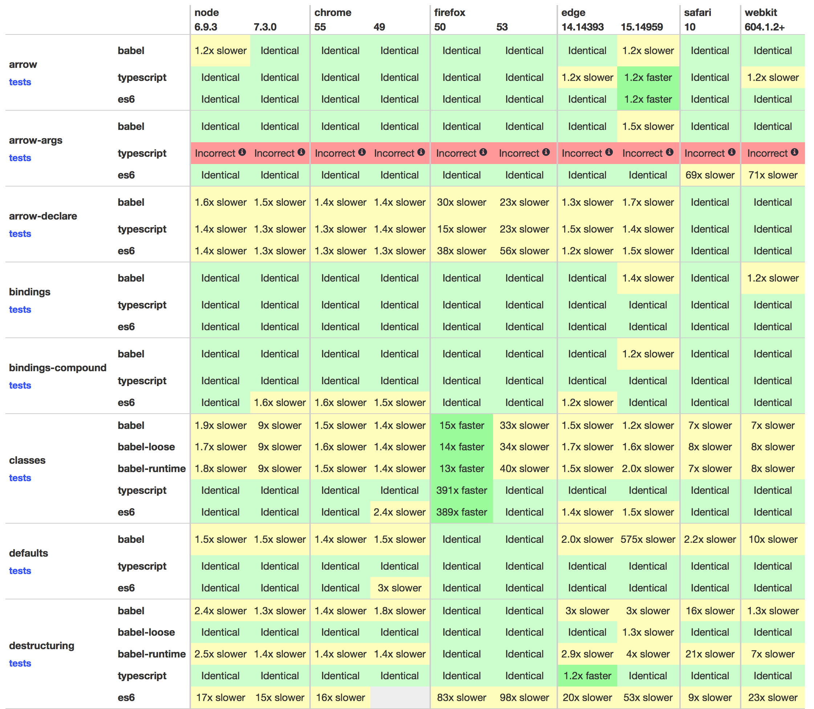

<!-- $size: 16:9 -->
<!-- page_number: true -->
<!-- $theme: elegant -->
<!-- $prism: default -->


<!-- footer: Image by Pete Linforth (https://pixabay.com/en/users/PeteLinforth-202249/), courtesy of Pixabay.com -->

# Modern JavaScript<br/> and PhoneGap <!--{style="color:white"}-->

## PhoneGap Day EU 2017 <!--{style="color:white"}-->

##### Kerri Shotts &bullet; [@kerrishotts](https://www.twitter.com/kerrishotts) <!--{style="color:white"}-->
<!--{h5:style="color:white"}-->

---
<!-- template: light -->

<!-- footer: https://github.com/kerrishotts/pgday/blob/master/2017/modern-javascript-and-phonegap -->

# About Me

 <!-- {style='float: right'} -->

* Used PhoneGap for over six years
* Authored Five books about PhoneGap
* Apache Cordova committer
* One of many moderators at:
    * [Cordova Google Group](https://groups.google.com/forum/#!forum/phonegap)
    * [PhoneGap Adobe Forums](http://forums.adobe.com/community/phonegap)
* I love retro technology and ST:TNG :wink:
---

# Remember ECMAScript 5?

Release year: 2009

* The version we all know and love (~ish?)
* Supported by all modern mobile web views^1^
    * iOS 6+, IE 10+, Edge (forever), Android 4.4+
* Lots of good things:
    * `map`, `reduce`, getters/setters, etc.

<hr>

1.  http://caniuse.com/#feat=es5

---

# ES2015 and beyond

<div style='font-size:110%'>

Version| Feature                               | Feature <!-- {tr:style='display:none'} -->
------:|:--------------------------------------|:-----------
2015^1^|Block-scoped `let` &amp; `const` <!-- {td:style='width:45%'} --> | Destructuring and named parms
       |Default parameters                     | Rest and Spread operator (`...`)
       |`for...of` loops and Iterators         | Arrow functions (`=>`)
       |Template strings &amp; interpolation   | Improved literals (object, `0b10`)
       |Generators (`*`/`yield`)               | Symbols, Maps &amp; Sets, Promises
       |`class` syntactic sugar &amp; `super`  | Modules (`import`, `export`)
2016^2^|Exponent (`**`)                        | `Array.prototype.incudes()`
2017^3^|`async` / `await`                      | String padding :wink:
       |Shared memory                          | Atomics

</div>

<hr>

1: https://github.com/lukehoban/es6features#readme; the list here is not a complete representation of _all_ features
2: http://www.2ality.com/2016/01/ecmascript-2016.html; 3: http://www.2ality.com/2016/02/ecmascript-2017.html

---

<!-- template: dark -->


# Some Very Important Caveats!

---

<!-- template: light -->


# Important Caveats

* ES2015+ is **NOT** a performance optimization
  * See https://kpdecker.github.io/six-speed/
* Typically requires a build step
* Debugging can be interesting
* Some of the syntax is a little _sharp_ &mdash; use with care


   <!--
   * Source maps _help_, but sometimes quirky
   * Getting better
   -->

<!--

* Best iOS performance requires `WKWebView`

   * `UIWebView` performance is _abysmal_
   -->


---



<!--

<hr>

Source: https://kpdecker.github.io/six-speed/ (2017/01/04)

-->

---

<!--
## Some unscientific numbers

|     Device               | GB4 | Web View   | Mode  | ES6 IPF (mips) | ES5 IPF (mips) | ES3 IPF (mips) |
|-------------------------:|----:|:----------:|:-----:|---------------:|---------------:|---------------:|
| MacBook Pro              | 3574| Safari 10  |  reg  |` 75650 (4.51)` |` 79783 (4.75)` |` 78381 (4.67)` |
|                          |     |            |  min  |` 72167 (4.30)` |` 80301 (4.77)` |` 72953 (4.35)` |
| iPad&nbsp;Pro&nbsp;12.9" | 3000| Safari 10  |  reg  |` 81344 (4.88)` |` 81720 (4.89)` |` 83584 (5.01)` |
|                          |     |            |  min  |` 80542 (4.83)` |` 72315 (4.34)` |` 81182 (4.87)` |
| iPad Mini 4              | 1638| Safari 10  |  reg  |` 32791 (1.97)` |` 36222 (2.17)` |` 39195 (2.35)` |
|                          |     |            |  min  |` 36501 (2.19)` |` 38676 (2.32)` |` 36715 (2.20)` |
| Tab S 8.4"               |  783| Chrome 54  |  reg  |`  2614 (0.13)` |`  3350 (0.17)` |`  2394 (0.11)` |
|                          |     |            |  min  |`  2847 (0.14)` |`  3557 (0.19)` |`  1950 (0.09)` |
| iPad&nbsp;Pro&nbsp;12.9" | 3000| UIWebView  |  reg  |`   100 (0.01)` |`   100 (0.01)` |`   100 (0.01)` |
|                          |     |            |  min  |`   100 (0.01)` |`   100 (0.01)` |`   100 (0.01)` |
-->
<!-- {table:style='font-size:70%'} -->

<!--
| iPhone 6s        | 2474| Safari 10  |  reg  |  41 552 (2.49) |  43 811 (2.63) |  42 912 (2.57) |
|                  |     |            |  min  |  41 773 (2.50) |  41 285 (2.48) |  41 411 (2.47) |
-->
<!-- template: dark -->


# Webviews &amp; Performance

<div style="columns: 2; font-size: 95%">

* **WKWebView** (iOS) single-core performance is **excellent**
* Compared to Safari on MBPr\*
    * iPad Pro 12.9&Prime;: roughly equal
    * iPhone 6s: 2&times; slower
    * iPad Mini 4: 2.5&times; slower

* **Android Webview / Chrome** performance is **slow** <!--{li:style="padding-top:1em"}-->; by roughly an order of magnitude
* Compared to Chrome on MBPr:
    * OnePlus One: ~10&times; slower
    * Samsung Tab S 8.4&Prime;: ~33&times; slower

</div>

<hr>

**Note:** Results _highly sensitive_ to the JavaScript features in use. \*MacBook Pro: Late 2014, 2.2GHz i7 16GB RAM <!--; _GB4_ = Geekbench 4 single-core score; _min_ = minified & dead code removed -->
[Left Picture](https://pixabay.com/en/rabbit-hare-animal-cute-adorable-1903016/) by [TPSDave (Pixabay)](https://pixabay.com/en/users/tpsdave-12019/); [Right Picture](https://pixabay.com/en/turtle-nature-animal-wildlife-702829/) by [leovalente (Pixabay)](https://pixabay.com/en/users/leovalente-203647/)

---

<!-- template: dark -->


> #### UIWebView strikes again <!--{style='text-align:center; color: white; position: absolute; left: 0; right: 0; top: 2in;'}-->

---


# Webviews &amp; Performance (2)

<div style="font-size:133%"; >

* UIWebView: *ugh*
    * "Slower than molasses in January"
    * e.g: ~75&times; slower on an iPad Pro 12.9&Prime;
    * No JIT :cry:

</div>


<hr>

**Note:** Results _highly sensitive_ to the JavaScript features in use. MacBook Pro: Late 2014, 2.2GHz i7 16GB RAM <!--; _GB4_ = Geekbench 4 single-core score; _min_ = minified & dead code removed -->
[Picture](https://pixabay.com/en/snail-snail-shell-slow-animal-405384/) by [Mhy (Pixabay)](https://pixabay.com/en/users/Mhy-333962/)

---

<!-- template: light -->

# Performance Takeaways

* Micro-benchmarks aren't the entire story
    * Performance is steadily improving
* Not "News" that most webviews are slow &mdash; true of ES5 too
    * Expected: iOS `WKWebView` is fast (JIT, faster single-core perf)
    * Expected: Android webviews aren't (slower single-core perf)
    * Expected: `UIWebView` is slower than a snail (no JIT)
* Frameworks are using ES2015 more
* More expressive &amp; less boilerplate

---

# Dang it, _this!_

<div style='font-size:95%'>

```javascript <!-- highlight=3,6 number -->
var app = {
  text: "Hello, PG Day Attendees!",
  sayHi: function() { alert(this.text); },
  start: function() {
    document.querySelector("#clickme")
      .addEventListener("click", this.sayHi, false);
  }
}

app.start();
```

</div>

---


<div style="position: absolute; top: 60%; width: 90%; height: 40%; left: 5%; right: 5%; background-color: rgba(255,255,255,0.85); border-radius: 0.5em; border: 1px solid rgba(0,0,0,0.25); display: flex; flex-direction: column;">
  <div style="line-height: 3.5em; padding: 0.5em; margin: auto; width: 100%;">undefined</div>
  <div style="border-top: 1px solid rgba(0,0,0,0.25); color: hsl(220, 75%, 60%); text-align: right; padding: 0.5em">Close</div>
</div>

<!--
# 
-->

---

# Arrow functions

<div style='font-size:85%'>

```javascript <!-- number highlight=3,6 -->
class App {
  constructor() { this.text = "Hello, PG Day Attendees!"; }
  sayHi() { alert(this.text); }
  start() {
    document.querySelector("#clickme")
      .addEventListener("click",() => this.sayHi(), false);
  }
}
const app = new App();
app.start();
```

</div>

<hr>

Line 6 ES5 equivalent: `.addEventListener("click", (function() { this.sayHi(); }).bind(this), false)`

---


<div style="position: absolute; top: 60%; width: 90%; height: 40%; left: 5%; right: 5%; background-color: rgba(255,255,255,0.85); border-radius: 0.5em; border: 1px solid rgba(0,0,0,0.25); display: flex; flex-direction: column;">
  <div style="padding: 0.5em; margin: auto; width: 100%; line-height: 3.5em">Hello, PG Day Attendees!</div>
  <div style="border-top: 1px solid rgba(0,0,0,0.25); color: hsl(220, 75%, 60%); text-align: right; padding: 0.5em">Close</div>
</div>

<!--
# 
-->


---

# Template Strings

```javascript
function sayHello(name) {
  return `Hello, ${name}!`;
}
sayHello("World");  // Hello, World!
```

Complex expressions (*use with care*):

```javascript
function sayComplexHello(name) {
  return `Hello, ${name ? name : "Jane Doe"}!`;
}
```

---

# Promises, Promises

Now with arrow functions:

```javascript
function getPos(options) {
  return new Promise((resolve, reject) => {
    navigator.geolocation.getCurrentPosition(
      resolve, reject, options);
  });
}
```
<!-- {style='font-size:90%'} -->

---

# Destructuring

```javascript
function gotPos(data) {
  const {timestamp, coords:{latitude, longitude}} = data;
  console.log(`At ${latitude},${longitude} on ${timestamp}`);
}
function gotError(err) {
    console.log(`Error ${err.code}: ${err.message}`);
}
getPos().then(gotPos).catch(gotError);
```
<!-- {style='font-size:90%'} -->


```javascript

// Arrays work too:
[a, b] = [b, a]  // swap!
```
<!-- {style='font-size:90%'} -->

---

# async / await (ES2017)

```javascript
async function start() {
  try {
    const pos = await getPos();
    const {timestamp, coords:{latitude, longitude}} = pos;
    console.log(`At ${latitude},${longitude} on ${timestamp}`);
  } catch(err) {
    console.log(`Error ${err.code}: ${err.message}`);
  }
}
```
<!-- {style='font-size:87%'} -->

<hr>

**Note**: `async` poisons the call tree; all callers must also be `async` or treat the response like a `promise`.

---

# Array-like conversion

If only I had a &euro; for every time I've written:

```javascript
var elList = document.querySelectorAll("a"),
    elArr = [].slice.call(elList, 0);
```

ES2015+\*:

```javascript
let elArr = Array.from(document.querySelectorAll("a"));
```

<hr>

\* with the standard library


---

# Spread/Rest is awesome (...)

Even shorter than `Array.from`:

```javascript
let elArr = [...document.querySelectorAll("a")];
```

Easy variadic arguments:
```javascript
function sum(start = 0, ...nums) {
  return nums.reduce((acc, val) => acc + val, start);
}
console.log(sum(1, 5, 10, 99)); /* 115 */
```

<!--

---

# Spread/Rest is awesome (...) (2)

Easy sprintf-like:
```javascript
function sprintf(str, ...replacements) {
    return str.match(/\%[0-9]+/g)
        .reduce((a, v) => a.replace(v, 
                            replacements[v.substr(1)]), str);
}
console.log(sprintf ("%1, %0", "world", "hello"));
```
&rArr; Hello, world

-->

---

# Named Parameters & Defaults

```javascript
function getPicture({quality=50, width=512, height=512}={}) {
  return new Promise((resolve, reject) => {
    navigator.camera.getPicture(resolve, reject, {
      quality, targetWidth: width, targetHeight: height,
      allowEdit: false, correctOrientation: true });
  });
}
getPicture().then(/*...*/);
getPicture({quality:75}).then(/*...*/);
getPicture({height: 1024, width: 1024}).then(/*...*/)
```
<!-- {style='font-size:90%'} -->

<!--

# Sets and Maps

Easy Dedup:

```Javascript
function dedup (arr = []) {
  return Array.from(new Set(arr));
}
```

---


### File Transfer (ES2017)

<div style='font-size:84%'>


```javascript
function uploadFile({source, target, options} = {}) {
  return new Promise((resolve, reject) => (new FileTransfer()).
    upload(url, to, resolve, reject, options));
}
async function start() {
  try {
   const {responseCode, response, bytesSent} = uploadFile({
      url: "cdvfile://localhost/persistent/test.txt",
      to:  "http://www.example.com/upload.php",
      options: { mimeType: "text/plain",
                 fileKey:  "file", fileName: "test" }});
  } catch (err) { /* do something with the error */ }
}
```

</div>

---

### Do you sense a pattern?

```javascript
function promisify(fn, thisArg = this, {split = 0} = {}) {
  return function __promisified__(...args) {
    const afterArgs = args.splice(split), beforeArgs = args;
    return new Promise((resolve, reject) => {
      try {
        fn.apply(thisArg, beforeArgs.concat(resolve, reject, 
          ...afterArgs));
      } catch (err) { resolve(err); }
    });
  }
}
```

---

### Easy wrappers for Cordova plugin APIs!

```javascript
const getLoc = promisify(
  navigator.geolocation.getCurrentPosition, 
  navigator.geolocation // "this" arg
);
const {timestamp, coords:{latitude, longitude}} = await getLoc();

const ft = new FileTransfer();
// upload signature: url, to [split], success, error, options
const uploadFile = promisify(ft.upload, ft, {split: 2});
const r = await uploadFile(url, to, options);
```

<hr>

\* Applies to Cordova plugin APIs that use the success, error form; could be made more generic


---

# Where can I use this now?

-->

---

# Modules

Static Analysis, FTW!

:page_facing_up: math.js:

```javascript
export function add(a, b) { return a+b; }
```
<!-- {style='font-size:90%'} -->

:page_facing_up: index.js:
```javascript
import {add} from "math.js";
console.log(add(4, 3));      // 7
```
<!-- {style='font-size:90%'} -->


---

# Native support is a moving target

|     OS             |   ES2015   |   ES2016   |   ES2017   |
|-------------------:|-----------:|-----------:|-----------:|
| Android (Chrome)   |  97% (51+) | 100% (55+) |  53% (56+) |
|           Edge 15  |      100%  |      100%  |       39%  |
|           Edge 14  |       93%  |         -  |         -  |
|           iOS 11\* |      100%  |      100%  |       98%  |
|            iOS 10  |      100%  |       61%  |       42%  |
|            iOS  9  |       54%  |         -  |         -  |

<hr>

\* Based on current status in Safari Technological Preview 11
**Note**: Some of the tests are based on existence, not completeness. **Sources**: [ES2015](http://kangax.github.io/compat-table/es6/), [ES2016](http://kangax.github.io/compat-table/es2016plus/), [ES2017](http://kangax.github.io/compat-table/esnext/)

---

# ES2015: The Rise of the Transpilers

These can all transpile ES2015\* (feature support may vary)

* [Babel](https://babeljs.io) (n&eacute;e es6to5)
* [TypeScript](https://www.typescriptlang.org)
* [Bubl&eacute;](https://buble.surge.sh) \*\*
* [Traceur](https://github.com/google/traceur-compiler)

<hr>

&nbsp;\* **Note:** Not every ES2015+ feature can be transpiled effectively (if at all), such as proxies, shared memory, atomics, built-in subclassing, and tail call elimination. Also, most transpilers need [core-js](https://github.com/zloirock/core-js) to polyfill the standard library.
\*\* Doesn't attempt to transform non-performant or non-trivial ES6 features; _also very young_

---

> ### Remember module support?

---

<!-- template: dark -->


> ### No Implementation! :scream: <!--{style='text-align:center; color: white; position: absolute; left: 0; right: 0; top: 2in;'}-->

---
<!-- template: light -->


> ### But we can fix that... <!--{style='text-align:center; color: white; position: absolute; left: 0; right: 0; top: 2in;'}-->


---

# Module support using Bundling :shopping:

Dependency management & `import`/`export` (and CommonJS, AMD, etc.) support

* [Webpack](https://webpack.js.org)
* [JSPM](http://jspm.io)
* [Browserify](http://browserify.org)

---

# Execution Options

* Manual
    * Just run each tool's CLI... _every time_...
    * Error prone &mdash; you might forget!
* Automatic
    * Task runners (`gulp` or `grunt`; out-of-scope)
    * `npm` scripts
    * Plugin or Project hooks

---

# Automating with npm scripts

<!-- * Determine ES2015+ code location -->

* Pick your bundler and transpiler

    * Bundler: Webpack 2

    * Transpilers: TypeScript &amp; Babel (showing both configs)

* Install Webpack & Transpiler

* Configure Webpack & Transpiler

* Add scripts to `package.json`

---

<!--

<div style="columns:2">

## Sibling Structure

* :file_folder: `project-root/`
    * :page_facing_up: `config.xml`
    * :file_folder: `www/`
        * :page_facing_up: `index.html`
        * :file_folder: `(ts|es)/`
            * :page_facing_up: `index.(ts|js)`
        * :file_folder: `js/`
            * :page_facing_up: `bundle.js` &larr; (gen)

<!-- {ul^4:class='no_bullets'} --

## External Structure

* :file_folder: `project-root/`
    * :page_facing_up: `config.xml`
    * :file_folder: `www.src/`
        * :page_facing_up: `index.html`
        * :file_folder: `(ts|es)/`
            * :page_facing_up: `index.(ts|js)`
    * :file_folder: `www/`
        * :page_facing_up: `index.html` &larr; (copied)
        * :file_folder: `js/`
            * :page_facing_up: `bundle.js` &larr; (gen)

<!-- {ul^5:class='no_bullets'} --
<!-- {ul^5:style='font-size:80%'} --

</div>

---

-->

# Install Webpack & Transpiler

```sh cli host=dev
npm install --save-dev webpack
```
<!-- {style='font-size:69%'} -->

Typescript:
``` sh cli host=dev output=2
npm install --save-dev ts-loader typescript core-js
```
<!-- {style='font-size:69%'} -->

Babel:

```sh cli host=dev output=2,3
npm install --save-dev babel-loader babel-core babel-polyfill \
  babel-preset-es2015 babel-preset-es2016 babel-preset-es2017 \ 
  babel-plugin-transform-runtime
```
<!-- {style='font-size:69%'} -->

<hr> 

**Note:** `core-js` is a standard library polyfill; depending on your feature use and targets you may not need it.

---

# Configure Transpiler

<div style="columns: 2">

```javascript
// tsconfig.json
{
  "compilerOptions": {
    "allowJs": true,
    "target": "es5",
    "module": "es2015", // DCR
    "lib": ["es2015", ...]
    "inlineSourceMap": true
  },
  "include": 
    ["www(.src)/(es|ts)/**/*"]
}
```
<!-- {style="font-size:75%"} -->

```javascript
// .babelrc
{
  "presets": [
    ["es2015", { 
      "loose": true,
      "modules": false // DCR
    }], 
    "es2016", "es2017"
  ], 
  "plugins": ["transform-runtime"]
}
```
<!-- {style="font-size:75%"} -->

</div>

<hr>

\* Don't forget to import `core-js`(ts)/`babel-polyfill` in your `index.?s` if targeting older runtimes. DCR = tree shaking

---

# webpack.config.js

```javascript
var src = path.resolve(__dirname, "www.src"),
    www = path.resolve(__dirname, "www"),
    loader = "ts-loader"; // or babel-loader
module.exports = {
  context: src, entry: "./es/index.js",
  devtool: "inline-source-map",
  output: { filename: "bundle.js", path: www + "/js" },
  module: { 
    rules: [
      { test: /\.(ts|js|jsx)$/, exclude: /node_modules/,
         use: loader, options: { entryFileIsJs: true } //excl if babel
    } /*, ... other rules as needed */ ]} 
}
```
<!-- {style='font-size:79%;'} -->

---

# Add Scripts

In `package.json`:

```javascript
"scripts": {
  "build:ios": "webpack -d && cordova build ios",
  "build:release:ios": "webpack -p && cordova build ios --release",
  // below requires http-server & npm-run-all to be installed
  "_watch:webpack": "webpack -d -w",
  "_watch:serve": "http-server -p 8080 -c-1 www",
  "watch": "run-p _watch:*"
}
```
<!-- {style='font-size:79%;'} -->

```sh host=dev cli
npm run build:ios
npm run watch
```
<!-- {style='font-size:79%;'} -->

---

# Automating with Plugin Hooks

[cordova-plugin-webpack-transpiler](https://github.com/kerrishotts/cordova-plugin-webpack-transpiler) transforms at `prepare`-time.

```sh <!-- host=dev output=2,3 cli -->
cordova plugin add --save              \ 
  cordova-plugin-webpack-transpiler    \
  --variable CONFIG=typescript|babel|...
```
<!-- {style='font-size:90%'} -->

Executes when `prepare` is called: `build`, `run`, `emulate`, etc.

```sh <!-- host=dev cli -->
cordova build ios             # debug mode
cordova build ios --release   # production mode
cordova run ios --notransform # don't transform
```
<!-- {style='font-size:89%'} -->

---

# Automating with Templates

<div style="font-size:97%">

 Template | Author | Bundler | Transpiler | Frameworks | Automation
---------:|:-------|:-------:|:----------:|:----------:|:----------:
[cordova-template-webpack-ts-scss](https://github.com/kerrishotts/cordova-template-webpack-ts-scss)| Me | Webpack | TypeScript | Vanilla | `cordova`
[cordova-template-webpack-babel-scss](https://github.com/kerrishotts/cordova-template-webpack-babel-scss)| Me | Webpack | Babel | Vanilla | `cordova`
[cordova-template-framework7-vue-webpack](https://www.npmjs.com/package/cordova-template-framework7-vue-webpack)| centrual | Webpack | Babel | Vue, F7 | `cordova`
[phonegap-template-react-hot-loader](https://www.npmjs.com/package/phonegap-template-react-hot-loader)| devgeeks | Webpack | Babel | React | `npm`
[phonegap-vueify](https://www.npmjs.com/package/phonegap-vueify)| lemaur | Browserify | Babel | Vue | `npm`

</div>

<hr>

Automation: "cordova" = Cordova hooks; "npm" = npm scripts

---

# Linting

`eslint` works just fine with ES2015! (`tslint` for Typescript)

```sh <!-- cli host=dev -->
npm install --save-dev eslint
```
<!-- {style='font-size:90%'} -->

:page_facing_up: `package.json`:
```json5
"scripts": {
    "lint": "eslint www.src"
}
```
<!-- {style='font-size:90%'} -->

```sh <!-- host=dev cli output=2 -->
npm run lint    # or, write a plugin /
                # project-level hook! ;-)
```
<!-- {style='font-size:90%'} -->

---

# Tests

```sh <!-- cli host=dev -->
npm install --save-dev mocha chai
npm install --save-dev ts-node        # for TypeScript
npm install --save-dev babel-register # for Babel
```
<!-- {style='font-size:80%'} -->

Add `test` to `package.json:scripts`\*

```javascript
"test": "mocha" // TypeScript (needs ./test/_bootstrap.js)
"test": "mocha --compilers js:babel-register"     // Babel
```
<!-- {style='font-size:90%'} -->

Then `npm test`

<hr>

\* Assumes tests are in `./test`
\_bootstrap.js: `require("ts-node").register();`

---

# Code coverage (Babel)

First, `npm install --save-dev instanbul cross-env nyc`

```javascript
{ // .babelrc
  "presets": ["es2015", ...],
  "plugins": [...],
  "env": { 
    "cover": {
      "plugins": ["transform-es2015-modules-commonjs",
                  "istanbul"]
    }
  } 
}
```
<!-- {style='font-size:85%'} -->

---

# Code coverage (Babel, 2)

```javascript
// package.json
"nyc": {
  "require": ["babel-register"], 
  "reporter": ["text", "html"],
  "sourceMap": false, 
  "instrument": false
},
"scripts": { //...,
  "cover": "cross-env NODE_ENV=cover nyc npm test"
}
```
<!-- {style='font-size:90%'} -->

---

# Tips

* ES5 still works; adjust to ES2015+ at your own speed
* `var` hasn't gone away; it's OK to use it!
  *  Use where performance is critical (e.g., tight nested loops)
* Try to declare `const`/`let` at the top of each scope
  * Benefits Chrome's optimizer
  * Good practice anyway
* Arrow functions aren't necessarily drop-in replacements
  * Can be risky with `describe` & `it` in your tests

---

# Tips (2)

* Minify & remove dead code for release builds
  * Reduces bundle sizes and startup time
* Split code bundles
  * Vendor code can be separately bundled
  * Easier to blacklist in debuggers

<!--

---

# Tips (3)


* Chrome likes to _deopt_ for seemingly odd reasons
    * The inspector will indicate `[deopt]` and the reason

    Reason                              | Workaround
    :-----------------------------------|:-----------------------------------
    Declaration not at top (TDZ issues) | Move declaration to top of function
    Compound assignments                | Use `var` in declaration instead

-->

<!-- {table:style='font-size:80%'} -->

<!--
* Not ES2015+ Specific:
   * Don't use clamped arrays -- *really* slow in Chrome
   * Assigning empty array is faster than `arr.length = 0`
-->

---

<!-- template: dark -->


> ### That's all, folks! <!--{style='text-align:right; color: white; position: absolute; left: 0; right: 0; top: 2in;'}-->

---

<!-- template: light -->


#  Thanks!

#### [@kerrishotts](https://www.twitter.com/kerrishotts)

###### https://github.com/kerrishotts/pgday/blob/master/2017/modern-javascript-and-phonegap

---

###### *This slide intentionally left blank*