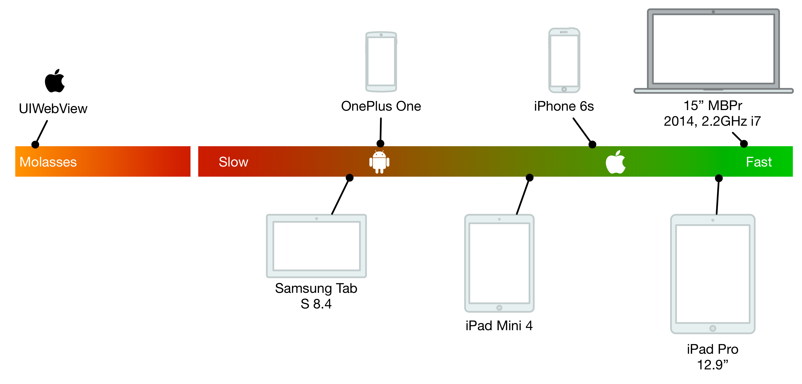

<!-- $size: 16:9 -->
<!-- page_number: false -->
<!-- $theme: elegant -->
<!-- $prism: default -->


<!-- footer: Image by Pete Linforth (https://pixabay.com/en/users/PeteLinforth-202249/), courtesy of Pixabay.com -->

# Modern JavaScript<br/> and PhoneGap <!--{style="color:white"}-->

##### Kerri Shotts &bullet; [@kerrishotts](https://www.twitter.com/kerrishotts) <!--{style="color:white"}-->
<!--{h5:style="color:white"}-->

##### https://kerrishotts.github.io/pgday/ <!--{style="color:white"}-->

---

<!-- template: light -->

<!-- footer:  -->

# About Me

 <!-- {style='float: right'} -->

* Used PhoneGap for over six years
* Authored Five books about PhoneGap
* Apache Cordova committer
* One of many moderators at:
    * [Cordova Google Group](https://groups.google.com/forum/#!forum/phonegap)
    * [PhoneGap Adobe Forums](http://forums.adobe.com/community/phonegap)
* Just started at Adobe

---

<!-- template: dark -->
<!-- footer: TARDIS by Zir at English Wikipedia, CC BY 2.5, https://commons.wikimedia.org/w/index.php?curid=8300120 -->

> > > > **2009**

---

<!-- footer: By nvog86 - Own work, CC BY-SA 3.0, https://commons.wikimedia.org/w/index.php?curid=20238837 -->


# iPhone<br/>3GS <!--{style="background: none; margin-left: -5.9em;"}-->

---

<!-- footer: By Source (WP:NFCC#4), Fair use, https://en.wikipedia.org/w/index.php?curid=49508224 -->


# iOS 3 <!--{style="background: none; padding-left: 4.5em;"}-->

## ES3 (1999) <!--{h2:style="padding-left: 15em;"}-->

---

<!-- footer: By AlvinPing at English Wikipedia, CC BY-SA 3.0, https://commons.wikimedia.org/w/index.php?curid=8406455 -->


# HTC<br/>Hero <!--{style="background: none; margin-left: -5.9em;"}-->

---

<!-- footer: By Android Police - Android Police, CC BY-SA 4.0, https://commons.wikimedia.org/w/index.php?curid=55057830 -->


# Android<br/>1.5 <!--{style="background: none; padding-left: 4.5em;"}-->

## ES3 (1999) <!--{h2:style="padding-left: 15em;"}-->

---

<!-- footer: By Ramaksoud2000 via Chris Williams - Wikipedia via GitHub logo.js, Public Domain, https://commons.wikimedia.org/w/index.php?curid=18434372 -->


# 5 <!--{h1: style="background: none; font-size: 1600%; margin-left: 0.875em;"}-->

---

<!-- footer: -->

# ES5

* The version we all know and love (~ish?)
  * `'use strict';`
  * `map`, `reduce`, `Object.create`, `Object.freeze`, `trim`!
  * JSON parsing
* Supported by all modern mobile web views^1^
    * iOS 6+, IE 10+, Edge (forever), Android 4.4+
    * But not in 2009 &mdash; _no one supported it_

<hr>

1 http://caniuse.com/#feat=es5

---

> > > > **2012** <!--{style="color:#DDD"}-->

<!-- footer: Time Vortex by Cosmic Thunder (https://cosmicthunder.deviantart.com/) -->

---


<!-- footer: By Zach Vega - Own work, CC BY-SA 3.0, https://commons.wikimedia.org/w/index.php?curid=21298355 -->

# iPhone<br/>5 <!--{style="background: none; margin-left: -5em;"}-->

---

<!-- footer: By Self-taken screenshot from an iPhone 5., https://en.wikipedia.org/w/index.php?curid=37500638 -->


# iOS 6 <!--{style="background: none; padding-left: 4.5em;"}-->

## 93% support for ES5 <!--{style="padding-left: 15em;"}-->

###### http://kangax.github.io/compat-table/es5/ <!--{style="font-size: 50%; font-weight: normal; opacity: 0.5; padding-left: 50em;"}-->

---

<!-- footer: By GalaxyOptimus - Own work, CC BY-SA 3.0, https://commons.wikimedia.org/w/index.php?curid=46022690 -->


# Samsung<br/>Galaxy S3  <!--{style="background: none; margin-left: -5em;"}-->

---


<!-- footer: By Android Open Source project, CC BY 2.5, https://commons.wikimedia.org/w/index.php?curid=20262781 -->

# Android 4.1<br/>Jelly Bean <!--{style="background: none; padding-left: 4.5em;"}-->

## 85% support for ES5 <!--{style="padding-left: 15em;"}-->

###### http://kangax.github.io/compat-table/es5/ <!--{style="font-size: 50%; font-weight: normal; opacity: 0.5; padding-left: 50em;"}-->

---

> > > > **2015** <!--{style="color:#DDD"}-->

<!-- footer: Time Vortex by Cosmic Thunder (https://cosmicthunder.deviantart.com/) -->

---
<!-- footer: -->

# :tada: ES2015 :tada:
## n&eacute;e ES6

---

<!-- footer: http://kangax.github.io/compat-table/es5/ & http://kangax.github.io/compat-table/es6/ -->

# iOS 9

## 54% ES2015

---

# Android 5.1

## 25% ES2015


---

<!-- footer: -->

# ES2015 (ES6)

New to the language...

 Feature                               | Feature <!-- {tr:style='display:none'} -->
:--------------------------------------|:-----------
Block-scoped `let` &amp; `const` <!-- {td:style='width:50%'} --> | Destructuring and named parms
Default parameters                     | Rest and Spread operator (`...`)
`for...of` loops and Iterators         | Arrow functions (`=>`)
Template strings &amp; interpolation   | Improved literals (object, `0b10`)
Generators (`*`/`yield`)               | Symbols, Maps &amp; Sets, Promises
`class` syntactic sugar &amp; `super`  | Modules (`import`, `export`)

<hr>

1: https://github.com/lukehoban/es6features#readme; **not** a complete representation of _all_ features

---


> > > > **2016** <!--{style="color:#DDD"}-->

<!-- footer: Time Vortex by Cosmic Thunder (https://cosmicthunder.deviantart.com/) -->

---

# iOS 10

## 100% ES2015 \*

<!-- footer: * Except module implementation; source: http://kangax.github.io/compat-table/es6/ -->

---

# Android (Chrome 50)

## 92% ES2015 \*

---

<!-- footer: -->

# ES2016 / ES7

---

# ES2016 (ES7)

Fewer features, but still important:

|Feature                               <!-- {tr:style='display:none'} -->|
|:--------------------------------------|
|Exponent (`**`)                        |
|`Array.prototype.includes()`           |

<hr>

Source: http://www.2ality.com/2016/01/ecmascript-2016.html

---


> > > > **2017** <!--{style="color:#DDD"}-->

<!-- footer: Time Vortex by Cosmic Thunder (https://cosmicthunder.deviantart.com/) -->

---

<!-- footer: -->

# ES2017


|Feature                               <!-- {tr:style='display:none'} -->|
|:--------------------------------------|
|`async` / `await`                      |
|String padding                         |
|Shared memory                          |
|Atomics                                |

<hr>

Source: http://www.2ality.com/2016/02/ecmascript-2017.html

---


> > > > **2018** <!--{style="color:#DDD"}-->

<!-- footer: Time Vortex by Cosmic Thunder (https://cosmicthunder.deviantart.com/) -->


---
<!-- footer: -->

# ES2018 and beyond

Template Literal Revision: https://tc39.github.io/proposal-template-literal-revision/

Stage 3 Proposals

|       |         |
|:-----:|:-------:|
| `global` | Object Rest/spread |
| async iteration | `import()` |
| RegExp improvements | `Promise.prototype.finally` |
| BigInt | Class Fields |
| Optional `catch` binding | `import.meta` |

---

## https://esdiscuss.org

###### (https://mail.mozilla.org/listinfo/es-discuss)

## https://github.com/tc39/ecma262

---

<!-- template: light -->

## A quick intro to ES2015+

---

# Block. Scoped. Variables. Finally.

```javascript
const NUMBER_OF_DOCTORS = 13;
const MY_DOCTOR = "David Tennant";

let i = NUMBER_OF_DOCTORS;
for (let i = 0; i < 100; i++) {
  console.log(MY_DOCTOR, i); // David Tennant 0, ... 
}
console.log(i);              // 13
```

---

## Constants !== immutable

The variable can't be reassigned, but the contents are still mutable.

```javascript
const THE_DOCTOR = {
  person: "Peter Capaldi"
};

THE_DOCTOR.person = "Jodie Whittaker";
console.log(THE_DOCTOR.person); // Jodie Whittaker
```

---

# _this_ is such a pain...

```javascript
var doctor = {
  greeting: "Hello, %target%! I'm the Doctor!",
  sayHi: function(evt) {
    alert(this.greeting.replace(/%target%/g, 
      evt.target.dataset.target));
  },
  start: function() {
    document.querySelector("#sayHiToK9")
      .addEventListener("click", this.sayHi, false);
  }
}
```

---

## TypeError: undefined is not an object (evaluating 'this.greeting.replace') <!-- {style="color: #A00"} -->

---

# Arrow functions

```javascript
const doctor = {
  greeting: "Hello, %target%! I'm the Doctor!",
  sayHi: function(evt) {
    alert(this.greeting.replace(/%target%/g, 
      evt.target.dataset.target));
  },
  start: function() {
    document.querySelector("#sayHiToK9")
      .addEventListener("click", 
        evt => this.sayHi(evt), false);
  }
}
```

---


# Hello, K9! I'm the Doctor!

---

# Arrow function quirks

Zero or 2+ parameters? Use parentheses:
```javascript
[1, 2, 3].map(() => Math.floor(Math.random() * 100));
[1, 2, 3].map((i, idx) => i * idx);
```

One parameter? Convention is no parentheses:
```javascript
[1, 2, 3].map(i => i * 2);
```

Need only the second?

```javascript
[1, 2, 3].map((_, idx) => idx * 2);
```

---

# Arrow function returns

Single line arrow functions use implicit `return`:

```javascript
[1, 2, 3].map(i => i * 2);
```

Block arrow functions use explicit `return`:

```javascript
[1, 2, 3].map(i => {
  const x = Math.floor(Math.random() * 100);
  return i * x;
});
```

---

# Arrow function ambiguity

But what if we return an object? This won't work:

```javascript
[1, 2, 3].map(i => {i: i * 2});
```

---

# Arrow function ambiguity

But what if we return an object? This won't work:

```javascript
[1, 2, 3].map(i => {i: i * 2}); // is equivalent to:

[1, 2, 3].map(i => {
i:                              // obviously not what
	i * 2;                      // we want :-(
});
```

---

# Arrow function ambiguity

Instead, wrap the object in parentheses:

```javascript
[1, 2, 3].map(i => ({i: i * 2}));
```

Or, just use the block form:

```javascript
[1, 2, 3].map(i => {
  return {i: i * 2};
});
```


---

# Template Literals

Multiline and expression interpolation:

```javascript
function sayHelloAndGoodbye(name) {
  return `Hello, ${name},
Goodbye, ${name}`;
}

console.log(sayHelloAndGoodbye("Doctor"));
// Hello, Doctor!
// Goodbye, Doctor!
```

---

# Template Literals

Arbitrary expressions (*use with care*):

```javascript
function sayComplexHello(name) {
  return `Hello, ${name ? name : "Doctor"}!`;
}

sayComplexHello("Sarah");   // Hello, Sarah!
sayComplexHello();          // Hello, Doctor!
```

---

# Promises, Promises

More concise with arrow functions:

```javascript
function getPos(options) {
  return new Promise((resolve, reject) => {
    navigator.geolocation.getCurrentPosition(
      resolve, reject, options);
  });
}
```

---

# Promises, Promises, Promises

Chaining is easier to read:

```javascript
getPos()
  .then(pos => console.log(JSON.stringify(pos)))
  .catch(err => console.error(err));
```

---

# Destructuring

Do be careful with how far you nest, though.

```javascript
function gotPos(data) {
  let {timestamp, coords:{latitude, longitude}} = data;
  console.log(`${latitude},${longitude}@${timestamp}`);
}
function gotError(err) {
  console.error(`Error received! ${err}`);
}
getPos().then(gotPos).catch(gotError);
```

---

# Destructuring

Not just for objects; arrays work too:

```javascript
function divide(a, b) {
  if (b === 0) {
    return [undefined, new Error("Divide by zero")];
  } else {
    return [a / b, null];
  }
}
const [results, error] = divide(4, 0);
```

---

# async / await (ES2017)

```javascript
async function start() {
  try {
    const pos = await getPos(),
      {coords:{latitude, longitude}} = pos;
    console.log(`${latitude}, ${longitude}`);
  } catch(err) {
    console.error(`Error received! ${err}`);
  }
}
```

<hr>

**Note**: `async` poisons the call tree; all callers must also be `async` or treat the return result like a `promise`.

---

# Array-like conversion

```javascript
// ES 5 way to convert a NodeList to an Array
var elList = document.querySelectorAll("a"),
    elArr = [].slice.call(elList, 0);

// ES2015 method
const elArr=Array.from(document.querySelectorAll("a"));
  
// Can also construct series:
const series = Array.from({length: 8}, 
  (_, idx) => idx * idx); // [0, 1, 4, 9, 16, 25, ...]
```

---

# Rest

Easy variable arguments:
```javascript
function sum(start = 0, ...nums) {
  return nums.reduce((acc, val) => acc + val, start);
}

console.log(sum(1, 5, 10, 99)); // 115 
```

---

# Named Parameters & Defaults

```javascript
function getPicture({quality = 50, width = 512, 
                     height = 512} = {}) {
  return new Promise((resolve, reject) => {
    navigator.camera.getPicture(resolve, reject, {
      allowEdit: false,
      correctOrientation: true, quality, 
      targetWidth: width, targetHeight: height,      
    });
  });
}
```

---

# Named Parameters & Defaults

```javascript
// use all the defaults
getPicture();

// specify only quality
getPicture({quality:75});

// specify only height & width
getPicture({height: 1024, width: 1024});
```

---

# Modules

Static Analysis, FTW!

math.js:

```javascript
export function add(a, b) { return a + b; }
```

index.js:
```javascript
import { add } from "./math.js";
console.log(add(4, 3));      // 7
```

---

# Cool! Where can I use it?

---

# Native support

|     OS             |   ES2015   |   ES2016   |   ES2017   |
|-------------------:|-----------:|-----------:|-----------:|
| Android (Chrome)   |  97% (51+) | 100% (55+) |  53% (56+) |
|  Windows (Edge 15) |      100%  |      100%  |       39%  |
|  Windows (Edge 14) |       93%  |         -  |         -  |
|           iOS 10.3 |      100%  |      100%  |       98%  |
|            iOS 10  |      100%  |       61%  |       42%  |
|            iOS  9  |       54%  |         -  |         -  |

<hr>

**Sources**: [ES2015](http://kangax.github.io/compat-table/es6/), [ES2016+](http://kangax.github.io/compat-table/es2016plus/)

---

# The Rise of the Transpilers

These can all transpile ES2015+\* to ES5:

* [Babel](https://babeljs.io) (n&eacute;e es6to5)
* [TypeScript](https://www.typescriptlang.org)
* [Bubl&eacute;](https://buble.surge.sh) \*\*
* [Traceur](https://github.com/google/traceur-compiler)

<hr>

&nbsp;\* **Note:** Not every ES2015+ feature can be transpiled effectively and to spec (if at all), such as proxies, shared memory, atomics, built-in subclassing, and tail call elimination. Also, most transpilers need to polyfill the standard library.
\*\* Doesn't attempt to transform non-performant or non-trivial ES6 features; _also very young_

---

<!-- template: light -->

# Module Support is problematic

Browsers have only _recently_ started shipping implementations:

* Available now:
	* Safari 10.1+, iOS 10.3+
	* Chrome and Android Webview 61+
* Behind a flag:
	* Edge 15
	* Firefox 54

<hr>

Source: http://caniuse.com/#feat=es6-module

---

# Native Modules

`js/index.js`: 
```javascript
import Game from "./Game.js";
const game = new Game();
game.start();
```

`index.html`: 
```html
<script type="module" src="./js/index.js"></script>
```

---

# There's always a catch

```javascript
import Game from "./Game"; // bare import (won't work)
import Decimal from "Decimal"; // also won't work
```

* No "bare" `import`!
	* Must include the path
	* Must include the extension
	* No node-style resolution

* iOS module loading does not work in PhoneGap / Cordova

---
<!-- template: light -->

# Module support using Bundling :shopping:

Dependency management & `import`/`export` (and CommonJS, AMD, etc.) support

* [Webpack](https://webpack.js.org)
* [JSPM](http://jspm.io)
* [Browserify](http://browserify.org)

You can do more than just bundling:

* Convert SASS to CSS, lint, copy assets, compress assets, etc.

---

## We can supply bundled and unbundled versions:

If you want...

```html
<!-- this script will have modules, and executes in
     modern browsers -->
<script type="module" src="./es/index.js"></script>

<!-- this script won't, and will only execute in 
     older browsers * -->
<script nomodule src="./js/index.js"></script>
```

<hr />

\* Except Safari 10.1. See https://gist.github.com/samthor/64b114e4a4f539915a95b91ffd340acc
See https://jakearchibald.com/2017/es-modules-in-browsers/ for more.

---

# Execution Options

* Manual
* Task runner
    * `gulp`, `grunt`, etc.
    * `npm` scripts
* Automatic
    * Plugin Hooks
    * Project hooks

---

# Automating with npm scripts

* Pick your bundler and transpiler

    * Bundler: Webpack

    * Transpilers: TypeScript &amp; Babel (showing both configs)

* Install Webpack & Transpiler

* Configure Webpack & Transpiler

* Add scripts to `package.json`

---

# Install Webpack

Easy (assuming `package.json` exists):

```sh cli prompt=$
npm install --save-dev webpack
```

---

# Install Transpiler

Typescript:
``` sh cli prompt=$ output=2
npm install --save-dev ts-loader typescript core-js
```

Babel:

```sh cli prompt=$ output=2-4
npm install --save-dev babel-loader babel-core 
  babel-polyfill babel-preset-env
  babel-plugin-transform-runtime
```

<hr> 

**Note:** `core-js` is a standard library polyfill; depending on your feature use and targets you may not need it.

---

# Configure Transpiler

<div style="columns: 2; font-size: 95%">

```javascript
// tsconfig.json
{ "compilerOptions": {
    "allowJs": true,
    "target": "es5",
    "module": "es2015", // DCR
    "lib": ["es2015", ...],
    "sourceMap": true
  },
  "include": 
    ["www.src/es/**/*"]
}
```
<!-- {style="font-size:80%"} -->

```javascript
// .babelrc
{ "presets": [
    ["env", { 
      "loose": true,
      "modules": false // DCR
    }]
  ], 
  "plugins":["transform-runtime"]
}
```
<!-- {style="font-size:80%"} -->

</div>

<hr>

\* Don't forget to import `core-js`(ts)/`babel-polyfill` in your `index.?s` if targeting older runtimes. DCR = tree shaking

---

# webpack.config.js

```javascript
module.exports = {
  devtool: "inline-source-map",
  context: path.resolve(__dirname, "www.src"), 
  entry: { app: ["./es/index.js"] },
  output: { 
    filename: "bundle.js", 
    path: path.resolve(__dirname, "www", "js")
  },
  module: { /*...*/ } 
}
```

---

# webpack.config.js

```javascript
module: {
  rules: [ { 
      test: /\.([t|j]sx?)$/,
      exclude: /node_modules/,
      loader: "ts-loader",           // or babel-loader
      options: { entryFileIsJs: true } // excl if babel
    } /*, ... other rules as needed */ 
  ] 
}
```

---

# npm Scripts

```javascript
"scripts": {
  "sim:ios": "webpack -d && cordova emulate ios",
  "run:ios": "webpack -d && cordova run ios",
  "build:ios": "webpack -d && cordova build ios",
  "build:ios:rel": "webpack -p && cordova build ios 
    --release"
}
```
<!-- {style='font-size:89%;'} -->

`-d`: debug
`-p`: production (minifies as well)

```sh prompt=$ cli
npm run build:ios
```
<!-- {style='font-size:90%;'} -->

---

# Code Splitting

```javascript
module.exports = {
  entry: { 
  	app: ["./es/index.js"],
    vendor: ["core-js"]
  }, /*...*/
  module: { /*...*/ },
  plugins: [
  	new webpack.optimize.CommonsChunkPlugin({
      name: "vendor", filename: "vendor.js"})
  ]
}

```

---

# ... don't forget to update index.html

`www/index.html`:
```html
<body>
  <script type="text/javascript" src="js/vendor.js">
  </script>
  <script type="text/javascript" src="js/bundle.js">
  </script>
</body>
```

---

# Automating with Plugin Hooks

[cordova-plugin-webpack-transpiler](https://github.com/kerrishotts/cordova-plugin-webpack-transpiler) transforms at `prepare`-time.

```sh <!-- prompt=$ output=2,3 cli -->
cordova plugin add cordova-plugin-webpack-transpiler
  --variable CONFIG=typescript|babel|...
```
<!-- {style='font-size:89%'} -->

Executes when `prepare` is called: `build`, `run`, `emulate`, etc.

```sh <!-- prompt=$ cli -->
cordova build ios               # debug mode
cordova build ios --release     # production mode
cordova run ios --notransform   # skip transform/bundle
```
<!-- {style='font-size:89%'} -->

---

# Automating with Templates

 Template | Author | Bundler | Transpiler | Frameworks | Automation
---------:|:------:|:-------:|:----------:|:----------:|:----------:
[cordova-template-webpack-ts-scss](https://github.com/kerrishotts/cordova-template-webpack-ts-scss)| Me | Webpack | TypeScript | Vanilla | `cordova`
[cordova-template-webpack-babel-scss](https://github.com/kerrishotts/cordova-template-webpack-babel-scss)| Me | Webpack | Babel | Vanilla | `cordova`
[cordova-template-framework7-vue-webpack](https://www.npmjs.com/package/cordova-template-framework7-vue-webpack)| centrual | Webpack | Babel | Vue, F7 | `cordova`
[phonegap-template-react-hot-loader](https://www.npmjs.com/package/phonegap-template-react-hot-loader)| devgeeks | Webpack | Babel | React | `npm`
[phonegap-template-vue-f7-blank](https://www.npmjs.com/package/phonegap-template-vue-f7-blank)| devgeeks | Webpack | Babel | Vue, F7 | `npm`
[phonegap-template-vue-f7-split-panel](https://www.npmjs.com/package/phonegap-template-vue-f7-split-panel)| devgeeks | Webpack | Babel | Vue, F7 | `npm`
[phonegap-template-vue-f7-tabs](https://www.npmjs.com/package/phonegap-template-vue-f7-tabs)| devgeeks | Webpack | Babel | Vue, F7 | `npm`
[phonegap-vueify](https://www.npmjs.com/package/phonegap-vueify)| lemaur | Browserify | Babel | Vue | `npm`

<!--{table:style="font-size:70%"}-->

---

###### [Video](./assets/templatevideo.mp4)


---

<!-- template: light -->

# Reality Check...

* Don't switch to ES2015+ because you expect performance improvements
  * See https://kpdecker.github.io/six-speed/ (as of 2017-01-04)


---

**Webview**
**ES2015+ Perf**
(Not to scale)


<!--


* **WKWebView** (iOS) single-core performance is **excellent**
* Compared to Safari on MBPr\*
    * iPad Pro 12.9&Prime;: roughly equal
    * iPhone 6s: 2&times; slower
    * iPad Mini 4: 2.5&times; slower

* **Android Webview / Chrome** performance is **slow**; by roughly an order of magnitude
* Compared to Chrome on MBPr:
    * OnePlus One: ~10&times; slower
    * Samsung Tab S 8.4&Prime;: ~33&times; slower


<hr>

**Note:** Results _highly sensitive_ to the JavaScript features in use.

-->

---

<!-- template: light -->

<!-- footer: UIWebView's performance is highly dependent upon language features used. -->



<!--

# Webviews &amp; Performance (2)

* UIWebView: *ugh*
    * "Slower than molasses in January"
    * e.g: ~75&times; slower on an iPad Pro 12.9&Prime;
    * No JIT :cry:

-->

---

<!-- footer: -->

# More Reality Checks

* Build step
* Debugging can be "fun"
* Some of the syntax can be a little _sharp_ &mdash; handle with care

---

<!-- template: light -->

# Euuuuggghhhh!!!

## Way to crush my dreams!

---

# Not really....

* Micro-benchmarks aren't the entire story
	* Engines are continually improving

* Actual performance deltas are highly variable 
	* Depends on platform and the language features in use

* Lots of benefits:
	* Expressive and concise
	* Less boilerplate
	* Modules, Template literals, and more!

---

# Tips

* ES5 still works
* Use ES2015+ as needed and when you're ready
* `var` is alive and well
  *  Use where performance is critical (e.g., tight nested loops)
* Arrow functions aren't drop-in
  * `this` is lexically scoped

---

# Tips

* Minify & remove dead code for release builds
  * Reduces bundle sizes and startup time
* Split code bundles
  * Vendor code can be separately bundled
  * Easier to blacklist in debuggers
* Use `WKWebView` on iOS for best performance

---

# Resources

* https://esdiscuss.org
* [ECMAScript 2015 Support in Mozilla](https://developer.mozilla.org/en-US/docs/Web/JavaScript/New_in_JavaScript/ECMAScript_2015_support_in_Mozilla)
* [ES2015 Compatibility Table](http://kangax.github.io/compat-table/es6/)
* [2ality - JavaScript and more](http://2ality.com)
* [Can I Use](http://caniuse.com)
* [WebKit Feature Status](https://webkit.org/status/)
* [Chrome Platform Status](https://www.chromestatus.com/features)

---

#  Thanks!

#### [@kerrishotts](https://www.twitter.com/kerrishotts)

#### https://kerrishotts.github.io/pgday/

---

###### *This slide intentionally left blank*