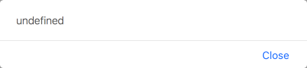

<!-- $size: 16:9 -->
<!-- page_number: true -->
<!-- $theme: evening -->

# Modern JavaScript and PhoneGap

## PhoneGap Day EU 2017

###### Kerri Shotts &bullet; [@kerrishotts](https://www.twitter.com/kerrishotts)

---

# Hi!

 <!-- {style='float: right'} -->

* I've Used PhoneGap for over six years
* I've written five books about PhoneGap
* I work with clients to create various kinds of apps
* I'm an Apache Cordova committer
* I'm one of several moderators on the [Cordova Google Group](https://groups.google.com/forum/#!forum/phonegap) and [PhoneGap Adobe Forums](http://forums.adobe.com/community/phonegap) &mdash; If you haven't checked out the latter, you should!
* I love retro technology! :-)

---

# Modern JavaScript Versions

---

# Remember ECMAScript 5?

Release year: 2009

* The version of JavaScript we all know and love (~ish?)
* Supported by all modern mobile web views^1^
    * iOS 6+, IE 10+, Edge (forever), Android 4.4+
* Reasonably modern (`map`, `reduce`, getters/setters, etc.)
* Things have changed a lot since then...

<hr>

1.  http://caniuse.com/#feat=es5

---

Version| Feature                               | Feature <!-- {tr:style='display:none'} -->
------:|:--------------------------------------|:-----------
2015^1^|Block-scoped `let` & `const` <!-- {td:style='width:45%'} --> | Destructuring and named parms
       |Default parameters                     | Rest and Spread operator (`...`)
       |`for...of` loops and Iterators         | Arrow functions (`=>`)
       |Template strings & interpolation       | Improved literals (object, `0b10`)
       |Generators (`*`/`yield`)               | Symbols, Maps & Sets, Promises
       |`class` syntactic sugar & `super`      | Modules (`import`, `export`)
2016^2^|Exponent (`**`)                        | `Array.prototype.incudes()`
2017^3^|`async` / `await`                      | String padding :wink:
       |Shared memory                          | Atomics
<!-- {table:style='font-size:83.25%'} -->

<hr>

1. https://github.com/lukehoban/es6features#readme; the list here is not a complete representation of _all_ features
2. http://www.2ality.com/2016/01/ecmascript-2016.html
3. http://www.2ality.com/2016/02/ecmascript-2017.html

---

## Before we go any further...

# Some Very Important Caveats!

---

# Caveats

* May need training to use / read effictively
* **Not** a performance optimization
* Adds a built step
* Debugging can be difficult
   * Source maps _help_, but they can be quirky
   * Getting better all the time
* Best iOS performance requires `WKWebView`
   * `UIWebView` performance is _abysmal_

---

<style>
    td.bad {
        background-color: hsl(45, 50%, 25%) !important;
    }
    td.abysmal {
        background-color: hsl(350, 50%, 50%) !important;
        color: white !important;
    }
    td.good {
        background-color: hsl(140, 50%, 25%) !important;
    }
    td.great {
        background-color: hsl(140, 50%, 50%) !important;
        color: white !important;
    }
</style>
<table style="font-size:82%; text-align: center">
  <thead>
    <tr>
      <th align="right">Performance Change</th><th>Chrome 55</th><th>Edge 15</th><th>Safari 10</th>
    </tr>
  </thead>
  <tbody>
    <tr><th align="right">Arrow functions  </th><td>N/C</td><td class="good">+1.2x</td><td>N/C</td></tr>
    <tr><th align="right">let compound     </th><td class="bad">-1.6x</td><td>N/C</td><td>N/C</td></tr>
    <tr><th align="right">Classes          </th><td>N/C</td><td class="bad">-1.5x</td><td>N/C</td></tr>
    <tr><th align="right">super            </th><td class="bad">-4x</td><td class="bad">-1.7x</td><td class="abysmal">-15x</td></tr>
    <tr><th align="right">Destructuring    </th><td class="abysmal">-16x</td><td class="abysmal">-53x</td><td class="abysmal">-23x</td></tr>
    <tr><th align="right">for ... of array </th><td class="abysmal">-17x</td><td class="bad">-7x</td><td class="bad">-1.3x</td></tr>
    <tr><th align="right">for ... of object</th><td class="bad">-1.8x</td><td class="bad">-4x</td><td class="bad">-2.3x</td></tr>
    <tr><th align="right">Map &amp; Set    </th><td class="bad">-4x</td><td class="abysmal">-23x</td><td class="bad">-8x</td></tr>
    <tr><th align="right">rest             </th><td class="good">+1.3x</td><td class="great">+14x</td><td class="abysmal">-33x</td></tr>
    <tr><th align="right">spread           </th><td class="abysmal">-22x</td><td class="bad">-1.7x</td><td class="bad">-5x</td></tr>
    <tr><th align="right">Template string  </th><td class="bad">-1.2x</td><td class="good">+1.4x</td><td class="abysmal">-18x</td></tr>

  </tbody>
</table>

<hr>

Source: https://kpdecker.github.io/six-speed/ (2017/01/04) | N/C: "no change"

---

# That said ...

Don't let those numbers scare you!

* Performance will improve as engines improve &mdash; ES2015+ is new!
* Outside of tight loops, not that much of a performance penalty
    * ... and ES5 works just fine in tight loops
* Fully capable of running an emulator at full tilt
    * ... on modern devices
    * ... on iOS using `WKWebView` (JIT compilation FTW)

---

|     Device       | GB4 | Web View   | Mode  | ES6 IPF (mips) | ES5 IPF (mips) | ES3 IPF (mips) |
|-----------------:|----:|:----------:|:-----:|---------------:|---------------:|---------------:|
| MacBook Pro      | 3574| Safari 10  |  reg  |  75 650 (4.51) |  79 783 (4.75) |  78 381 (4.67) |
|                  |     |            |  min  |-! 72 167 (4.30) |  80 301 (4.77) |-! 72 953 (4.35) |
| iPad&nbsp;Pro&nbsp;12.9" | 3000| Safari 10  |  reg  |  81 344 (4.88) |  81 720 (4.89) |  83 584 (5.01) |
|                  |     |            |  min  |  80 542 (4.83) |-! 72 315 (4.34) |  81 182 (4.87) |
| iPhone 6s        | 2474| Safari 10  |  reg  |  41 552 (2.49) |  43 811 (2.63) |  42 912 (2.57) |
|                  |     |            |  min  |  41 773 (2.50) |  41 285 (2.48) |  41 411 (2.47) |
| iPad Mini 4      | 1638| Safari 10  |  reg  |-! 32 791 (1.97) |  36 222 (2.17) |  39 195 (2.35) |
|                  |     |            |  min  |  36 501 (2.19) |  38 676 (2.32) |  36 715 (2.20) |
| Tab S 8.4"       |  783| Chrome 54  |  reg  |   2 614 (0.13) |+! 3 350 (0.17) |   2 394 (0.11) |
|                  |     |            |  min  |   2 847 (0.14) |+! 3 557 (0.19) |   1 950 (0.09) |
| iPad&nbsp;Pro&nbsp;12.9" | 3000| UIWebView |  reg  |     100 (0.01) |     100 (0.01) |     100 (0.01) |
|                  |     |            |  min  |     100 (0.01) |     100 (0.01) |     100 (0.01) |
<!-- {table:style='font-size:72%'} -->

<hr>

**Note:** Of course, this is _highly sensitive_ to the ES2015+ features that you use.
MacBook Pro: Late 2014, 2.2GHz i7 16GB RAM; _GB4_ = Geekbench 4 single-core score; _min_ = minified & tree shaken

---

# A whirlwind tour

---

# Dang it, _this!_

```javascript
var app = {
  text: "Hello, PhoneGap Day Attendees!",
```

```javascript
  sayHi: function() { alert(this.text); },
```
<!-- {style='background-color: hsl(120, 25%, 25%)'} -->

```javascript
  start: function() {
    document.getElementById("clickme")
```

```javascript
        .addEventListener("click", this.sayHi, false);
```
<!-- {style='background-color: hsl(120, 25%, 25%)'} -->

```javascript
  }
}

app.start();
```

---

# Wah wah :no_entry_sign:

# 

---

# Arrow functions (=>)

```javascript
class App {
  constructor({text = "Hello, world!"} = {}) {
    this.text = text;
  }
  start() {
    document.getElementById("clickme")
```
<!-- {style='font-size:80%'} -->
```javascript
        .addEventListener("click", () => this.sayHi(), false);
```
<!-- {style='font-size:80%; background-color: hsl(120, 25%, 25%)'} -->

```javascript
  }
  sayHi() { alert(this.text); }
}
const app = new App({text: "Hello, PhoneGap Day Attendees!"});
app.start();
```
<!-- {style='font-size:80%'} -->

<hr>

ES5 equivalent: `(function() { this.sayHi(); }).bind(this)`

---

# Hi! :tada:

# 

---

# Array.from

Remember doing this?

```javascript
var elList = document.querySelectorAll("a"),
    elArr = [].slice.call(elList, 0);
```

Now we can do this:

```javascript
let elArr = Array.from(document.querySelectorAll("a"));
```

---

# Spread/Rest is awesome (...)

Even shorter than `Array.from`:

```javascript
let elArr = [...document.querySelectorAll("a")];
```

Easy variadic arguments:
```javascript
function sum(...nums) {
    return nums.reduce((a, v) => a + v, 0);
}
console.log(sum(1, 5, 10, 99));
```
&rArr; 115

---

# Spread/Rest is awesome (...) (2)

Easy sprintf-like:
```javascript
function sprintf(str, ...replacements) {
    return str.match(/\%[0-9]+/g)
        .reduce((a, v) => a.replace(v, 
                            replacements[v.substr(1)]), str);
}
console.log(sprintf ("%1, %0", "world", "hello"));
```
&rArr; Hello, world

---

# Destructuring

Easy swap:
```javascript
[a, b] = [b, a]
```

Multiple return values:
```javascript
function someFunction(str) {
  return {result: str + str, error: str === "" ? "no string" : null};
}
let {result, error} = someFunction("that might error");
// renaming:
let {result:r, error:err} = someFunction("that might error");
```
<!-- {style='font-size:80%'} -->

---

# Named Parameters & Defaults

```javascript
class Button {
    constructor({type = "default", text = "", 
                 x = 0, y = 0, w = 100, h = 44} = {}) {
        this.type = type;
        this.text = text;
        this.frame = {x, y, w, h};
        this.bounds = {x: 0, y: 0, w, h};
    }
}

let button = new Button ({type: "round", text: "Click me",
                          x: 100, y: 100});
```

---

# Template Strings

```javascript
let x = 4;
let y = 10;
console.log(`x + y => ${x} + ${y} => ${x + y}`); 
```

&rArr; x + y => 4 + 10 => 14

Allows multi-line strings (preserving &crarr;):

```javascript
let template=`<ul>
    <li><span></span></li>
</ul>`;
```

---

# Sets and Maps

Easy Dedup:

```Javascript
function dedup (arr = []) {
    return Array.from(new Set(arr));
}

let arr = dedup([ 1,  4,  9,  3,  4,  9, 12, 
                 20, 12, 32, 94,  9, 12, 
                 94, 34,  1]);

```

---

# Promises, promises

Hopefully already familiar to you...

```javascript
function requestFileSystem({type = window.PERSISTENT, 
                            quota = 5 * 1024 * 1024} = {}) {
    return new Promise((resolve, reject) => {
        window.requestFileSystem(type, quota, 
                                 resolve, reject);
    });
}
```

But ES2017 has something nice in store...

---

# async / await

```javascript
async function readFile(name) {
    const fs = await requestFileSystem({
        type: window.PERSISTENT, quota: 10 * 1024 * 1024});
    const fileEntry = await getFile(name);
    const contents = await readFile(fileEntry);
    return contents;
}
async function start() {
    try {
        const data = await readFile("poem.txt");
        alert (data);
    } catch (err) {
        alert (err);
    }
}
```
<!-- {style='font-size:80%'} -->

<!--
    async declares that a function is asynchronous -- that it will use await.
    note: async does tend to poison the call chain -- all functions in the call
          stack MUST be async or treat return value as a promise.
    await waits for a promise to resolve
    return value of async function IS a promise
    errors and rejections can be handled with try/catch
-->

---

# Classes

```javascript
const BUTTON_TYPE = Symbol("Button Type");
class Button extends Widget {
    constructor({type = "rounded", frame} = {}) {
        super({frame});
        this[BUTTON_TYPE] = type;
    }
    get buttonType() {
        return this[BUTTON_TYPE];
    }
    set buttonType(type) {
        this[BUTTON_TYPE] = type;
    }
}
```


---

# Modules (friendly to static analysis)

:page_facing_up: math.js:

```javascript
export function add(a, b) { 
    return a+b; 
}
```

:page_facing_up: index.js:
```javascript
import {add} from "math.js";
console.log(add(4, 3));
```

&rArr; 7

---

# PhoneGap Examples

---

### Geolocation with ES2017

```javascript
function getLocation(options) {
  return new Promise((resolve, reject) => {
    navigator.geolocation.getCurrentPosition(p => {
        p.coords.timestamp = p.timestamp;
    	resolve(p.coords);
    }, reject, options);
  });
}
async function start() {
  try {
    const {timestamp, latitude, longitude} = await getLocation();
    alert(`At ${latitude}, ${longitude} on ${timestamp}`);
  } catch(err) {
    alert(`Error ${err.code}: ${err.message}`);
  }
}
```
<!-- {style='font-size:80%'} -->

---

### File Transfer with ES2017

```javascript
function uploadFile({source, target, options} = {}) {
  return new Promise((resolve, reject) => {
    const ft = new FileTransfer();
    ft.upload(url, to, resolve, reject, options);
  });
}
async function start() {
  try {
   const {responseCode, response, bytesSent} = uploadFile({
      url: "cdvfile://localhost/persistent/test.txt",
      to: "http://www.example.com/upload.php",
      options: { mimeType: "text/plain",
                  fileKey: "file",
                 fileName: "test" }});
  } catch (err) { /* do something with the error */ }
}
```
<!-- {style='font-size:80%'} -->

---

### Do you sense a pattern?

```javascript
function promisify(fn, thisArg = this, {split = 0} = {}) {
  return function __promisified__(...args) {
    const afterArgs = args.splice(split), beforeArgs = args;
    return new Promise((resolve, reject) => {
      try {
        fn.apply(thisArg, beforeArgs.concat(resolve, reject, 
          ...afterArgs));
      } catch (err) {
        resolve(err);
      }
    });
  }
}
```

---

### Easy wrappers for Cordova plugin APIs! \*

```javascript
const getLocation = promisify(
  navigator.geolocation.getCurrentPosition, 
  navigator.geolocation // "this" arg
);
const {timestamp, coords:{latitude, longitude}} = 
  await getLocation();

const ft = new FileTransfer();
// upload signature: url, to [split], success, error, options
const uploadFile = promisify(ft.upload, ft, {split: 2});
const r = await uploadFile(url, to, options);
```

<hr>

\* Applies to Cordova plugin APIs that use the success, error form; could be made more generic

---


# Where can I use this now?

---

# Native support (%coverage)

|     OS             |   ES2015   |   ES2016   |   ES2017   |
|-------------------:|-----------:|-----------:|-----------:|
| Android (Chrome)   |  97% (51+) | 100% (55+) |  53% (56+) |
|           Edge 15  |      100%  |      100%  |       39%  |
|           Edge 14  |       93%  |         -  |         -  |
|           iOS 11\* |      100%  |      100%  |       98%  |
|            iOS 10  |      100%  |       61%  |       42%  |
|            iOS  9  |       54%  |         -  |         -  |

<hr>

\* Based on current status in Safari Technological Preview 11

---

# Remember Module syntax?

_No implementation!_ :scream: <!-- {p^0:style='font-size:300%; text-align: center'} --> 

> Supporting the syntax doesn't always mean that there is an implementation, or that it is a fully-compliant implementation.

## But we can fix that... <!-- {h2^0:style='font-size:200%; text-align: center'} --> 

---

## But, I want it everywhere!

# ES2015+ &rArr; ES5!

## or, *The Rise of the Transpilers*

---

# Common Transpilers

These can all transpile ES2015\* (feature support may vary)

* [Babel](https://babeljs.io) (n&eacute;e es6to5)
* [TypeScript](https://www.typescriptlang.org)
* [Bubl&eacute;](https://buble.surge.sh) \*\*
* [Traceur](https://github.com/google/traceur-compiler)

<hr>

&nbsp;\* **Note:** Not every ES2015+ feature can be transpiled effectively (if at all), such as proxies, shared memory, atomics, built-in subclassing, and tail call elimination
&nbsp;\* **Note:** Most transpilers need [core-js](https://github.com/zloirock/core-js) to polyfill the standard library.
\*\* Doesn't attempt to transform non-performant or non-trivial ES6 features; _also very young_

---

# Module support using Bundling :shopping:

Dependency management & `import`/`export` (and CommonJS, AMD, etc.) support

Bundler                              | Babel | Bubl&eacute; | Coffee | Typescript | Traceur |
------------------------------------:|:-----:|:------------:|:------:|:---------:|:---------:
[Webpack](https://webpack.js.org)    |&check;| &check;      | &check;| &check; | &check;
[JSPM](http://jspm.io)               |&check;| &mdash;      | &mdash;| &check; | &check;
[Browserify](http://browserify.org)  |babelify| bubleify    | coffeeify| tsify | traceurify

---

# PhoneGap Integration

* You can always do it manually, right?
    * Just run each tool's CLI... _every time_...
    * Error prone &mdash; you might forget!
* Developers like automation, right? :robot:
    * `gulp` / `grunt` task runners
    * `npm run` scripts &larr; great if you are already comfortable with npm and node
    * Plugin hooks &larr; _this is really fun! :grin:_
    * Project-level hooks work too
---

# Setting up (npm scripts)

* Where to put your ES2015+ code?
    * Sibling (sibling of `www/js`)
    * External (sibling of `www`)

* Install Webpack & Transpiler

* Configure Webpack & Transpiler

* Add build scripts to `package.json`

---

<div style="columns:2">

## Sibling Structure

* :file_folder: `project-root/`
    * :page_facing_up: `config.xml`
    * :file_folder: `www/`
        * :page_facing_up: `index.html`
        * :file_folder: `(ts|es)/`
            * :page_facing_up: `index.(ts|js)`
        * :file_folder: `js/`
            * :page_facing_up: `index.js` &larr; (gen)

<!-- {ul^4:class='no_bullets'} -->

## External Structure

* :file_folder: `project-root/`
    * :page_facing_up: `config.xml`
    * :file_folder: `www.src/`
        * :page_facing_up: `index.html`
        * :file_folder: `(ts|js)/`
            * :page_facing_up: `index.(ts|js)`
    * :file_folder: `www/`
        * :page_facing_up: `index.html` &larr; (copied)
        * :file_folder: `js/`
            * :page_facing_up: `index.js` &larr; (gen)

<!-- {ul^5:class='no_bullets'} -->
<!-- {ul^5:style='font-size:80%'} -->

</div>

---

# Install Webpack & Transpiler

```bash
$ npm install --save-dev webpack
 ```

Typescript:
```bash
$ npm install --save-dev ts-loader typescript core-js
```

Babel:

```bash
$ npm install --save-dev babel-loader babel-core babel-polyfill \
  babel-preset-es2015 babel-preset-es2016 babel-preset-es2017 \ 
  babel-preset-react babel-plugin-transform-runtime
```

<!-- {style='font-size:80%'} -->

<hr> 

**Note:** `core-js` is a standard library polyfill; depending on your feature use and targets you may not need it.

---

# Configure TypeScript

Create `tsconfig.json`:

```javascript
{
    "compilerOptions": {
        "allowJs": true,
        "target": "es5",        // es2015, es5, es3
        "module": "es2015",     // required for tree shaking
        "inlineSourceMap": true
    },
    "include": [
        "www.src/es/**/*"       // or www/es/**/* if sibling
    ]
}
```
<!-- {style="font-size:90%"} -->

---

# Configure Babel

Create `.babelrc`:

```javascript
{
    "presets": [ 
        ["es2015", { 
            "loose": true,    // best performance
             "modules": false // required for tree shaking
        }],
        "es2016", "es2017", "react"
    ],
    "plugins": ["transform-runtime"] // reduces repetition in
                                     // output files
}
```
<!-- {style="font-size:90%"} -->

---

# Configure Webpack

Create `webpack.config.js`:

```javascript
var path = require("path");
module.exports = {
    devtool: "inline-source-map",
    // if sibling, use   __dirname, "www"
    context: path.resolve(__dirname, "www.src"),
    entry: "./" + path.join("es", "index.js"),   // will fail without ./!
    output: { filename: "bundle.js",
              path: path.resolve(__dirname, "www", "js") },
    module: { loaders: [ {
                test: /\.(ts|js|jsx)$/,          // remove ts for babel
                loader: 'ts-loader',             // or babel-loader
                exclude: /node_modules/,
                options: { entryFileIsJs: true } // only for js with typescript
            } ] }
}
```
<!-- {style='font-size:70%;'} -->

---

# Add run script to package.json
(assuming `cordova` and `webpack` are installed locally)

```json5
"scripts": {
    "cordova": "cordova",
    "webpack": "webpack",
    "build:ios": 
         "npm run webpack && npm run cordova -- build ios"
}
```
<br>

```bash
$ npm run build:ios
```
<hr> 

Note: if using _sibling_ layout, you might want to delete the duplicate code in the platform `www/es` folders. Otherwise, you'll end up copying your ES2015+ code _and_ the resulting bundle to the app bundle.

---

# Webpack Transpiler Plugin :grin:

```bash
$ cordova plugin add cordova-plugin-webpack-transpiler \
  --variable CONFIG=typescript|babel --save
```

* Create your project structure (sibling or external supported)
* Then `cordova prepare`
    * Runs `npm init` and `npm install` for dependencies if needed
    * Creates configuration files if needed
    * Transforms and bundles ES2015+/TS &rarr; JS using webpack
    * Transforms SCSS &rarr; CSS if present

<!-- {ul^1:style='font-size:90%'} -->

<hr>

Fork, translate, and/or improve it: https://github.com/kerrishotts/cordova-plugin-webpack-transpiler
    
---

# What about tests?

# ... and code coverage?

# ... and linting?

---

# Tests

```bash
$ npm install --save-dev mocha chai
$ npm install --save-dev ts-node        # for TypeScript
$ npm install --save-dev babel-register # for Babel
```

Add `test` to `package.json:scripts`\*

```javascript
"test": "mocha" // TypeScript (need ./test/_bootstrap.js)
"test": "mocha --compilers js:babel-register"   // Babel
```

Then `npm test`

<hr>

\* Assumes tests are in `./test`
\_bootstrap.js: `require("ts-node").register();`

---

# Code coverage (Babel)

`npm install --save-dev instanbul`, then in `.babelrc`:
```javascript
{ 
  "presets": ["es2015", ...],
  "plugins": ["transform-es2015-modules-commonjs", ...]
  "env": { 
    "test": {
      "plugins": ["istanbul"]
    }
  } 
}
```

---

# Code coverage (Babel, 2)

`npm install --save-dev cross-env nyc` and configure (in `package.json`):

```javascript
"nyc": {
  "require": ["babel-register"],
  "reporter": ["text", "html"],
  "sourceMap": false,
  "instrument": false // instanbul instrumented already
}
```

And create a `npm run` script:

```javascript
"cover": "cross-env NODE_ENV=test nyc npm test"
```

---

# Linting

`eslint` works just fine with ES2015. It's up to you how strict you want `eslint` to be with regard to mixing ES5 and ES2015.

```bash
$ npm install --save-dev eslint
```
:page_facing_up: `package.json`:
```json5
"scripts": {
    "lint": "eslint src test"
}
```
<br>

```bash
$ npm run lint    # or, write a plugin/platform hook! ;-)
```

---

# Tips

---

# Tips

* Don't assume `=>` functions are drop-in replacements
* Be careful passing arrow functions to `describe` & `it` in your tests
* Use `var` instead of `let` in tight nested loops where performance is critical
* ***Do*** minify & tree shake &mdash; reduces file size and startup time
* But, don't count on minified code as a performance optimization (results highly variable)

---

# Tips (2)

* Don't get carried away &mdash; some of the syntax can cause terrible headaches if overused!
    * True especially with descructuring and template strings.
* You don't have to convert overnight &mdash; ES5 still works fine.
* **Do** use `const` to identify unchanging _references_.
    * But don't think of the variable as _immutable_ &mdash; it isn't.
* `var` hasn't gone away; it still works just fine!
* Use `for...of` instead of `for...in & hasOwnProperty()`

---

# Tips (3)

* Try to declare `let`/`const` at the top of each scope (for Chrome's benefit)

* Chrome likes to _deopt_ for seemingly odd reasons
    * The inspector will indicate `[deopt]` and the reason

    Reason                              | Workaround
    :-----------------------------------|:-----------------------------------
    Declaration not at top (TDZ issues) | Move declaration to top of function
    Compound assignments                | Use `var` in declaration instead
<!-- {table:style='font-size:80%'} -->

<!--
* Not ES2015+ Specific:
   * Don't use clamped arrays -- *really* slow in Chrome
   * Assigning empty array is faster than `arr.length = 0`
-->

---

# To bundle or not to bundle?

## Yes, absolutely.

---

# To transpile or not to transpile?

## Yes.\*

###### \* Technically, it depends on your targets, and what flavor of Modern JavaScript you intend on using. But usually, yes. <!-- {h6^0:style='text-align: justify; padding: 0 3em;'} -->

---

#  Thanks!

###### https://github.com/kerrishotts/pgday/2017/modern-javascript-and-phonegap

###### [@kerrishotts](https://www.twitter.com/kerrishotts)