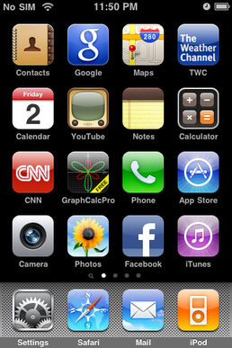

<!-- $size: 16:9 -->
<!-- page_number: false -->
<!-- $theme: elegant -->
<!-- $prism: default -->


<!-- footer: Image by Pete Linforth (https://pixabay.com/en/users/PeteLinforth-202249/), courtesy of Pixabay.com -->

# Modern JavaScript<br/> and PhoneGap <!--{style="color:white"}-->

##### Kerri Shotts &bullet; [@kerrishotts](https://www.twitter.com/kerrishotts) <!--{style="color:white"}-->
<!--{h5:style="color:white"}-->

##### https://kerrishotts.github.io/pgday/ <!--{style="color:white"}-->

---

<!-- template: light -->

<!-- footer:  -->

# About Me

 <!-- {style='float: right'} -->

* Used PhoneGap for over six years
* Authored Five books about PhoneGap
* Apache Cordova committer
* One of many moderators at:
    * [Cordova Google Group](https://groups.google.com/forum/#!forum/phonegap)
    * [PhoneGap Adobe Forums](http://forums.adobe.com/community/phonegap)

---

<!-- template: dark -->
<!-- footer: TARDIS by Zir at English Wikipedia, CC BY 2.5, https://commons.wikimedia.org/w/index.php?curid=8300120 -->

> > > **2009**

---

<!-- footer: By nvog86 - Own work, CC BY-SA 3.0, https://commons.wikimedia.org/w/index.php?curid=20238837 -->


# iPhone<br/>3GS <!--{style="background: none; margin-left: -5.9em;"}-->

---

<!-- footer: By Source (WP:NFCC#4), Fair use, https://en.wikipedia.org/w/index.php?curid=49508224 -->



# iOS 3 <!--{style="background: none; padding-left: 4.5em;"}-->

## ES3 (1999) <!--{h2:style="padding-left: 15em;"}-->

---

<!-- footer: By AlvinPing at English Wikipedia, CC BY-SA 3.0, https://commons.wikimedia.org/w/index.php?curid=8406455 -->


# HTC<br/>Hero <!--{style="background: none; margin-left: -5.9em;"}-->

---

<!-- footer: By Android Police - Android Police, CC BY-SA 4.0, https://commons.wikimedia.org/w/index.php?curid=55057830 -->


# Android<br/>1.5 <!--{style="background: none; padding-left: 4.5em;"}-->

## ES3 (1999) <!--{h2:style="padding-left: 15em;"}-->

---

<!-- footer: By Ramaksoud2000 via Chris Williams - Wikipedia via GitHub logo.js, Public Domain, https://commons.wikimedia.org/w/index.php?curid=18434372 -->


# 5 <!--{h1: style="background: none; font-size: 1600%; margin-left: 0.875em;"}-->

---

<!-- footer: -->

# ES5

* The version we all know and love (~ish?)
  * `'use strict';`
  * `map`, `reduce`, `Object.create`, `Object.freeze`, `trim`!
  * JSON parsing
* Supported by all modern mobile web views^1^
    * iOS 6+, IE 10+, Edge (forever), Android 4.4+
    * But not in 2009 &mdash; _no one supported it_

<hr>

1 http://caniuse.com/#feat=es5

---

> > > **2012**

---


<!-- footer: By Zach Vega - Own work, CC BY-SA 3.0, https://commons.wikimedia.org/w/index.php?curid=21298355 -->

# iPhone<br/>5 <!--{style="background: none; margin-left: -5em;"}-->

---

<!-- footer: By Self-taken screenshot from an iPhone 5., https://en.wikipedia.org/w/index.php?curid=37500638 -->


# iOS 6 <!--{style="padding-left: 4.5em;"}-->

## 93% support for ES5 <!--{style="padding-left: 15em;"}-->

###### http://kangax.github.io/compat-table/es5/ <!--{style="font-size: 50%; font-weight: normal; opacity: 0.5; padding-left: 50em;"}-->

---

<!-- footer: By GalaxyOptimus - Own work, CC BY-SA 3.0, https://commons.wikimedia.org/w/index.php?curid=46022690 -->


# Samsung<br/>Galaxy S3  <!--{style="background: none; margin-left: -5em;"}-->

---


<!-- footer: By Android Open Source project, CC BY 2.5, https://commons.wikimedia.org/w/index.php?curid=20262781 -->

# Android 4.1<br/>Jelly Bean <!--{style="background: none; padding-left: 4.5em;"}-->

## 85% support for ES5 <!--{style="padding-left: 15em;"}-->

###### http://kangax.github.io/compat-table/es5/ <!--{style="font-size: 50%; font-weight: normal; opacity: 0.5; padding-left: 50em;"}-->

---
<!-- footer: -->

> > > **2015**

---

# :tada: ES2015 :tada:
## n&eacute;e ES6

---

<!-- footer: http://kangax.github.io/compat-table/es5/ & http://kangax.github.io/compat-table/es6/ -->

# iOS 9

## 54% ES2015

---

# Android 5.1

## 25% ES2015


---

<!-- footer: -->

# ES2015 (ES6)

It had been quite a while, so the list is long...

 Feature                               | Feature <!-- {tr:style='display:none'} -->
:--------------------------------------|:-----------
Block-scoped `let` &amp; `const` <!-- {td:style='width:50%'} --> | Destructuring and named parms
Default parameters                     | Rest and Spread operator (`...`)
`for...of` loops and Iterators         | Arrow functions (`=>`)
Template strings &amp; interpolation   | Improved literals (object, `0b10`)
Generators (`*`/`yield`)               | Symbols, Maps &amp; Sets, Promises
`class` syntactic sugar &amp; `super`  | Modules (`import`, `export`)

<hr>

1: https://github.com/lukehoban/es6features#readme; **not** a complete representation of _all_ features

---

> > > **2016**

---

# Brexit

## Wait... how'd that happen?

---

# iOS 10

## 100% ES2015 \*

<!-- footer: * Except module implementation; source: http://kangax.github.io/compat-table/es6/ -->

---

# Android (Chrome 50)

## 92% ES2015

---

<!-- footer: -->

# ES2016 / ES7

---

# ES2016 (ES7)

Fewer features, but still important:

|Feature                               <!-- {tr:style='display:none'} -->|
|:--------------------------------------|
|Exponent (`**`)                        |
|`Array.prototype.includes()`           |

<hr>

Source: http://www.2ality.com/2016/01/ecmascript-2016.html

---

> > > **2017**

---

# ES2017

---

# ES2017

Finally &mdash; proper string padding!

|Feature                               <!-- {tr:style='display:none'} -->|
|:--------------------------------------|
|`async` / `await`                      |
|String padding :wink:                  |
|Shared memory                          |
|Atomics                                |

<hr>

Source: http://www.2ality.com/2016/02/ecmascript-2017.html

---

# ES2018 and beyond

## https://esdiscuss.org

###### https://mail.mozilla.org/listinfo/es-discuss

---

<!-- template: light -->

> ### A quick intro to ES2015+

---

# Block. Scoped. Variables. Finally.

```javascript
const SECONDS_IN_A_MINUTE = 60;
const HELLO = "Hiya";

let i = SECONDS_IN_A_MINUTE;
for (let i = 0; i < 100; i++) {
  console.log(HELLO, i); // Hiya 0... Hiya 99
}
console.log(i); // 60
```

---

# Constants aren't constant

Only the reference is constant!

```javascript
const DEFAULT_OPTIONS = {
  quality: 50
};

DEFAULT_OPTIONS.quality = 100;
console.log(DEFAULT_OPTIONS.quality); // 100
```

---

# Dang it, _this!_

```javascript <!-- highlight=4,8 number -->
var app = {
  text: "Hello, PG Day Attendees!",
  sayHi: function() { 
  	alert(this.text); 
  },
  start: function() {
    document.querySelector("#clickme")
    .addEventListener("click", this.sayHi, false);
  }
}
```

---


<div style="position: absolute; top: 60%; width: 90%; height: 40%; left: 5%; right: 5%; background-color: rgba(255,255,255,1); border-radius: 0.5em; border: 1px solid rgba(0,0,0,0.25); display: flex; flex-direction: column;">
  <div style="line-height: 3.5em; padding: 0.5em; margin: auto; width: 100%;">undefined</div>
  <div style="border-top: 1px solid rgba(0,0,0,0.25); color: hsl(220, 75%, 60%); text-align: right; padding: 0.5em">Close</div>
</div>

<!--
# 
-->

---

# Arrow functions

```javascript <!-- number highlight=5,8 -->
class App {
  constructor() { 
    this.text = "Hello, PG Day Attendees!"; 
  }
  sayHi() { alert(this.text); }
  start() {
    document.querySelector("#clickme")
    .addEventListener("click",() => this.sayHi());
  }
}
```

---


<div style="position: absolute; top: 60%; width: 90%; height: 40%; left: 5%; right: 5%; background-color: rgba(255,255,255,1); border-radius: 0.5em; border: 1px solid rgba(0,0,0,0.25); display: flex; flex-direction: column;">
  <div style="padding: 0.5em; margin: auto; width: 100%; line-height: 3.5em">Hello, PG Day Attendees!</div>
  <div style="border-top: 1px solid rgba(0,0,0,0.25); color: hsl(220, 75%, 60%); text-align: right; padding: 0.5em">Close</div>
</div>

<!--
# 
-->

---

# Arrow function quirks

No or 2+ parameters? Use parentheses:
```javascript
[1, 2, 3].map(() => Math.floor(Math.random() * 100));
[1, 2, 3].map((i, idx) => i * idx);
```

One parameter? Convention is no parentheses:
```javascript
[1, 2, 3].map(i => i * 2);
```

---

# Arrow function returns

Single line arrow functions use implicit `return`:

```javascript
[1, 2, 3].map(i => i * 2);
```

Block arrow functions use explicit `return`:

```javascript
[1, 2, 3].map(i => {
  let x = Math.floor(Math.random() * 100);
  return i * x;
});
```

---

# Arrow function ambiguity

But what if we return an object? This won't work:

```javascript
[1, 2, 3].map(i => {i: i * 2}); // is equivalent to
[1, 2, 3].map(i => {            // this, which is
i:                              // obviously not what
	i * 2;                      // we want :-(
});
```
Instead, wrap the implicit return in parentheses:

```javascript
[1, 2, 3].map(i => ({i: i * 2}));
```

---

# Template Strings

Multiline and Variable interpolation:

```javascript
function sayHelloAndGoodbye(name) {
  return `Hello, ${name},
Goodbye, ${name}`;
}

sayHelloAndGoodbye("World");  
// Hello, World!
// Goodbye, World!
```

---

# Template Strings

Arbitrary expressions (*use with care*):

```javascript
function sayComplexHello(name) {
  return `Hello, ${name ? name : "Jane Doe"}!`;
}

sayComplexHello("Alex");    // Hello, Alex!
sayComplexHello();          // Hello, Jane Doe!
```

---

# Promises, Promises

More concise with arrow functions:

```javascript
function getPos(options) {
  return new Promise((resolve, reject) => {
    navigator.geolocation.getCurrentPosition(
      resolve, reject, options);
  });
}
```

---

# Promises, Promises, Promises

Chaining is easier to read:

```javascript
getPos().then(pos => {
  console.log(JSON.stringify(pos));
}).catch(err => {
  console.error(err);
});
```

---

# Destructuring

Do be careful with how far you nest, though.

```javascript
function gotPos(data) {
  let {timestamp, coords:{latitude, longitude}} = data;
  console.log(`${latitude},${longitude}@${timestamp}`);
}
function gotError(err) {
    console.log(`Error received! ${err}`);
}
getPos().then(gotPos).catch(gotError);
```

---

# Destructuring

Not just for objects; arrays work too:

```javascript
function divide(a, b) {
  if (b === 0) {
    return [undefined, new Error("Divide by zero")];
  } else {
    return [a / b, null];
  }
}
let [results, error] = divide();
```

---

# async / await (ES2017)

```javascript
async function start() {
  try {
    let pos = await getPos(),
        {coords:{latitude, longitude}} = pos;
    console.log(`${latitude}, ${longitude}`);
  } catch(err) {
    console.log(`Error received! ${err}`);
  }
}
```

<hr>

**Note**: `async` poisons the call tree; all callers must also be `async` or treat the response like a `promise`.

---

# Array-like conversion

If only I had a &euro; for every time I've written:

```javascript
var elList = document.querySelectorAll("a"),
    elArr = [].slice.call(elList, 0);
```

ES2015:

```javascript
let elArr = Array.from(document.querySelectorAll("a"));
```


---

# Rest

Easy variable arguments:
```javascript
function sum(start = 0, ...nums) {
  return nums.reduce((acc, val) => acc + val, start);
}
console.log(sum(1, 5, 10, 99)); /* 115 */
```

---

# Named Parameters & Defaults

```javascript
function getPicture({quality = 50, width = 512, 
                     height = 512} = {}) {
  return new Promise((resolve, reject) => {
    navigator.camera.getPicture(resolve, reject, {
      allowEdit: false,
      correctOrientation: true, quality, 
      targetWidth: width, targetHeight: height,      
    });
  });
}
```

---

# Named Parameters & Defaults

```javascript
// use all the defaults
await getPicture();

// specify only quality
await getPicture({quality:75});

// specify only height & width
await getPicture({height: 1024, width: 1024});
```

---

# Modules

Static Analysis, FTW!

math.js:

```javascript
export function add(a, b) { return a + b; }
```

index.js:
```javascript
import {add} from "./math.js";
console.log(add(4, 3));      // 7
```

---

# Cool! Where can I use it?

---

# Native support is a moving target

|     OS             |   ES2015   |   ES2016   |   ES2017   |
|-------------------:|-----------:|-----------:|-----------:|
| Android (Chrome)   |  97% (51+) | 100% (55+) |  53% (56+) |
|  Windows (Edge 15) |      100%  |      100%  |       39%  |
|  Windows (Edge 14) |       93%  |         -  |         -  |
|           iOS 10.3 |      100%  |      100%  |       98%  |
|            iOS 10  |      100%  |       61%  |       42%  |
|            iOS  9  |       54%  |         -  |         -  |

<hr>

**Sources**: [ES2015](http://kangax.github.io/compat-table/es6/), [ES2016+](http://kangax.github.io/compat-table/es2016plus/)

---

# The Rise of the Transpilers

These can all transpile ES2015+\* to ES5:

* [Babel](https://babeljs.io) (n&eacute;e es6to5)
* [TypeScript](https://www.typescriptlang.org)
* [Bubl&eacute;](https://buble.surge.sh) \*\*
* [Traceur](https://github.com/google/traceur-compiler)

<hr>

&nbsp;\* **Note:** Not every ES2015+ feature can be transpiled effectively and to spec (if at all), such as proxies, shared memory, atomics, built-in subclassing, and tail call elimination. Also, most transpilers need to polyfill the standard library.
\*\* Doesn't attempt to transform non-performant or non-trivial ES6 features; _also very young_

---

> ### Remember module support?

---

<!-- template: dark -->


> ### No Implementation! :scream: <!--{style='text-align:center; color: white; position: absolute; left: 0; right: 0; top: 2in;'}-->

---

<!-- template: light -->

# Until now...

Browsers have _finally_ started shipping implementations:

* Available now:
	* Safari 10.1, iOS 10.3
* Behind a flag:
	* Edge 15
	* Firefox 54
	* Chrome and Android WebView 60

<hr>

Source: http://caniuse.com/#feat=es6-module

---

# Native Modules

`js/index.js`: 
```javascript
import Game from "./Game.js";
const game = new Game();
game.start();
```

`index.html`: 
```html
<script type="module" src="./js/index.js"></script>
```

---

# There's always a catch

* No "bare" `import`!
	* Must include the path
	* Must include the extension
	* No node-style resolution

* iOS module loading does not work in PhoneGap / Cordova

<center>
Timo Ernst<br/>
Building PhoneGap apps with Vue.js and Framework7<br/>
13:30 &mdash; 14:10
</center>

---
<!-- template: dark -->


> ### But we can fix all that... <!--{style='text-align:center; color: white; position: absolute; left: 0; right: 0; top: 2in;'}-->


---
<!-- template: light -->

# Module support using Bundling :shopping:

Dependency management & `import`/`export` (and CommonJS, AMD, etc.) support

* [Webpack](https://webpack.js.org)
* [JSPM](http://jspm.io)
* [Browserify](http://browserify.org)

You can do more than just bundling:

* Convert SASS to CSS, lint, copy assets, compress assets, etc.

---

# Execution Options

* Manual
* Task runner
    * `gulp`, `grunt`, etc.
    * `npm` scripts
* Automatic
    * Plugin Hooks
    * Project hooks

---

# Automating with npm scripts

* Pick your bundler and transpiler

    * Bundler: Webpack 2

    * Transpilers: TypeScript &amp; Babel (showing both configs)

* Install Webpack & Transpiler

* Configure Webpack & Transpiler

* Add scripts to `package.json`

---

# Install Webpack

Easy (assuming `package.json` exists):

```sh cli prompt=$
npm install --save-dev webpack
```

---

# Install Transpiler

Typescript:
``` sh cli prompt=$ output=2
npm install --save-dev ts-loader typescript core-js
```

Babel:

```sh cli prompt=$ output=2-4
npm install --save-dev babel-loader babel-core 
  babel-polyfill babel-preset-es2015 
  babel-preset-es2016 babel-preset-es2017 
  babel-plugin-transform-runtime
```

<hr> 

**Note:** `core-js` is a standard library polyfill; depending on your feature use and targets you may not need it.

---

# Configure Transpiler

<div style="columns: 2">

```javascript
// tsconfig.json
{ "compilerOptions": {
    "allowJs": true,
    "target": "es5",
    "module": "es2015", // DCR
    "lib": ["es2015", ...]
    "sourceMap": true
  },
  "include": 
    ["www.src/es/**/*"]
}
```
<!-- {style="font-size:80%"} -->

```javascript
// .babelrc
{ "presets": [
    ["es2015", { 
      "loose": true,
      "modules": false // DCR
    }], 
    "es2016", "es2017"
  ], 
  "plugins":["transform-runtime"]
}
```
<!-- {style="font-size:80%"} -->

</div>

<hr>

\* Don't forget to import `core-js`(ts)/`babel-polyfill` in your `index.?s` if targeting older runtimes. DCR = tree shaking

---

# webpack.config.js

```javascript
module.exports = {
  devtool: "inline-source-map",
  context: path.resolve(__dirname, "www.src"), 
  entry: { app: ["./es/index.js"] },
  output: { 
    filename: "bundle.js", 
    path: path.resolve(__dirname, "www", "js")
  },
  module: { /*...*/ } 
}
```

---

# webpack.config.js

```javascript
module: {
  rules: [ { 
      test: /\.([t|j]sx?)$/,
      exclude: /node_modules/,
      loader: "ts-loader",           // or babel-loader
      options: { entryFileIsJs: true } // excl if babel
    } /*, ... other rules as needed */ 
  ] 
}
```

---

# npm Scripts

```javascript
"scripts": {
  "sim:ios": "webpack -d && cordova emulate ios",
  "run:ios": "webpack -d && cordova run ios",
  "build:ios": "webpack -d && cordova build ios",
  "build:ios:rel": "webpack -p && cordova build ios --release"
}
```
<!-- {style='font-size:89%;'} -->

`-d`: debug
`-p`: production (minifies as well)

```sh prompt=$ cli
npm run build:ios
```
<!-- {style='font-size:90%;'} -->

---

# Code Splitting

```javascript
module.exports = {
  entry: { 
  	app: ["./es/index.js"],
    vendor: ["core-js"]
  }, /*...*/
  module: { /*...*/ },
  plugins: [
  	new webpack.optimize.CommonsChunkPlugin({
      name: "vendor", filename: "vendor.js"})
  ]
}

```

---

# ... don't forget to update index.html

`www/index.html`:
```html
<body>
  <script type="text/javascript" src="js/vendor.js">
  </script>
  <script type="text/javascript" src="js/bundle.js">
  </script>
</body>
```

---

# Automating with Plugin Hooks

[cordova-plugin-webpack-transpiler](https://github.com/kerrishotts/cordova-plugin-webpack-transpiler) transforms at `prepare`-time.

```sh <!-- prompt=$ output=2,3 cli -->
cordova plugin add cordova-plugin-webpack-transpiler
  --variable CONFIG=typescript|babel|...
```
<!-- {style='font-size:89%'} -->

Executes when `prepare` is called: `build`, `run`, `emulate`, etc.

```sh <!-- prompt=$ cli -->
cordova build ios               # debug mode
cordova build ios --release     # production mode
cordova run ios --notransform   # skip transform/bundling
```
<!-- {style='font-size:89%'} -->

---

# Automating with Templates

 Template | Author | Bundler | Transpiler | Frameworks | Automation
---------:|:------:|:-------:|:----------:|:----------:|:----------:
[cordova-template-webpack-ts-scss](https://github.com/kerrishotts/cordova-template-webpack-ts-scss)| Me | Webpack | TypeScript | Vanilla | `cordova`
[cordova-template-webpack-babel-scss](https://github.com/kerrishotts/cordova-template-webpack-babel-scss)| Me | Webpack | Babel | Vanilla | `cordova`
[cordova-template-framework7-vue-webpack](https://www.npmjs.com/package/cordova-template-framework7-vue-webpack)| centrual | Webpack | Babel | Vue, F7 | `cordova`
[phonegap-template-react-hot-loader](https://www.npmjs.com/package/phonegap-template-react-hot-loader)| devgeeks | Webpack | Babel | React | `npm`
[phonegap-template-vue-f7-blank](https://www.npmjs.com/package/phonegap-template-vue-f7-blank)| devgeeks | Webpack | Babel | Vue, F7 | `npm`
[phonegap-template-vue-f7-split-panel](https://www.npmjs.com/package/phonegap-template-vue-f7-split-panel)| devgeeks | Webpack | Babel | Vue, F7 | `npm`
[phonegap-template-vue-f7-tabs](https://www.npmjs.com/package/phonegap-template-vue-f7-tabs)| devgeeks | Webpack | Babel | Vue, F7 | `npm`
[phonegap-vueify](https://www.npmjs.com/package/phonegap-vueify)| lemaur | Browserify | Babel | Vue | `npm`

<!--{table:style="font-size:70%"}-->

---

###### [Video](./assets/templatevideo.mp4)

---

<!-- template: dark -->


# Reality Check...

---

<!-- template: light -->

# Reality Check...

* ES2015+ is **NOT** a performance optimization
  * See https://kpdecker.github.io/six-speed/ (as of 2017-01-04)


---

**Webview**
**ES2015+ Perf**
(Not to scale)


<!--


* **WKWebView** (iOS) single-core performance is **excellent**
* Compared to Safari on MBPr\*
    * iPad Pro 12.9&Prime;: roughly equal
    * iPhone 6s: 2&times; slower
    * iPad Mini 4: 2.5&times; slower

* **Android Webview / Chrome** performance is **slow**; by roughly an order of magnitude
* Compared to Chrome on MBPr:
    * OnePlus One: ~10&times; slower
    * Samsung Tab S 8.4&Prime;: ~33&times; slower


<hr>

**Note:** Results _highly sensitive_ to the JavaScript features in use.

-->

---

<!-- template: dark -->


> #### UIWebView strikes again <!--{style='text-align:center; color: white; position: absolute; left: 0; right: 0; top: 2in;'}-->

---

<!-- template: light -->

<!-- footer: UIWebView's performance is highly dependent upon language features used. -->


<!--

# Webviews &amp; Performance (2)

* UIWebView: *ugh*
    * "Slower than molasses in January"
    * e.g: ~75&times; slower on an iPad Pro 12.9&Prime;
    * No JIT :cry:

-->

---

<!-- footer: -->

# More Reality Checks

* Build step
* Debugging can be "fun"
* Some of the syntax can be a little _sharp_ &mdash; handle with care

---

<!-- template: light -->

# Euuuuggghhhh!!!

## Way to crush my dreams!

---

# Not really....

* Micro-benchmarks aren't the entire story
	* Engines are continually improving

* Actual performance deltas are highly variable 
	* Depends on platform and the language features in use

* Lots of benefits:
	* Expressive and concise
	* Less boilerplate
	* String padding! :wink:

---

# Tips

* ES5 still works
* Use ES2015+ as needed and when you're ready
* `var` is alive and well
  *  Use where performance is critical (e.g., tight nested loops)
* Arrow functions aren't drop-in
  * `this` is lexically scoped

---

# Tips

* Minify & remove dead code for release builds
  * Reduces bundle sizes and startup time
* Split code bundles
  * Vendor code can be separately bundled
  * Easier to blacklist in debuggers
* Use `WKWebView` on iOS for best performance

---

# Resources

* https://esdiscuss.org
* [ECMAScript 2015 Support in Mozilla](https://developer.mozilla.org/en-US/docs/Web/JavaScript/New_in_JavaScript/ECMAScript_2015_support_in_Mozilla)
* [ES2015 Compatibility Table](http://kangax.github.io/compat-table/es6/)
* [2ality - JavaScript and more](http://2ality.com)
* [Can I Use](http://caniuse.com)
* [WebKit Feature Status](https://webkit.org/status/)
* [Chrome Platform Status](https://www.chromestatus.com/features)

---

<!-- template: dark -->


> ### That's all, folks! <!--{style='text-align:right; color: white; position: absolute; left: 0; right: 0; top: 2in;'}-->

---

<!-- template: light -->


#  Thanks!

#### [@kerrishotts](https://www.twitter.com/kerrishotts)

#### https://kerrishotts.github.io/pgday/

---

###### *This slide intentionally left blank*