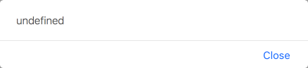

<!-- $size: 16:9 -->
<!-- page_number: true -->
<!-- $theme: evening -->
<!-- template: default -->

# Modern JavaScript and PhoneGap

## PhoneGap Day EU 2017

###### Kerri Shotts &bullet; [@kerrishotts](https://www.twitter.com/kerrishotts)

---

# Hi!

 <!-- {style='float: right'} -->

* I've Used PhoneGap for over six years
* I've written five books about PhoneGap
* I work with clients to create various kinds of apps
* I'm an Apache Cordova committer
* I'm one of several moderators on the [Cordova Google Group](https://groups.google.com/forum/#!forum/phonegap) and [PhoneGap Adobe Forums](http://forums.adobe.com/community/phonegap) &mdash; If you haven't checked out the latter, you should!
* I love retro technology! :-)

---

# Modern JavaScript Versions

---

# Remember ECMAScript 5?

Release year: 2009

* The version of JavaScript we all know and love (~ish?)
* Supported by all modern mobile web views^1^
    * iOS 6+, IE 10+, Edge (forever), Android 4.4+
* Reasonably modern (`map`, `reduce`, getters/setters, etc.)
* Things have changed a lot since then...

<hr>

1.  http://caniuse.com/#feat=es5

---

# ECMAScript 6 / ES2015

 Good stuff                            | Good Stuff <!-- {tr:style='display:none'} -->
:--------------------------------------|:-----------
Block-level scoped `let` & `const` <!-- {td:style='width:50%'} -->     | Destructuring and named parameters 
Default parameters                     | Rest and Spread operator (`...`)
`for...of` loops and Iterators         | Lexical function binding (`=>`)
Template strings & interpolation       | Improved literals (object, binary, octal)
Generators (`*`/`yield`)               | Symbols, Maps, Sets, WeakMaps, WeakSets, Promises
`class` syntactic sugar & `super`\*    | Modules (`import`, `export`)
<!-- {table:style='font-size:84%'} -->

\* Debatable if this is a good thing or not! :wink:

<hr>

Source: https://github.com/lukehoban/es6features#readme

---

# ECMAScript 2016

Small point release, essentially:

* Exponentiation operator (`**`)
* `Array.prototype.includes()`

<hr>

Source: http://www.2ality.com/2016/01/ecmascript-2016.html <!-- {p:style='font-size:50%'} -->

---

# ECMAScript 2017

A bit more this year...

* `async`/`await`
* String padding, _finally_ :wink:
* Shared memory and atomics

<hr>

Source: http://www.2ality.com/2016/02/ecmascript-2017.html

---

## Before we go any further...

# Some Very Important Caveats!

---

# Caveats

* **Not** a performance optimization: ES2015+ code often slower than ES5^1^
* Introduces a build step to your processes
* Debugging can be difficult / confusing _even with source maps_ (but this is steadily improving)
* For iOS, _you really need `WKWebView`_ and all that entails
   * `UIWebView` perf is abysmal
* For Android, 4.4+ should be OK
   * <4.4 use Crosswalk.
<!-- {ul^2:style='font-size:90%'} -->
<hr>

1. https://kpdecker.github.io/six-speed/

---

|         Feature | Chrome 55 | Edge 15 | Safari 10 |
|----------------:|:---------:|:-------:|:---------:|
| Arrow functions |    N/C    |**+1.2x**|     N/C   |
| `let` compound  |    -1.6x  |    N/C  |     N/C   |
| Classes         |     N/C   |   -1.5x |     N/C   |
| `super`         |     -4x   |   -1.7x |    -15x   |
| Destructuring   |    -16x   |   -53x  |    -23x   |
| `for`...`of Array` |  -17x  |    -7x  |    -1.3x  |
| `for`...`of Object` | -1.8x |    -4x  |    -2.3x  |
| `Map` & `Set`   |    -4.x   |   -23x  |     -8x   |
| rest `...`      | **+1.3x** | **+14x**|    -33x   |
| spread `...`    |    -22x   |  -1.7x  |     -5x   |
| Template string |   -1.2x   |**+1.4x**|    -18x   |
<!-- {table:style='font-size:80%'} -->
<hr>

Source: https://kpdecker.github.io/six-speed/ (2017/01/04) | N/C: "no change"

---

# A whirlwind tour

---

# Dang it, _this!_

```javascript
var app = {
  text: "Hello, PhoneGap Day Attendees!",
```

```javascript
  sayHi: function() { alert(this.text); },
```
<!-- {style='background-color: hsl(120, 25%, 25%)'} -->

```javascript
  init: function() {
    document.getElementById("clickme")
```

```javascript
        .addEventListener("click", this.sayHi, false);
```
<!-- {style='background-color: hsl(120, 25%, 25%)'} -->

```javascript
  }
}

app.init();
```

---

# Wah wah :no_entry_sign:

# 

---

# Arrow functions (=>)

```javascript
class App {
  constructor({text = "Hello, world!"} = {}) {
    this.text = text;
  }
  init() {
    document.getElementById("clickme")
```
<!-- {style='font-size:80%'} -->
```javascript
        .addEventListener("click", () => this.sayHi(), false);
```
<!-- {style='font-size:80%; background-color: hsl(120, 25%, 25%)'} -->

```javascript
  }
  sayHi() { alert(this.text); }
}
const app = new App({text: "Hello, PhoneGap Day Attendees!"});
app.init();
```
<!-- {style='font-size:80%'} -->

<hr>

ES5 equivalent: `(function() { this.sayHi(); }).bind(this)`

---

# Hi! :tada:

# 

---

# Array.from

Remember doing this?

```javascript
var elList = document.querySelectorAll("a"),
    elArr = [].slice.call(elList, 0);
```

Now we can do this:

```javascript
let elArr = Array.from(document.querySelectorAll("a"));
```

---

# Spread/Rest is awesome (...)

Even shorter than `Array.from`:

```javascript
let elArr = [...document.querySelectorAll("a")];
```

Easy variadic arguments:
```javascript
function sum(...nums) {
    return nums.reduce((a, v) => a + v, 0);
}
console.log(sum(1, 5, 10, 99));
```
&rArr; 115

---

# Spread/Rest is awesome (...) (2)

Easy sprintf-like:
```javascript
function sprintf(str, ...replacements) {
    return str.match(/\%[0-9]+/g)
        .reduce((a, v) => a.replace(v, 
                            replacements[v.substr(1)]), str);
}
console.log(sprintf ("%1, %0", "world", "hello"));
```
&rArr; Hello, world

---

# Destructuring

Easy swap:
```javascript
[a, b] = [b, a]
```

Multiple return values:
```javascript
function someFunction(str) {
  return {result: str + str, error: str === "" ? "no string" : null};
}
let {result, error} = someFunction("that might error");
// renaming:
let {result:r, error:err} = someFunction("that might error");
```
<!-- {style='font-size:80%'} -->

---

# Named Parameters & Defaults

```javascript
class Button {
    constructor({type = "default", text = "", 
                 x = 0, y = 0, w = 100, h = 44} = {}) {
        this.type = type;
        this.text = text;
        this.frame = {x, y, w, h};
        this.bounds = {x: 0, y: 0, w, h};
    }
}

let button = new Button ({type: "round", text: "Click me",
                          x: 100, y: 100});
```

---

# Template Strings

```javascript
let x = 4;
let y = 10;
console.log(`x + y => ${x} + ${y} => ${x + y}`); 
```

&rArr; x + y => 4 + 10 => 14

Allows multi-line strings (preserving &crarr;):

```javascript
let template=`<ul>
    <li><span></span></li>
</ul>`;
```

---

# Sets and Maps

Easy Dedup:

```Javascript
function dedup (arr = []) {
    return Array.from(new Set(arr));
}

let arr = dedup([ 1,  4,  9,  3,  4,  9, 12, 
                 20, 12, 32, 94,  9, 12, 
                 94, 34,  1]);

```

---

# Modules (friendly to static analysis)

:page_facing_up: math.js:

```javascript
export function add(a, b) { 
    return a+b; 
}
```

:page_facing_up: index.js:
```javascript
import {add} from "math.js";
console.log(add(4, 3));
```

&rArr; 7

---

# Where can I use this now?

---

# Native support (%coverage)

|     OS             |   ES2015   |   ES2016   |   ES2017   |
|-------------------:|-----------:|-----------:|-----------:|
| Android (Chrome)\* |  97% (51+) | 100% (55+) |  53% (56+) |
|           Edge 15  |      100%  |      100%  |       39%  |
|           Edge 14  |       93%  |         -  |         -  |
|        iOS 11\*\*  |      100%  |      100%  |       98%  |
|            iOS 10  |      100%  |       61%  |       42%  |
|            iOS  9  |       54%  |         -  |         -  |

<hr>

&nbsp;\* Forget about Android 4.4 or lower without Crosswalk
\*\* Based on current status in Safari Technological Preview &mdash; Admittedly this is a bit of a guess

---

## But, I want it everywhere!

# ES2015+ &rArr; ES5!

## or, *The Rise of the Transpilers*

---

# The Transpilers

These can all transpile ES2015\* (with varying degrees of success):

* [Babel](https://babeljs.io) (n&eacute;e es6to5)
* [TypeScript](https://www.typescriptlang.org)
* [Bubl&eacute;](https://buble.surge.sh) \*\*
* [Traceur](https://github.com/google/traceur-compiler)
<!-- {ul^0:style='font-size:90%'} -->

There is no wrong answer here.

<hr>

&nbsp;\* **Note:** Not every ES2015+ feature can be transpiled effectively (if at all), such as proxies, shared memory, atomics, built-in subclassing, and tail call elimination
&nbsp;\* **Note:** Most transpilers need [core-js](https://github.com/zloirock/core-js) to polyfill the standard library.
\*\* Doesn't attempt to transform non-performant or non-trivial ES6 features; _also very young_

---

## Remember Module syntax?

# No implementation! :scream: <!-- {h1^0:style='font-size:350%'} -->

## But we can fix that...

---

# Module support using Bundling :shopping:

Dependency management & `import`/`export` support

Bundler                              | Babel | Bubl&eacute; | Coffee | Typescript | Traceur |
------------------------------------:|:-----:|:------------:|:------:|:---------:|:---------:
[Webpack](https://webpack.js.org)    |&check;| &check;      | &check;| &check; | &check;
[JSPM](http://jspm.io)               |&check;| &mdash;      | &mdash;| &check; | &check;
[Browserify](http://browserify.org)  |babelify| bubleify    | coffeeify| tsify | traceurify

<hr>

There is no wrong choice here (unless you need a transpiler that isn't supported). 
However, Webpack probably has the most momentum at present.

---

# PhoneGap Integration

* If you're sadistic, you can do it manually &mdash; just run each tool's CLI... _every time_...
* But you're a developer, so you like automation, right? :robot:
    * :runner: `gulp` / `grunt` task runners
    * :scroll: `npm run` scripts &larr; great if you are already comfortable with npm and node
    * :fish: Plugin hooks &larr; _this is really fun! :grin:_
        * Project-level hooks work too
---


# Building (npm scripts)

* Where to put your ES2015+ code?
    * Sibling (sibling of `js`)
    * External (sibling of `www`)

* Install Webpack & Transpiler

* Configure Webpack & Transpiler

* Add scripts to `package.json`

---

<div style="columns:2">

# Sibling Structure

* :file_folder: `project-root/`
    * :page_facing_up: `config.xml`
    * :file_folder: `www/`
        * :page_facing_up: `index.html`
        * :file_folder: `esm/`
            * :page_facing_up: `index.(ts|js)`
        * :file_folder: `js/`
            * :page_facing_up: `index.js` &larr; (gen)

<!-- {ul^4:class='no_bullets'} -->

# External Structure

* :file_folder: `project-root/`
    * :page_facing_up: `config.xml`
    * :file_folder: `esm/`
        * :page_facing_up: `index.(ts|js)`
    * :file_folder: `www/`
        * :page_facing_up: `index.html`
        * :file_folder: `js/`
            * :page_facing_up: `index.js` &larr; (gen)

<!-- {ul^4:class='no_bullets'} -->

</div>

---


---

# Which one?

&nbsp;  | Pros                                | Cons
-------:|:-----------------------------------:|:-----------------------:
Sibling | Easier path resolution (completion) | Code duplication in builds\*
External| No duplication in app               | Outside of `www`

No right or wrong answer &mdash; depends on your needs

<hr>

\* ... but we can delete those files

---

## Install Webpack & Transpiler

```bash
$ npm install --save-dev webpack
 ```

Typescript:
```bash
$ npm install --save-dev ts-loader typescript core-js
```

Babel:

```bash
$ npm install --save-dev babel-loader babel-core \
  babel-polyfill babel-preset-es2015 babel-preset-es2016 \
  babel-preset-es2017 babel-preset-react \
  babel-plugin-transform-runtime
```

<!-- {style='font-size:85%'} -->

<hr> 

**Note:** `core-js` is a standard library polyfill; depending on your feature use and targets you may not need it.

---

# Configure TypeScript

Create `tsconfig.json`:

```javascript
{
    "compilerOptions": {
        "allowJs": true,
        "target": "es5",
        "module": "es2015",     // required for tree shaking
        "inlineSourceMap": true
    },
    "include": [
        "www/esm/**/*"          // or esm/**/* if external
    ]
}
```
<!-- {style="font-size:90%"} -->

---

# Configure Babel

Create `.babelrc`:

```javascript
{
    "presets": [ 
        ["es2015", { 
            "loose": true,    // Use LOOSE for best perf
             "modules": false // required for tree shaking
        }],
        "es2016", "es2017", "react"
    ],
    "plugins": ["transform-runtime"] // reduces repetition in
                                     // output files
}
```
<!-- {style="font-size:90%"} -->

---

# Configure Webpack

Create `webpack.config.js`:

```javascript
var path = require("path");
module.exports = {
    devtool: "inline-source-map",
    context: path.resolve(__dirname, "www"),
    // if external, use __dirname, "esm", "index.js"
    entry: path.resolve(__dirname, "www", "esm", "index.js"),
    output: { filename: "app.bundle.js",
              path: path.resolve(__dirname, "www", "js") },
    module: { loaders: [ {
                test: /\.(ts|js)$/,
                loader: 'ts-loader',             // or babel-loader
                exclude: /node_modules/,
                options: { entryFileIsJs: true } // only for js with typescript
            } ] }
}
```
<!-- {style='font-size:70%;'} -->

---

# Add run script to package.json

In `package.json` (assuming `cordova` is local):

```json
{
   "scripts": {
       "cordova": "cordova",
       "webpack": "webpack",
       "build:ios": "npm run webpack && \
                     npm run cordova -- build ios && \
                     rm ./platforms/ios/www/esm/*.*"
   }
}
```

---

# Webpack Transpiler Plugin :grin:

```bash
$ cordova plugin add cordova-plugin-webpack-transpiler \
  --variable TRANSPILER=typescript|babel \
  --variable MODE=sibling|external
```
    
* Runs `npm init` and `npm install` for dependencies
* Creates initial configuration files
* Hooks `prepare` to perform the transforms and clean up
	* Sorry, **PGB** users; this means it won't work for you :cry:

<hr>

Fork, translate, and/or improve it: https://github.com/kerrishotts/cordova-plugin-webpack-transpiler
    
---

# What about tests?

# ...and code coverage?

---

# Tests

```bash
$ npm install --save-dev mocha chai
$ npm install --save-dev ts-node        # for TypeScript
$ npm install --save-dev babel-register # for Babel
```

Add `test` to `package.json:scripts`\*

```javascript
"test": "mocha" // TypeScript (need ./test/_bootstrap.js)
"test": "mocha --compilers js:babel-register"   // Babel
```

Then `npm test`

<hr>

\* Assumes tests are in `./test`
\_bootstrap.js: `require("ts-node").register();`

---

# Code coverage (Babel)

`npm install --save-dev instanbul`, then in `.babelrc`:
```javascript
{ 
  "presets": ["es2015", ...],
  "plugins": ["transform-es2015-modules-commonjs", ...]
  "env": { 
    "test": {
      "plugins": ["istanbul"]
    }
  } 
}
```

---

# Code coverage (Babel, 2)

`npm install --save-dev cross-env nyc` and configure (in `package.json`):

```javascript
"nyc": {
  "require": ["babel-register"],
  "reporter": ["text", "html"],
  "sourceMap": false,
  "instrument": false
}
```

And create a `npm run` script:

```javascript
"cover": "cross-env NODE_ENV=test nyc npm test"
```

---

# Tips

---

# Tips

* Be careful of arrow functions to `describe` & `it` in your tests
    * `this` will not be what your test runner expects!
* Use `var` instead of `let` in tight nested loops where performance is critical
* Minified code is not necessarily more performant (depends on the optimizer)
* 

---

# Tips (2)

* Chrome _deopt_&rsquo;s for odd reasons
    * The inspector will indicate `[deopt]` and the reason

    Reason                              | Workaround
    :-----------------------------------|:-----------------------------------
    Declaration not at top (TDZ issues) | Move declaration to top of function
    Compound assignments                | Use `var` in declaration instead
<!-- {table:style='font-size:80%'} -->

<!--
* Not ES2015+ Specific:
   * Don't use clamped arrays -- *really* slow in Chrome
   * Assigning empty array is faster than `arr.length = 0`
-->

---

# Some device ES2015 perf stats...

|     Device       |GB 4 SC| Web View   | MIPS | IPF    |  FPS  |
|-----------------:|------:|:-----------|-----:|-------:|:-----:|
| MacBook Pro 2014 |  3574 | Safari     | 4.74 | 79,248 |   ~60 |
| iPad Pro 12.9"   |  3013 | `WKWebView`| 4.52 | 75,602 |   ~60 |
| MacBook Pro 2014 |  3574 | Chrome     | 3.94 | 66,092 |   ~60 |
| iPhone 6s        |  2359 | `WKWebView`| 2.49 | 41,552 |   ~60 |
| iPad Mini 4      |  1633 | `WKWebView`| 2.00 | 33,806 |   ~59 |
|Samsung Tab S 8.4"|   783 | Chrome     | 0.13 | ~2,166 |   ~53 |
| iPad Pro 12.9"   |  3013 | `UIWebView`| 0.01 |   ~166 |   ~42 |

<hr>

**Note:** Of course, this is _highly sensitive_ to the ES2015+ features that you use.

--- 

# To bundle or not to bundle?

## Yes.

---

# To transpile or not to transpile?

## Yes.\*

###### \* Technically, it depends on your targets, and what flavor of Modern JavaScript you intend on using. <!-- {h6^0:style='text-align: justify; padding: 0 3em;'} -->

---

# Questions?


## Thanks!

###### https://github.com/kerrishotts/pgday/2017/modern-javascript-and-phonegap

###### [@kerrishotts](https://www.twitter.com/kerrishotts)