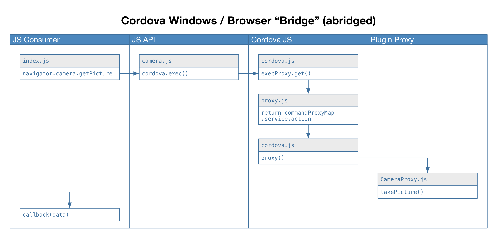
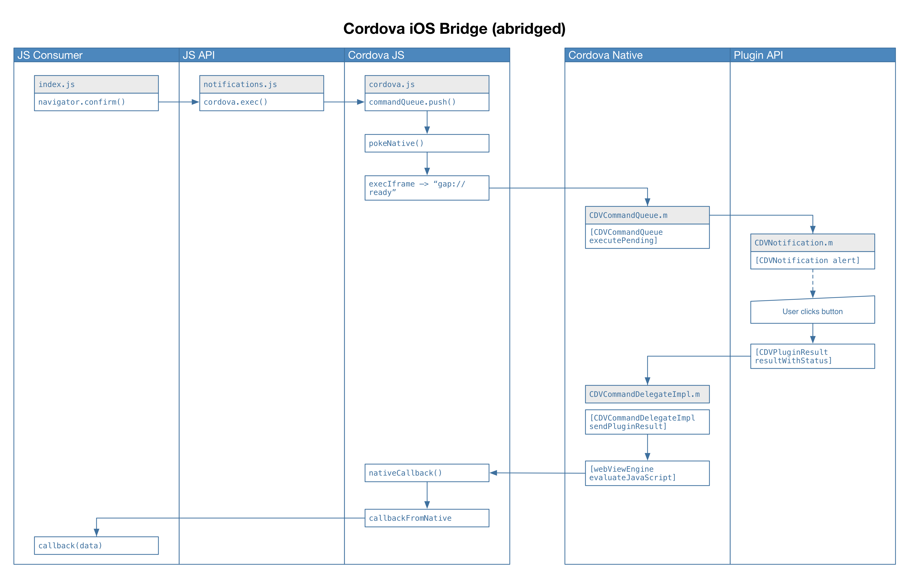
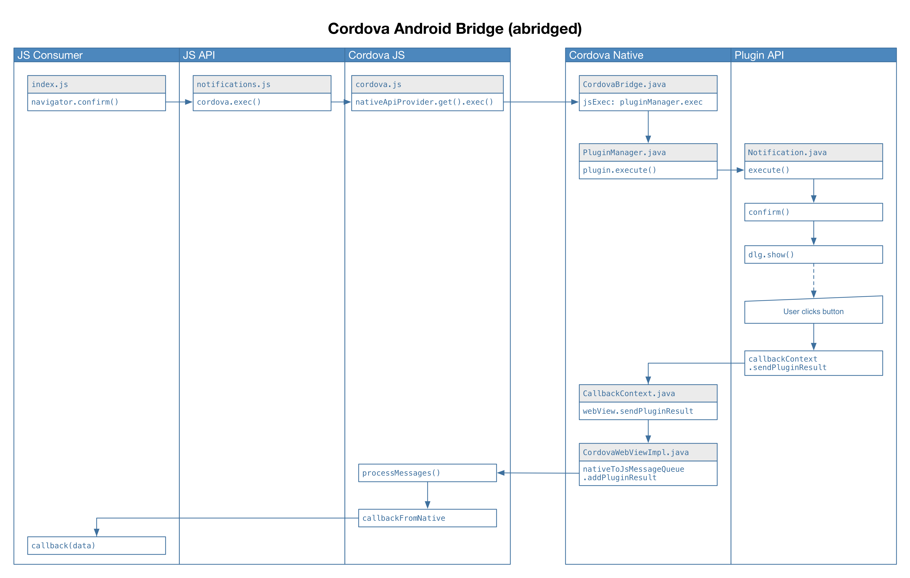

We've not really discussed just how JavaScript and your plugin's native code actually interact. For non-proxy platforms, they interact over something called a "bridge". The implementation of this bridge is different for each platform, but the idea is the same: to facilitate communication between JavaScript and native code.

The entire process is complex, and it's not a requirement that you know this by heart. But it is a good idea to have a basic understanding of what's going on under the hood in case you run into any difficulties.

# Browser &amp; Windows Bridge

The proxy-based platforms do have a "bridge" of sorts, but it's far less complicated than the bridges for non-proxy-based platforms. The bridge looks something like the following for browsers and Windows:

The second and fourth columns is code that our plugin provides. The leftmost column is the consumer of the plugin. The third column is essentially the proxy bridge &mdash; it is here that the service is mapped to your JavaScript proxy code.

# iOS Bridge

iOS has a pretty complex bridge in place. It looks something like this:

The bridge itself consists here of two parts: the third and fourth lanes. The other lanes represent the plugin's consumer (leftmost lane) or our plugin's code (second and rightmost lane).

# Android Bridge

Android's bridge is pretty complex as well. It looks something like this:

As with iOS, the bridge itself consists of two parts: lanes three and four. The remaining lanes represent the plugin's consumer (leftmost lane) or our plugin's code (second and rightmost lane).

# So what's this mean?

Now that you've seen a sample of what the bridges look like, there are some conclusions we can draw:

* It should be clearer why plugin requests are asynchronous in nature
* If we don't initialize the bridges, our plugins can't work. This is what happens if we forget `cordova.js`, for example, or if something else interferes with Cordova's proper initialization.
* Why we have to wait for `deviceready` should be obvious as well: not only do we need to wait for plugins to initialize, but we also have to have the bridge in place, or we couldn't ever contact our plugins.

It is a good idea to navigate through the code for all the platforms you intend on supporting &mdash; there's lots of great nuggets that you can dig out, and you'll understand how the entire process works, which should also help you write better plugins.
