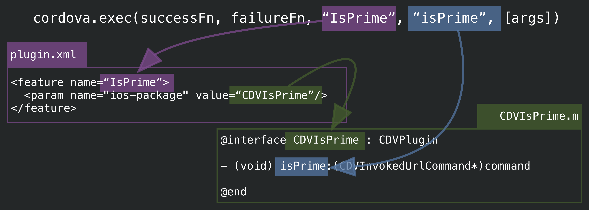
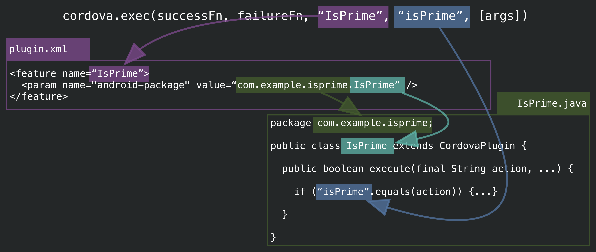

Time to get back to something we mentioned in [Creating a Plugin, part one](./creating.md) &mdash; how `plugin.xml` maps `cordova.exec` requests to our actual native code.

# Plugin class mapping

Let's take a look at the tail end of our `plugin.xml` again:

```xml
    <platform name="android">
        <config-file target="res/xml/config.xml" parent="/*">
            <feature name="IsPrime" >
                <param name="android-package" value="com.kerrishotts.example.isprime.IsPrime"/>
            </feature>
        </config-file>
        <source-file src="src/android/IsPrime.java" target-dir="src/com/kerrishotts/example/isprime" />
        <source-file src="src/android/InspectableThreadPoolExecutor.java" target-dir="src/com/kerrishotts/example/isprime" />
        <source-file src="src/android/IsPrimeRunnable.java" target-dir="src/com/kerrishotts/example/isprime" />
    </platform>

    <platform name="ios">
        <config-file target="config.xml" parent="/*">
            <feature name="IsPrime">
                <param name="ios-package" value="CDVIsPrime"/>
            </feature>
        </config-file>
        <source-file src="src/ios/CDVIsPrime.m" />
    </platform>

    <platform name="browser">
        <js-module src="src/browser/IsPrimeProxy.js" name="IsPrimeProxy">
            <runs />
        </js-module>
    </platform>

    <platform name="windows">
        <js-module src="src/windows/IsPrimeProxy.js" name="IsPrimeProxy">
            <runs />
        </js-module>
        <!-- if using managed code in prior section -->
        <framework src="src/windows/IsPrimeRuntimeComponent/IsPrimeRuntimeComponent/bin/Release/IsPrimeRuntimeComponent.winmd" custom="true"/>
    </platform>
```

Now that we've written some code, hopefully this begins to make some more sense. Essentially, `plugin.xml` is not just indicating where our source files are, but the location to which they should be copied, and how service names are mapped to native plugin code.

Here's a couple of pictures that should make the mapping even more obvious:





For proxy-based platforms, the mapping is handled by the proxy JavaScript module, which is why a `<js-module>` with a `<runs>` child is used instead.

# Dependencies

Many times one will need to specify some dependencies. You can add both plugins and platforms as dependencies. The method differs by Cordova version.

* pre-Cordova 6.1.0
    * Managed by `plugin.xml`
    * plugin dependencies ([eg](https://github.com/apache/cordova-plugin-file-transfer/blob/ac2ae8ba2edc099dcde49cd66b810eb225e04d3d/plugin.xml#L32); [docs](https://cordova.apache.org/docs/en/latest/plugin_ref/spec.html#dependency))
    ```xml
    <dependency id="cordova-plugin-file" version="^4.0.0" />
    ```
    * platform &amp; tool dependencies ([eg];(https://github.com/apache/cordova-plugin-inappbrowser/blob/92ca973b3da3c79fd4bba1e1ca8a12c75a1b6260/plugin.xml#L32) ; [docs](https://cordova.apache.org/docs/en/latest/plugin_ref/spec.html#engines-and-engine))
    ```xml
    <engines>
        <engine name="cordova" version=">=3.1.0" />
    </engines>
    ```
* Cordova 6.1.0 and later
    * Managed in `package.json`
    * [Full docs](https://cordova.apache.org/docs/en/latest/guide/hybrid/plugins/index.html#specifying-cordova-dependencies)
    ```javascript
        "engines": {
            "cordovaDependencies": {
                "2.0.0": { // plugin version (applies to any ver 2+)
                    "cordova-plugin-console": ">1.0.0",
                    "cordova": ">6.0.0" // cordova-cli above version 6
                }
            }
        }
    ```